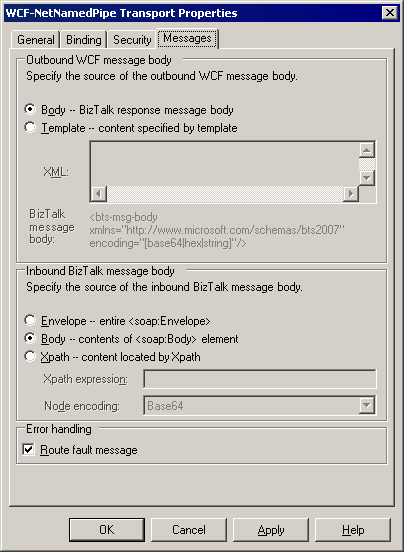

# Known Issues for the WCF Adapters
This topic describes the known issues for the WCF adapters included with [!INCLUDE[btsBizTalkServer2006r3](../includes/btsbiztalkserver2006r3-md.md)].  
  
## A message that fails in the inbound SOAP marshaling processing is not suspended in WCF receive adapters  
 When a message arrives at a WCF receive adapter, the WCF adapter creates a BizTalk message from the incoming SOAP message, and then passes the BizTalk message to the transport proxy, which is managed by the Endpoint Manager. If the adapter fails to read the SOAP envelope and body while creating the BizTalk message, the message is not suspended because the adapter uses the fast, non-cached, and forward-only reader to access the SOAP message.  
  
 You should check the event log for the failed message. For example, you can use a body path expression on the **Messages** tab in the WCF adapter transport properties dialog box to specify how to create the inbound BizTalk message body from a SOAP message incoming through the WCF adapter. When an invalid body path expression for the incoming SOAP message is supplied on the **Messages** tab, the adapter fails to create the BizTalk message and cannot suspend the incoming message. For more information about how to use the body path expression on the **Messages** tab, see [Specifying the Message Body for the WCF Adapters](../core/specifying-the-message-body-for-the-wcf-adapters.md).  
  
 The following figure shows the **Messages** tab on which you can specify how to create inbound BizTalk messages from the incoming SOAP messages.  
  
## A message that fails in the inbound SOAP marshaling processing is not suspended in WCF send adapters  
 The solicit-response WCF send port can receive a WCF message as a response message. When the message arrives at the WCF send adapter, the WCF adapter creates the BizTalk message from the incoming SOAP message, and then passes the BizTalk message to the transport proxy, which is managed by the Endpoint Manager. If the adapter fails to read the SOAP envelope and body while creating the BizTalk message, the message is not suspended because the adapter uses the fast, non-cached, and forward-only reader to access the SOAP message.  
  
 You should check the event log for the failed message. For example, you can use an XPath expression on the **Messages** tab in the WCF adapter transport properties dialog box to specify how to create the inbound BizTalk message body from a SOAP message incoming through the WCF adapter. When an invalid XPath expression for the incoming SOAP message is supplied on the **Messages** tab, the adapter fails to create the BizTalk message and cannot suspend the incoming message. For more information about how to use the XPath expression on the **Messages** tab, see [Specifying the Message Body for the WCF Adapters](../core/specifying-the-message-body-for-the-wcf-adapters.md).  
  
 The following figure shows the **Messages** tab of the WCF-NetNamedPipe send adapter as an example.  
  
   
  
## Messages can be lost when using OneWayBindingElement in a two-way transport with custom binding in non-transactional WCF receive locations  
 In a two-way communication, WCF adapters will send the response back until the messages have been persisted in the MessageBox database. However, using **OneWayBindingElement** generates a dummy response immediately before dispatching the received message to the WCF adapter. Therefore, if you configure a custom binding with a **OneWayBindingElement** in the channel stack for two-way transport in non-transactional receive locations, messages can be lost because the WCF adapters process the received messages in the one-way fashion.  
  
## Default values of the ReaderQuotas attributes in the WCF-Custom and WCF-CustomIsolated transport properties dialog boxes are used when constructing the bindings  
 In the WCF-Custom and WCF-CustomIsolated transport properties dialog boxes, the **ReaderQuotas** attribute values are shown as zero. However, when constructing the bindings, the following values are used:  
  
|Attribute|Description|Value|  
|---------------|-----------------|-----------|  
|maxArrayLength|A positive integer that specifies the maximum allowed array length.|16384|  
|maxBytesPerRead|A positive integer that specifies the maximum allowed bytes returned per read.|4096|  
|maxDepth|A positive integer that specifies the maximum nested node depth per read.|32|  
|maxNameTableCharCount|A positive integer that specifies the maximum characters allowed in a table name.|16384|  
|maxStringContentLength|A positive integer that specifies the maximum characters allowed in XML element content.|8192|  
  
## The WCF receive locations may be disabled if you change the WCF adapter type and keep the same address  
 If you change the adapter type—for example, change the WCF adapter type from WCF-NetTcp to WCF-Custom with NetTcp Binding—and keep the same address, the receive location may be disabled because of the caching problem in the Endpoint Manager. To work around this, you can do either of the following:  
  
-   Restart the BTSNTSvc service.  
  
-   Change the URI to a different address and save it, and then change the URI back to the original address and save it again.  
  
## The WCF action set in the orchestration does not override the action setting in the static send port  
 If you set the **WCF.Action** context property in the orchestration, you need to leave the **Action** field blank in the WCF adapter transport properties dialog box. If you also specify an action in the static send port, the **WCF.Action** context property you set in the orchestration will be overridden by the value you set in the static send port.  
  
## Propagating a fault message is not supported in the transactional send  
 The **Propagate fault message** option in the solicit-response send ports allows you to route the messages that fail the outbound processing to a subscribing application. However, if the **Enable transactions** check box is also selected in the transport properties dialog box and the transaction is aborted or not usable when the fault response arrives to the adapter, you will not be able to propagate the fault messages to any subscribing applications  
  
## The MSMQ cluster resource group needs to be restarted before restarting the BizTalk Host cluster resource group during the cluster failover  
 In a failover cluster scenario, when a failover is taking place, the MSMQ cluster resource group needs to be restarted before restarting the BizTalk Host cluster resource group. If you fail to do so, the MSMQ receive locations may be disabled. To work around this issue, you can make the BizTalk Host cluster resource group dependent on the MSMQ cluster resource group to ensure that the MSMQ cluster resource group starts before the BizTalk Host cluster resource group. Alternatively, you can restart the BizTalk Host cluster resource group to work around this issue.  
  
## You receive an error when sending messages to a WCF service that uses wsFederationHttpBinding in the endpoint  
 You receive an error similar to the following:  
  
```  
The adapter failed to transmit message going to send port "MySendPort" with URL "http://localohost/MywsFedHttp". It will be retransmitted after the retry interval specified for this Send Port. Details:"The channel is configured to use interactive initializer 'System.ServiceModel.Security.InfocardInteractiveChannelInitializer', but the channel was Opened without calling DisplayInitializationUI.  Call DisplayInitializationUI before calling Open or other methods on this channel.".  
```  
  
 This behavior is by design. WCF adapters cannot send messages to the WCF services that are using **wsFederationHttpBinding** in their endpoints.  
  
## The BizTalk WCF Service Consuming Wizard does not enable you to select message types or port types from the WSDL  
 The BizTalk WCF Service Consuming Wizard does not enable you to select message types or port types from the WSDL when importing the WCF services. To work around this limitation, you can use the following code to obtain the schemas and then add the desired schemas to your BizTalk projects:  
  
```  
svcutil.exe /t:metadata http://service/metadataendpoint  
```  
  
## The BizTalk WCF Service Consuming Wizard does not allow the combination of one-way and request-response operations  
 The BizTalk WCF Service Consuming Wizard does not allow you to import the port types that have a combination of one-way and request-response operations. To work around this, you can use the ServiceModel Metadata Utility Tool to generate the port types.  
  
## The BizTalk WCF Service Consuming Wizard does not allow you to set certificate credentials when retrieving the WSDL  
 The BizTalk WCF Service Consuming Wizard does not allow you to set certificate credentials when retrieving the WSDL. To work around this, you can use the ServiceModel Metadata Utility Tool to generate the WSDL and XSD files from the WCF services you wish to consume with the certificate credentials set in the svcutil.exe.config file, and then import them into the BizTalk WCF Service Consuming Wizard by choosing **Metadata Files (WSDL and XSD)** option in the **Metadata source** page.  
  
## WCF adapters do not support one-way operations  
 You will receive an error message similar to the following when consuming WCF services published with the WCF adapters (except for the WCF-NetMsmq receive adapter) if the **IsOneWay** property is set to **true** at client side. This is because the **System.ServiceModel.OperationContractAttribute.IsOneWay** property of WCF services published with the WCF adapters (except for services published with the WCF-NetMsmq receive adapter) is set to **false** even for the one-way receive locations.  
  
```  
The channel received an unexpected input message while closing. Your Channel.Close() calls are not synchronized.  
```  
  
 You will receive an error message similar to the following when consuming the WCF services specified with the **IsOneWay** property set to **true**. The messages you sent from [!INCLUDE[btsBizTalkServerNoVersion](../includes/btsbiztalkservernoversion-md.md)] will be suspended and resumable.  
  
```  
The request operation at net.tcp://localhost:8088/MyService/tcp did not receive a reply within timeout 00:01:00.  
```  
  
## A memory leak may occur when sending messages to non-transactional MSMQ queues using WCF-NetMsmq binding  
 A memory leak may occur in the BizTalk NT service when sending messages to non-transactional MSMQ queues using WCF-NetMsmq binding. This may occur when you send messages to a non-transactional MSMQ queue using WCF-NetMsmq transport or when you send messages to a non-transactional MSMQ queue using netMsmqBinding with WCF-Custom transport.  
  
 To resolve the issue, you must install .NET Framework 3.0 hotfix described in the KB article 936512 at [http://go.microsoft.com/fwlink/?LinkId=92962](http://go.microsoft.com/fwlink/?LinkId=92962). The hotfix does not require a system reboot but it is necessary to restart the BizTalk NT service which hosts the send ports that using WCF-NetMsmq binding.  
  
## You may receive exception when communicating with Apache Web servers using WCF-BasicHttp adapter  
 When you use WCF-BasicHttp adapter with transport security to communicate with an Apache Web server, you may receive the exception similar to the followings:  
  
```  
System.Net.WebException: The underlying connection was closed: An unexpected error occurred on a send.  
System.IO.IOException: Unable to write data to the transport connection: An established connection was aborted by the software in your host machine. System.Net.Sockets.SocketException: An established connection was aborted by the software in your host machine  
```  
  
 To work around this, you need to use WCF-Custom adapter instead of WCF-BasicHttp adapter to communicate with the Apache Web servers as following:  
  
1.  Create a send port and set the transport type to **WCF-Custom**.  
  
2.  In the **WCF-Custom Transport Properties** dialog box, on the **Binding** tab, select **customBinding** from the **Binding Type** drop-down list.  
  
3.  Under **CustomeBindingElement**, right-click **httpTransport**, and then click **Remove extension**.  
  
4.  Right-click **CustomeBindingElement**, and then click **Add extension**.  
  
5.  In the **Select Binding Element Extension** dialog box, select **httpTransport** and then click **OK**.  
  
6.  Click **httpTransport**, and then in the **Configuration** pane, set the value of **keepAliveEnabled** to **False**.  
  
7.  Click **textMessageEncoding**, and then in the **Configuration** pane, set the value of **messageVersion** to `Soap11WSAddressing10`.  
  
8.  You may need to configure additional properties as needed.  
  
## BizTalk Server does not work with WCF clients that using ClientViaBehavior for multiple-hop conversations  
 WCF clients use ClientViaBehavior when the immediate network destination is not the intended processor of the message to enable multiple-hop conversations when the calling application does not necessarily know the ultimate destination. If you specify the ClientViaBehavior and set the To address to a remote service where [!INCLUDE[btsBizTalkServerNoVersion](../includes/btsbiztalkservernoversion-md.md)] will be acting as an intermediary, you will receive the error message similar to the following:  
  
```  
The message with To 'net.tcp://localhost:5555/test.svc' cannot be processed at the receiver, due to an AddressFilter mismatch at the EndpointDispatcher. Check that the sender and receiver's EndpointAddresses agree  
```