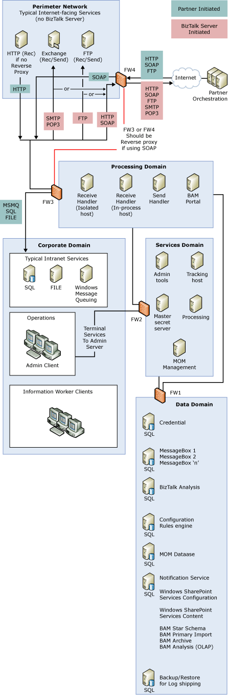

# Large Distributed Architecture with Information Worker Services
For complete information about designing the system architecture for BizTalk Server deployment, see [Sample BizTalk Server Architectures](../core/sample-biztalk-server-architectures.md).  
  
 Business Activity Monitoring (BAM) gives information workers visibility into the business processes and direct communication with partners. This presents a different set of requirements for securing these services. Information workers are likely to have accounts in the corporate domain and not in the data domain, and they need access service interfaces domain to access to some of the data BizTalk Server generates.  
  
 The following figure shows a distributed BizTalk Server architecture that includes BAM.  
  
   
Distributed BizTalk Server Architecture with Information Worker Services  
  
 Compared to the architecture shown in [Large Distributed Architecture](../core/large-distributed-architecture.md), the distributed architecture for the information worker services contains an additional information worker services such as BAM Portal. The information worker services container includes the following servers and services:  
  
-   A BAM Portal server. Business end users use the BAM portal to access the BAM databases to monitor Key Performance Indicators (KPIs), which measure progress toward a business goal, as well as other information about their business process. This server also has the BAM Query Web service and BAM Management Web service.  
  
-   A SQL Server for BAM: the BAM Primary Import database, BAM Archive database, BAM Star Schema database, and BAM Analysis database.  
  
## See Also  
 [Large Distributed Architecture](../core/large-distributed-architecture.md)   
 [Scaled Down Architecture with Information Worker Services](../core/scaled-down-architecture-with-information-worker-services.md)   
 [BAM Security Recommendations](../core/bam-security-recommendations.md)   
 [Sample BizTalk Server Architectures](../core/sample-biztalk-server-architectures.md)
