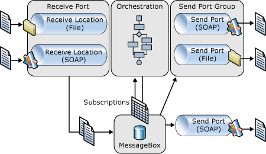

# Lifecycle of a Message
The following figure provides a high-level overview of the BizTalk Server architecture from a messaging perspective.  
  
   
  
 In this simplified view, a message is received through a receive location defined in a given receive port. This message is processed by the receive location and then published to the MessageBox database, the main persistence and routing mechanism for BizTalk Server. The MessageBox evaluates active subscriptions and routes the message to those orchestrations and send ports with matching subscriptions. Orchestrations may process the message and publish messages through the MessageBox to a send port where it is pushed out to its final destination.  
  
 The following are key components involved in BizTalk Server message processing.  
  
## Receive Ports and Receive Locations  
 A *receive port* is a collection of one or more receive locations that define specific entry points into BizTalk Server. A *receive location* is the configuration of a single endpoint (URL) to receive messages. The location contains configuration information for both a receive adapter and a receive pipeline. The *adapter* is responsible for the transport and communications part of receiving a message. Examples include the File adapter and SOAP adapter, each of which receives messages from different types of sources. The receive pipeline is responsible for preparing the message for publishing into the MessageBox. A *pipeline* is a series of components that are executed in sequence, each providing specific processing to a message such as decryption/encryption, parsing, or validation. For more information about pipelines, receive ports, and receive locations, see [Artifacts](../core/artifacts.md).  
  
## Send Ports and Send Port Groups  
 A *send port* is the combination of a send pipeline and a send adapter. A send port group is a collection of send ports and works much like an e-mail distribution list. A message sent to a send port group will be sent to all send ports in that group. The send pipeline is used to prepare a message coming from BizTalk Server for transmission to another service. The send adapter is responsible for actually sending the message using a specific protocol such as SOAP, or FTP. For more information on send ports and send port groups, see [Artifacts](../core/artifacts.md).  
  
## Orchestrations  
 Orchestrations can subscribe to (receive) and publish (send) messages through the MessageBox. In addition, orchestrations can construct new messages. Messages are received using the subscription and routing mechanism already discussed. When subscriptions are filled for orchestrations, a new instance is activated and the message is delivered, or in the case of instance subscriptions, the instance is rehydrated if necessary and the message is then delivered. When messages are sent from an orchestration, they are published to the MessageBox in the same manner as a message arriving at a receive location with the appropriate properties is inserted into the database for use in routing. For more information about orchestrations, see [Artifacts](../core/artifacts.md).  
  
## MessageBox Database  
 The heart of the publish/subscribe engine in BizTalk Server is the MessageBox database. The MessageBox is made up of two components: one or more Microsoft SQL Server databases and the Message Agent. The SQL Server database provides the persistence store for many things including messages, message properties, subscriptions, orchestration states, tracking data, and host queues for routing. For more information about the MessageBox database, see [The MessageBox Database](../core/the-messagebox-database.md).  
  
## Hosts and Host Instances  
 A *host* is a logical representation of a Microsoft Windows process that executes BizTalk Server artifacts such as send ports and orchestrations. A *host instance* is the physical representation of a host on a specific server. A host can be either an in-process host, which means it is owned and managed by BizTalk Server, or an isolated host, which means that the BizTalk Server code is running in a process that is not controlled by BizTalk Server. A good example of an isolated host is Internet Information Services (IIS), which hosts the receive functionality of the HTTP and SOAP adapters. Hosts are defined for an entire BizTalk Server group; a collection of BizTalk Servers that share configuration, MessageBoxes, ports, and so on. For more information about hosts and host instances, see [Entities](../core/entities.md).  
  
## Saving a Message Body  
 There are three ways to save a message body.  
  
### From the Admin MMC group hub page queries  
 This method is for messages in the MessageBox database only.  
  
-   View a Service Instance.  
  
-   Open the **Service Instance Details** dialog box.  
  
-   Click the **Messages Tab** to view the list of messages associated with this instance.  
  
-   Either right-click the message, and then click **Save**.  
  
     -or-  
  
-   Double-click the message to open it in the **Message Viewer**, and click **Save**.  
  
### From the Operations OM  
  
-   Use **GetInstance** to retrieve a Service Instance object.  
  
-   Use **Instance.Messages [ ]** to enumerate all messages which the service instance currently references.  
  
-   Use methods on the message object such as **Message.BodyPart [ ]** and **Message.Context [  ]** to access and save it.  
  
### From the DTA  
  
-   Retrieve messages from the DTA using the **GetTrackedInstance** and **GetTrackedmessage** API calls.  
  
## See Also  
 [Runtime Architecture](../core/runtime-architecture.md)