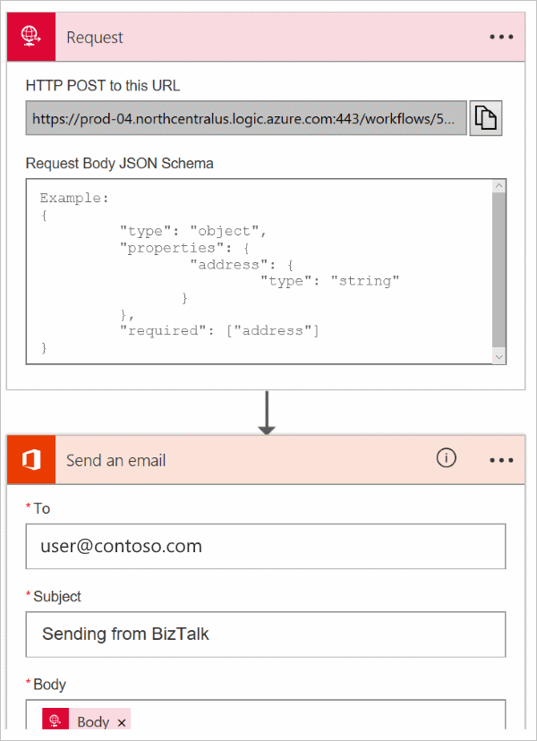

# Logic App Adapter

## Overview
BizTalk Server uses the Logic Apps adapter to receive messages from an Azure logic app, or send messages to an Azure logic app. 

In Azure, we create a logic app. This logic app uses the BizTalk Connector to connect to a receive location that you create on your BizTalk Server. This topic assumes you have some familiarity with Azure Logic Apps. If you're new to logic apps, we suggest [learning more about them](https://azure.microsoft.com/documentation/articles/app-service-logic-what-are-logic-apps/), and even [creating your own logic app](https://azure.microsoft.com/documentation/articles/app-service-logic-create-a-logic-app/).

In this topic, we list the steps to receive a message in BizTalk Server from a logic app. Put another way, the logic app sends messages to a BizTalk Server. The receive-side uses applications in IIS to handle the communication with the Azure service. If BizTalk Server is on-premises, you also install a data gateway on the BizTalk Server, and create a gateway in Azure. 

If BizTalk Server is installed on an Azure virtual machine (VM), then you can choose to expose the VM as an HTTP endpoint (you get a URL), or don't expose it as an HTTP endpoint. If you expose it, then you don't need to use the gateway. You can enter your URL in the BizTalk Connector in your logic app. If you don't expose the VM (no URL), then you need to use the gateway. These steps are listed in this topic.

We also show you how to send messages from BizTalk Server to an Azure logic app. Put another way, the logic app receives messages from BizTalk Server. The send side is fairly straightforward, as you will see in this topic.

Use this topic to create a receive location and a send port using the Logic Apps adapter. You can use the LogicApp adapter in a on-premises (joined to your domain) BizTalk Server, or an Azure virtual machine running BizTalk Server. 

## Requirements

- An Azure subscription to sign-in to the Azure portal, and create a logic app.
- Optional. To send a test message to your logic app, install an HTTP testing tool, such as [Fiddler](http://www.telerik.com/fiddler) or [Postman](https://www.getpostman.com/). If you use another method to send a message to a logic app, you don't have to use these tools. 

## Receive messages from a logic app

There are a few steps involved for BizTalk Server to receive messages from a logic app. This section lists these steps. It's possible the user interface in Azure changes, so some of the steps may not be exactly as listed. 

#### Prerequisites

- If BizTalk Server is on-premises, install and configure the [on-premises data gateway](https://azure.microsoft.com/documentation/articles/app-service-logic-gateway-install/) for Logic Apps. Then, in Azure, [create the data gateway resource](https://azure.microsoft.com/documentation/articles/app-service-logic-gateway-connection/) to connect to your BizTalk Server.
- If BizTalk Server is installed on an Azure VM, and the VM is not exposed as an HTTP endpoint, then install and configure the [on-premises data gateway](https://azure.microsoft.com/documentation/articles/app-service-logic-gateway-install/) for Logic Apps. Then, in Azure, [create the data gateway resource](https://azure.microsoft.com/documentation/articles/app-service-logic-gateway-connection/) to connect to your BizTalk Server.
- If BizTalk Server is installed on an Azure VM, and the VM is exposed as an HTTP endpoint, then the gateway is not needed or used. 

### Step 1: Install the Logic App adapter

The Logic App adapter is a separate download, and is not included with the BizTalk Server installation. 

> [!IMPORTANT] 
> To download the LogicAppAdapter.iso:
> 
> 1. Go to [Microsoft BizTalk Server Adapter for Logic Apps](https://www.microsoft.com/download/details.aspx?id=54287), and save. 
> 2. Open the LogicAppAdapter.iso, and run the **LogicApp Adapter.msi** file to install.

1. On your BizTalk Server, download and install the Logic App adapter. 

2. Double-select **LogicApp Adapter.msi** to install. Accept the license agreement, and **Install**.
3. **Finish** the install, an	d restart the **BizTalkServerApplication** and **BizTalkServerIsolatedHost** host instances.

Once installed, you have the following:

- The LogicApp adapter is added to BizTalk Administration.
- The send handler is created, and uses the BizTalkServerApplication host.
- The receive handler is created as a WCF service, and uses the BizTalkServerIsolatedHost host.
- The `C:\Program Files (x86)\Microsoft BizTalk Server 2016\LogicApp Adapter` folder is created, and includes two services: Management and ReceiveService. 

	The **Management** is used by the BizTalk Connector in a logic app to connect to BizTalk Server using the data gateway. This management service allows BizTalk Server to receive messages from an Azure logic app using the data gateway. This service is only used on the receive-side of BizTalk. It is not used by the send-side.

	The **ReceiveService** is used by the BizTalk Connector in a logic app when you enter the receive location. The **ReceiveService** is responsible for sending the messages from the logic app. This service is only used on the receive-side of BizTalk. It is not used by the send-side.


### Step 2: Create the IIS applications

The IIS applications use the Management and ReceiveService services.

You can run the IIS applications using a new application pool, or an existing application pool. The identity of the AppPool requires membership to the same groups as the account that runs the BizTalk services, such as the BizTalk Application Users and BizTalk Isolated Host Users groups.  

> [!TIP] 
> If you create a new application pool, then keep the default .NET CLR version, and managed pipeline. Remember, choose an identity (Advanced Settings) that has membership to the same BizTalk groups as your BizTalk service account. 

#### Create the Management IIS application
The URL of this IIS application is used by the BizTalk Connector (in your logic app) to use the data gateway on your BizTalk Server.

1. Open the Internet Information Services (IIS) Manager.
2. Right-click **Default Web Site**, and **Add Application**. In this new application: 

	1. Enter the **Alias** (name) for your application, such as **IISLogicApp**. 
	2. **Select** the application pool.
	3. Set the **Physical path** to `C:\Program Files (x86)\Microsoft BizTalk Server 2016\LogicApp Adapter\Management`. 
	3. **Test Settings** to confirm the application pool identity passes the Authentication and Authorization tests.

3. Select **OK** to save your changes.
4. Open a web browser, and go to `http://localhost/YourApplicationAlias/schemas?api-version=2016-10-26`, such as `http://localhost/IISLogicApp/Schemas?api-version=2016-10-26`. Either a list of schemas display, or you are prompted to open/save `schemas.json`. The actual result depends on your web browser. If neither of these happens, then your AppPool identity may be missing membership to the BizTalk groups.

#### Create the BizTalk ReceiveService IIS application
The URL of this IIS application is used by the BizTalk Connector (in your logic app) when you choose the receive location. 

1. Open the Internet Information Services (IIS) Manager.
2. Right-click **Default Web Site**, and **Add Application**. In this new application: 

	1. Enter the **Alias** (name) for your application, such as **ReceiveWCFService**. 
	2. **Select** the same application pool as the previous IIS application.
	3. Set the **Physical path** to `C:\Program Files (x86)\Microsoft BizTalk Server 2016\LogicApp Adapter\ReceiveService`. 
	3. **Test Settings** to confirm the application pool identity passes the Authentication and Authorization tests.

3. Select **OK** to save your changes.


### Step 3: Create a logic app

1. In the [Azure portal](https://portal.azure.com), create a new logic app.
2. Add the **When an HTTP request is received** trigger.
3. Add the **BizTalk Server - Prepare message from JSON** action. 
4. **Optional**: Select **Connect via on-premise data gateway**, and enter the following: 

  	| Property | Description |
   | --- | --- |
    | BizTalk Server URL | Enter the fully qualified domain name (FQDN) of the BizTalk Management in IIS application URL. For example, enter `http://BizTalkServerName.corp.contoso.com/IISLogicApp/`. |
    | Authentication Type | Select **Windows**. |
   | Username | Enter the identity of the IIS application pool. |
   | Password | Enter the password of the IIS application pool. |
   | Gateway | Select the gateway you created. |

	> [!TIP] 
	> Remember, the data gateway is only required if:
	> - You're using an on-premises BizTalk Server
	> - You're using a BizTalk Server Azure virtual machine *and* the VM is NOT exposed as an HTTP endpoint (no URL)

5. Select **Create**. 
6. Configure the action. For **Body**, select the HTTP body output. For **Schema**, select the schema you want to use. 

	> [!NOTE] 
	> This step assumes you are familiar with schemas in BizTalk, and know which schema you want. If you're not sure, then deploy the HelloWorld SDK sample, update its artifacts to use the Logic App adapter, and use its schema and sample message. 

7. Add a new step, and select the **BizTalk Server - Send message** action. For  **Receive Location**, select the URL from the drop-down list, or enter the fully qualified domain name (FQDN) of the ReceiveService IIS application URL. For example, enter `http://BizTalkServerName.corp.contoso.com/ReceiveWCFService/Service1.svc`.

	> [!TIP] 
	> When you create the receive location, this exact URL will also be entered in the receive location transport properties as the **Public Address** (General tab).

	For **Body**, select the body output from the previous BizTalk Server action. 

8. **Save** your changes. 

When you save, the HTTP Request trigger automatically creates a URL. Copy this URL; you need it in **Step 5: Send a message**.

### Step 4: Create a receive port and a receive location

> [!NOTE] 
> Instead of creating your own receive ports and receive location, you can deploy the HelloWorld SDK sample. Update the artifacts to use the Logic Apps adapter. 
 
This section lists the steps to create your own artifacts. 

1. In BizTalk Server Administration, expand **BizTalk Server Administration**, expand **BizTalk Group**, expand **Applications**, and then expand the application you want to run the receive location. For example, expand **BizTalk Application 1**.
2. Right-select **Receive Ports**, select **New**, and select **One-way Receive Port**.
3. In the Receive Port properties, enter the following:  

	| Use this | To do this |
	| --- | --- |
	| **Name** | Enter a name for the receive port. For example, enter **LAReceivePort**. |
	| **Authentication** | Options: <br/><ul><li>No Authentication: Default. Disables authentication.</li><li>Drop messages if authentication fails: Enables authentication but to drop unauthenticated messages.</li><li>Keep messages if authentication fails: Click this option to enable authentication and keep unauthenticated messages. </li></ul>|
	| **Enable routing for failed messages** | Routes any message that fails processing to a subscribing application (such as another receive port or orchestration schedule). Uncheck this option to suspend failed messages and generate a negative acknowledgment (NACK). The default value is cleared. For more information, see [How to Enable Routing for Failed Messages for a Receive Port](../core/how-to-enable-routing-for-failed-messages-for-a-receive-port.md).|

4. Select **Receive Locations**, and select **New**. 
5. Enter a **Name** for the receive location. For example, enter **LAReceiveLoc**.
6. For the **Type**, select **LogicApp** from the list, and select the **Configure button**. 
7. In the **General** tab, configure the endpoint address for your logic app:

	| Use this | To do this |
	| --- | --- |
	| **Address (URI)** | Required. Enter the BizTalk ReceiveService IIS application URL (`/YourIISApp2Name/Service1.svc`). For example, enter `/ReceiveWCFService/Service1.svc`. |
	| **Public Address** | Required. Enter `http://<your fully qualified machine name>/YourIISApp2Name/Service1.svc`. For example, enter `http://btsProd.northamerica.corp.contoso.com/ReceiveWCFService/Service1.svc`. <br/><br/>This exact URL is also listed in your logic app in the receive location.|

8. **Optional**. In the **Binding** tab, configure any timeout and encoding-related properties of the underlying WCF-WebHttp binding. These properties are helpful when dealing with large messages.

	| Use this | To do this |
	| --- | --- |
	| Open timeout | Enter the time interval it should take for the channel open operation to complete. This value should be greater than or equal to System.TimeSpan.Zero. <br/><br/>Default value: 00:01:00<br/>Maximum value: 23:59:59 |
	| Send timeout |Enter the time interval it should take for the send operation to complete. This value should be greater than or equal to System.TimeSpan.Zero. If you use a request-response receive port, this value specifies a time span for the entire interaction to complete, even if the client returns a large message. <br/><br/>Default value: 00:01:00<br/>Maximum value: 23:59:59|
	| Close timeout | Enter the time interval it should take for the channel close operation to complete. This value should be greater than or equal to System.TimeSpan.Zero. <br/><br/>Default value: 00:01:00<br/>Maximum value: 23:59:59 |
	| Maximum received message size (bytes) | Enter the maximum size, in bytes, for a message including headers, to be received on the wire. The size of the messages is bound by the amount of memory allocated for each message. You can use this property to limit exposure to denial of service (DoS) attacks. <br/><br/>Default value: 65536<br/>Maximum value: 2147483647|
	| Maximum concurrent calls | Enter the number of concurrent calls to a single service instance. Calls in excess of the limit are queued. Setting this value to 0 is equivalent to setting it to Int32.MaxValue. <br/><br/>The default is 200.|

9. **Optional**. In the **Security** tab, configure any security properties. For development purposes, you can choose None:

	| Use this | To do this |
	| --- | --- |
	| Security mode | Options:  <br/><br/><ul><li>None: Messages are not secured during transfer.</li><li>Transport: Security is provided using the HTTPS transport. The SOAP messages are secured using HTTPS. To use this mode, you must set up Secure Sockets Layer (SSL) in Internet Information Services (IIS). </li><li>TransportCredentialOnly: Default. </li></ul> |
	| Transport client credential types | Choose the credential type when using client authentication. Options:  <br/><br/><ul><li>None: No authentication occurs at the transport level.</li><li>Basic: Uses Basic authentication to send user names and passwords in plain text over the network. You must create the domain or local user accounts corresponding to the credentials.</li><li>Digest: Uses Digest authentication to send passwords as a hash value over the network. Only available on domains with domain controllers running Windows Server operating systems authentication. You must create the domain or local user accounts corresponding to client credentials.</li><li>Ntlm: Default. Clients sends the credentials without sending a password to this receive location. You must create the domain or local user accounts corresponding to client credentials.</li><li>Windows: Windows integrated authentication negotiates Kerberos or NTLM, preferring Kerberos if a domain is present. To use Kerberos, it is important to have the client identify the service with a service principal name (SPN). You must create the domain or local user accounts corresponding to client credentials.</li><li>Certificate: Uses a client certificate. The CA certificate chain for the client X.509 certificates must be installed in the Trusted Root Certification Authorities certificate store of this computer so that the clients can authenticate to this receive location.</li><li>InheritedFromHost</li></ul> |
	| Use Single Sign-On | |


10. **Optional**. In the **Messages** tab, use the **Outbound HTTP Headers** property to add any custom headers, and use the additional properties to help with faults: 

	| Use this | To do this |
	| --- | --- |
	|Outbound HTTP Headers | Enter any HTTP headers that you want stamped on the response message. | 
	| Disable location on failure | Disables the receive location if inbound processing fails due to a receive pipeline failure or a routing failure. Default is unchecked.|
	| Suspend request message on failure | Suspends the request message if inbound processing fails due to a receive pipeline failure or a routing failure. Default is unchecked.|
	| Include exception detail in faults | When an error occurs, returns any SOAP faults to help debugging. Default is unchecked.|

[Managing Receive Locations](../core/managing-receive-locations.md) describes the additional properties. 

### Step 5: Send a message

1. Open Fiddler or Postman (or whatever you prefer).
2. Paste the URL of the Request trigger from your logic app. You copied this URL in Step 3. 
3. Select **POST** as the HTTP verb, and set the **Content-type** header to `application/json`. In the body, paste the following JSON:  

    ```json
    {“hello”:”world”}
    ```

4. Because this is a one-way call to BizTalk, the result should be an HTTP 202. If you're using the HelloWorld SDK sample, go to your BizTalk server. There may be a file in your send folder. 


## Send messages to a logic app

### Step 1: Install the Logic Apps adapter

The Logic Apps adapter is a separate download, and is not included with the BizTalk Server installation.

1. Go to [Microsoft BizTalk Server Adapter for Logic Apps](https://www.microsoft.com/download/details.aspx?id=54287), and save. 
2. Open the LogicAppAdapter.iso, and run the **LogicApp Adapter.msi** file to install.
3. **Finish** the install, and restart the **BizTalkServerApplication** and **BizTalkServerIsolatedHost** host instances.

Once installed, you have the following:

- The LogicApp adapter is added to BizTalk Administration
- The send handler is created, and uses the BizTalkServerApplication host.
- The receive handler is created as a WCF service, and uses the BizTalkServerIsolatedHost host.
- The `C:\Program Files (x86)\Microsoft BizTalk Server 2016\LogicApp Adapter` folder is created, and includes two services: Management and ReceiveService. These services are not used to send messages to a logic app. 


### Step 2: Create a logic app

1. In the [Azure portal](https://portal.azure.com), create a new logic app.
2. Add the **When an HTTP request is received** trigger
3. Add the **Office 365 Outlook - Send an email** action. For the **To** address, enter your Office 365 address. For the **Subject**, enter `Sending from BizTalk`. For **Body**, choose the *Body* output from the **When an HTTP request is received** trigger. 
4. Your logic app looks similar to: 

	

5. Copy the HTTP POST URL that is automatically created when you save the logic app; you need this URL in the next step. You may have to close and reopen the logic app to see the URL.  


### Step 3: Create a Send Port

For BizTalk Server to send messages to a logic app, the logic app must have a **Manual** trigger, such as **Manual - When an HTTP request is received**. 

1. In BizTalk Server Administration, expand **BizTalk Server Administration**, expand **BizTalk Group**, expand **Applications**, and then expand the application you want to run the send port. For example, expand **BizTalk Application 1**.
2. Right-select **Send Ports**, select **New**, and select **Static One-way Send Port**.
3. Enter a **Name** for the send port. For example, enter **LASendPort**.
4. For the **Type**, select **LogicApp** from the list, and select the **Configure** button. 
5. In the **General** tab, configure the **Callback URI** of your logic app trigger. There are two ways to do this: 

	**Option 1** : Paste the HTTP POST URL you copied in the previous step in the **Trigger (Callback URI)** property. You can also copy the URI using the following steps:  
  
   1. In the [Azure portal](https://portal.azure.com), open your logic app in the Logic Apps designer (edit mode). 
   2. Select the **When an HTTP request is received** card, and copy the **URL**. 
   3. In your send port, paste this URL in the **Trigger (Callback URI)** property.

      > [!TIP] 
      > You can also use your management APIs to get this URI.

      **Option 2** : If you don't know the Callback URI for your trigger, select **Configure**, and sign-in to Azure. Then, use the drop-down lists to choose your **Subscription**, **Resource Group**, **Logic App**, and **Trigger**.
 
6. **Optional**. In the **Binding** tab, configure any timeout and encoding-related properties of the underlying WCF-WebHttp binding. These properties are helpful when dealing with large messages.

	| Use this | To do this |
	| --- | --- |
	| Open timeout | Enter the time interval it should take for the channel open operation to complete. This value should be greater than or equal to System.TimeSpan.Zero. <br/><br/>Default value: 00:01:00<br/>Maximum value: 23:59:59 |
	| Send timeout |Enter the time interval it should take for the send operation to complete. This value should be greater than or equal to System.TimeSpan.Zero. If you use a request-response receive port, this value specifies a time span for the entire interaction to complete, even if the client returns a large message. <br/><br/>Default value: 00:01:00<br/>Maximum value: 23:59:59|
	| Close timeout | Enter the time interval it should take for the channel close operation to complete. This value should be greater than or equal to System.TimeSpan.Zero. <br/><br/>Default value: 00:01:00<br/>Maximum value: 23:59:59 |
	| Maximum received message size (bytes) | Enter the maximum size, in bytes, for a message including headers, to be received on the wire. The size of the messages is bound by the amount of memory allocated for each message. You can use this property to limit exposure to denial of service (DoS) attacks. <br/><br/>The logic appa adapter leverages the [WebHttpBinding class](https://msdn.microsoft.com/library/system.servicemodel.webhttpbinding.aspx) in the buffered transfer mode to communicate with an endpoint. For the buffered transport mode, the [WebHttpBinding.MaxBufferSize](https://msdn.microsoft.com/library/system.servicemodel.webhttpbinding.maxbuffersize.aspx) property is always equal to the value of this property.  <br/><br/>Default value: 65536<br/>Maximum value: 2147483647 |


7. **Optional**. In the **Messages** tab, use the **Outbound HTTP Headers** property to add any custom headers on the outgoing message. 
8. Select **OK** to save your configuration. 

[Managing Send Ports and Send Port Groups](../core/managing-send-ports-and-send-port-groups.md) describes the additional send port properties. 

### Step 4: Send some messages

You can create a receive port and receive location using the File adapter. Be sure your logic app is enabled.

1. Create a receive port, such as *FileSendPort*,
2. Create a receive location, and set the properties similar to:  

  	| Property | Sample input |
    | --- | --- |
   | Receive folder | C:\temp\In\ |
   | File mask | *.txt |
   | Pipeline | PassThruReceive |

3. In the send port you created, set the **Filter** to:

  	| Property | Operator | Value |
    | --- | --- | --- |
    | BTS.ReceivePortName |  == | *FileSendPort* |

4. Create a text file (FileName.txt) with the following text. Use this text file as your sample message: 

  	```
    <Data>
      <DataID>DataID_0</DataID>
      <DataDetails>DataDetails_0</DataDetails>
    </Data>
    ```

5. Copy your sample message (FileName.txt) into the receive folder. The send port sends the .txt file to the logic app using the URI you entered. Your logic app receive the files. If you used the Office 365 Outlook connector, your *To* email address should receive the email, with the sample message.

## Next
[What are Logic Apps](https://azure.microsoft.com/documentation/articles/app-service-logic-what-are-logic-apps/)  

[Create a logic app](https://azure.microsoft.com/documentation/articles/app-service-logic-create-a-logic-app/)

[Using adapters in BizTalk Server](../core/using-adapters.md)