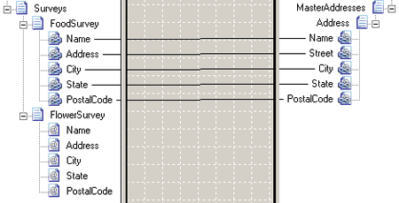
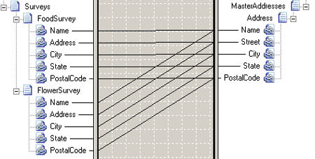

# Loop Paths
An element in a schema is looping if its Max Occurs property is greater than 1. A loop path occurs when you draw a link between a looping element in the source schema and a looping element in the destination schema.  
  
## Configuring a Loop Path  
 BizTalk Mapper automatically handles the looping records when you create a loop path.  
  
 You can configure a loop path in a map by linking a field in a looping record in the source schema to a field that is in a looping record in the destination schema. The figure below shows a map that copies only food survey records into a master address list.  
  
   
Loop Path Map  
  
## Multiple Loop Paths  
 A multiple loop path occurs in a map when you link fields contained by two or more looping records to fields contained in a single looping record. The following figure shows an attempt to combine addresses collected from two different surveys into a single master address list.  
  
   
Map With Multiple Loop Paths (Incorrect)  
  
 This map will not produce the expected results. When the Mapper encounters multiple loop paths during compilation, it produces a warning and selects the first loop path by default. In order to combine the two different addresses into a single master address list, use a **Looping** functoid as shown in the map below.  
  
   
Looping Functoid Map (Correct)  
  
 The **Looping** functoid should be used instead of multiple loop paths in the following scenarios:  
  
1.  When the Mapper does not produce the desired output in a multiple loop paths scenario.  
  
2.  To combine multiple repeating structures in an input instance message into a single repeating structure in the output instance message.  
  
3.  To convert a flat schema to a hierarchical schema by mapping a single record to multiple records. This is a common operation in converting flat schemas to Microsoft Commerce Server catalogs.  
  
## See Also  
 [How to Add Looping Functoids to a Map](../core/how-to-add-looping-functoids-to-a-map.md)   
 [Looping Functoid](../core/looping-functoid.md)