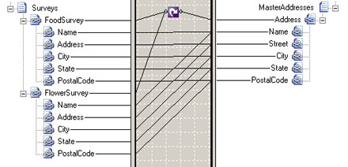

# Looping Functoid

## Overview & example
The **Looping** functoid combines multiple records or fields in the source schema into a single record in the destination schema.  
  
 The following figure shows a **Looping**functoid used in a map to combine addresses collected from two different surveys into a single master address list.  
  
> [!NOTE]
>  The **Looping** and **Value Mapping (Flattening)** functoids should not be used together. If both are used together, it results in a compiled map that assumed there is no source looping dependency for the target nodes that are below the **Looping** functoid.  
  
   
  
 The **FoodSurvey** and **FlowerSurvey** looping records of the source schema are mapped to the looping **Address** record of the destination schema. If an input instance message has three **FoodSurvey** records and two **FlowerSurvey** records, the **Looping**functoid combines these to create five **Address** records in the output instance message.  
  
 The following code is a sample input instance message.  
  
```  
<ns0:Surveys xmlns:ns0="http://LoopingFunctoid.Surveys">  
    <FoodSurvey Name="Karin Zimprich" Address="345 N 63rd St" City="Boston" State="MA" PostalCode="07485" />  
    <FoodSurvey Name="Wendy Wheeler" Address="7890 Broadway" City="Columbus" State="OH" PostalCode="46290" />  
    <FoodSurvey Name="Florian Voss" Address="1234 Main St" City="Denver" State="CO" PostalCode="97402" />  
    <FlowerSurvey Name="Kelly Focht" Address="456 1st Ave" City="Miami" State="FL" PostalCode="81406" />  
    <FlowerSurvey Name="Jim Kim" Address="567 2nd Ave" City="Seattle" State="WA" PostalCode="98103" />  
</ns0:Surveys>  
```  
  
 This input instance message produces the following output instance message when processed by the map in the preceding figure.  
  
```  
<ns0:MasterAddresses xmlns:ns0="http://LoopingFunctoid.MasterAddresses">  
    <Address Name="Karin Zimprich" Street="345 N 63rd St" City="Boston" State="MA" PostalCode="07458"/>  
    <Address Name="Wendy Wheeler" Street="7890 Broadway" City="Columbus" State="OH" PostalCode="46290"/>  
    <Address Name="Florian Voss" Street="1234 Main St" City="Denver" State="CO" PostalCode="97402"/>  
    <Address Name="Kelly Focht" Street="456 1st Ave" City="Miami" State="FL" PostalCode="81406"/>  
    <Address Name="Jim Kim" Street="567 2nd Ave" City="Seattle" State="WA" PostalCode="98103"/>  
</ns0:MasterAddresses>  
```  
  
 The **FoodSurvey** and **FlowerSurvey** message addresses have been combined. The combined message does not indicate the source of each address. If you want to track the source, add a **Source** attribute to the **Address** record of the **MasterAddress** schema and map a constant value. To set this value, connect the **FoodSurvey** field to the new **Source** field. On the connector line, modify the **Link Properties** &#124; **Compiler** &#124; **Source Links** property to "Copy name". Repeat this process for the **FlowerSurvey** field. Reprocessing the input message from above yields the following output:  
  
```  
<ns0:MasterAddresses xmlns:ns0="http://LoopingFunctoid.MasterAddresses">  
    <Address Name="Karin Zimprich" Street="345 N 63rd St" City="Boston" State="MA" PostalCode="07458" Source="FoodSurvey"/>  
    <Address Name="Wendy Wheeler" Street="7890 Broadway" City="Columbus" State="OH" PostalCode="46290" Source="FoodSurvey"/>  
    <Address Name="Florian Voss" Street="1234 Main St" City="Denver" State="CO" PostalCode="97402" Source="FoodSurvey"/>  
    <Address Name="Kelly Focht" Street="456 1st Ave" City="Miami" State="FL" PostalCode="81406" Source="FlowerSurvey"/>  
    <Address Name="Jim Kim" Street="567 2nd Ave" City="Seattle" State="WA" PostalCode="98103" Source="FlowerSurvey"/>  
</ns0:MasterAddresses>  
```  

## Relationships with nodes

 Relationships among nodes affect the behavior of the **Looping** functoid. For example, linking both a child node and its parent in the source schema to the **Looping** functoid prevents the destination node from being created.  
  
 Functoids are also affected by the relationships among source nodes. Connecting a functoid to non-sibling child fields of source nodes of the **Looping** functoid may produce unexpected results. For example, using the **String Concatenate** functoid to combine the **FoodSurvey** Name field and **FlowerSurvey** Address field into the Address Name field in **MasterAddress** would produce the following output instance message:  
  
```  
<ns0:MasterAddresses xmlns:ns0="http://LoopingFunctoid.MasterAddresses">  
    <Address Street="345 N 63rd St" City="Boston" State="MA" PostalCode="07458"/>  
    <Address Street="7890 Broadway" City="Columbus" State="OH" PostalCode="46290"/>  
    <Address Street="1234 Main St" City="Denver" State="CO" PostalCode="97402"/>  
    <Address Name="Kelly Focht" Street="456 1st Ave" City="Miami" State="FL" PostalCode="81406"/>  
    <Address Name="Jim Kim" Street="567 2nd Ave" City="Seattle" State="WA" PostalCode="98103"/>  
</ns0:MasterAddresses>  
```  
  
 Notice how the **Name** field is missing for **FoodSurvey** source messages but is present for **FlowerSurvey** source messages.  
  
> [!IMPORTANT]
>  Connecting a functoid to child fields of source nodes of the **Looping** functoid may produce unexpected results if the source nodes are not siblings.  
  
 The **Looping** functoid is a powerful construct that you can use to create conditional loops and to map schemas to catalogs. There are also some effects of overlapping **Looping** functoid paths you need to take into account.  
  
## Next steps
  
-   [Conditional Looping](../core/conditional-looping.md)  
  
-   [Flat Schema to Catalog](../core/flat-schema-to-catalog.md)  
  
-   [Loop Paths](../core/loop-paths.md)  
  
## See Also  
 **Table Looping Functoid Reference** [!INCLUDE[ui-guidance-developers-reference](../includes/ui-guidance-developers-reference.md)]
