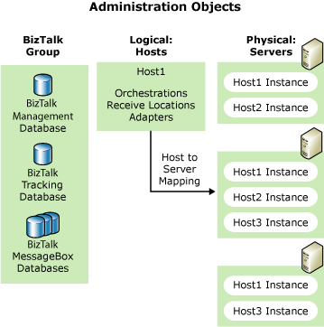

# Managing BizTalk Hosts and Host Instances
A [!INCLUDE[btsBizTalkServerNoVersion](../includes/btsbiztalkservernoversion-md.md)] Host is a logical set of zero or more [!INCLUDE[btsBizTalkServerNoVersion](../includes/btsbiztalkservernoversion-md.md)] run-time processes in which you deploy items such as adapter handlers, receive locations (including pipelines), and orchestrations. For more information about hosts, see [Hosts](../core/hosts.md).  
  
 A host instance is the process where the message processing, receiving, and transmitting occurs. You install a host instance on each server running [!INCLUDE[btsBizTalkServerNoVersion](../includes/btsbiztalkservernoversion-md.md)] that has one or more hosts mapped to that server. For more information about host instances, see [Host Instances](../core/host-instances.md).  
  
 Hosts have the following characteristics:  
  
- Hosts are the logical containers of [!INCLUDE[btsBizTalkServerNoVersion](../includes/btsbiztalkservernoversion-md.md)] objects.  
  
- Only one instance of a specific host can exist on each server.  
  
- You can map one host to multiple servers.  
  
  Host instances have the following characteristics:  
  
- Host instances are the physical containers of [!INCLUDE[btsBizTalkServerNoVersion](../includes/btsbiztalkservernoversion-md.md)] objects.  
  
- You create a host instance when you map a server to a host.  
  
- Multiple host instances (of different hosts) can exist on a server when load balancing or for failover.  
  
  The following figure shows the relationship between servers, hosts, and host instances.  
  
    
  Relationship between hosts, host instances, and servers  
  
## In This Section  
  
-   [How to Create a BizTalk Server Hosting Environment](../core/how-to-create-a-biztalk-server-hosting-environment.md)  
  
-   [How to Create a New Host](../core/how-to-create-a-new-host.md)  
  
-   [How to Modify Host Properties](../core/how-to-modify-host-properties.md)  
  
-   [How to Delete a Host](../core/how-to-delete-a-host.md)  
  
-   [How to Add a Host Instance](../core/how-to-add-a-host-instance.md)  
  
-   [How to Start a Host Instance](../core/how-to-start-a-host-instance.md)  
  
-   [How to Stop a Host Instance](../core/how-to-stop-a-host-instance.md)  
  
-   [How to Delete a Host Instance](../core/how-to-delete-a-host-instance.md)  
  
-   [How to Modify Host Instance Properties](../core/how-to-modify-host-instance-properties.md)