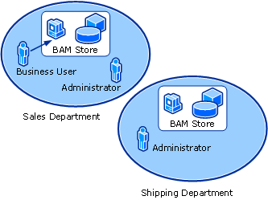

# Managing Distributed Navigation of Remote Activities
Distributed navigation of remote activities is the process by which a business user navigates to and views activities that exist in separate BAM databases. When you configure the BAM infrastructure to provide distributed navigation, the remote activity is accessible to the business user in the BAM portal. When the user clicks the activity, the activity is opened on the remote BAM portal. At this point the user has been transferred in a transparent and seamless manner to the remote BAM portal and can navigate to the activity search, aggregations, and alert management for the activity as if the activity existed on the user's home data store.  
  
## Why Use Distributed Navigation of Activities and Documents?  
 Distributed navigation allows organizations to retain control of departmental BAM databases without having to agree on a single location for the activities. This also allows for better performance from your BAM databases by distributing the system load of the activities throughout your environment.  
  
 The following figure illustrates a scenario in which distributed navigation addresses the needs of the business user to have easy access to activities that are managed by separate departments in a company. The administrators in those departments maintain control of the business processes specific to that department.  
  
 In this scenario there are the following stakeholders:  
  
- An administrator who owns the infrastructure for the sales department. The administrator is solely responsible for the availability and security of the department’s data.  
  
- An administrator who owns the infrastructure for the shipping department. He is responsible for meeting the needs of the sales.  
  
- A business user in the sales department. The business user sees subsets of the sales data that are included in the views to which the user has been added. The views are created by the administrator who grants the business user access to the view. The business user's primary view of the business is the Purchase Order activity in which she participates. This user is set up to view the home page of the BAM portal maintained by the administrator of the sales department.  
  
  **Using Distributed Navigation in BAM**  
  
    
  
  The administrators want to configure their servers to be as independent as possible, as follows:  
  
- The sales department administrator does not want the acceptance of the orders to stop or the query functionality for his business users to be affected if the shipping department infrastructure is down.  
  
- The shipping department administrator does not want his department to be affected by performance problems in the sales department. He wants his business users to be able to follow the progress of the shipments, even if the sales department is unavailable.  
  
  The goal of distributed navigation is to provide the business end user with access to every view to which they have permissions.  
  
  For example, views A and B are defined in the sales database. The shipping department has view C defined. The business user has permission to view all of these, and accesses the BAM portal specific to the sales department. Allowing the business user to see views A, B, and C in the **MyViews** frame of the portal is accomplished by establishing at least a one-way trust from the sales database to the shipping database.  
  
> [!NOTE]
>  The permissions for the category of business user that can see specified data are defined by the power business user, such as a manager or analyst. The administrators only add users to existing groups or BAM views.  
  
 Distributed navigation of BAM activities also allows the user to see and access distributed activity relationships. When there are activity instances on two different BAM databases that have been related to each other using distributed navigation, the remote related activity is displayed as a related activity in the activity details of the local activity instance. Clicking the related activity opens the activity details page for the activity on the remote portal. For more information about the related activities of the activity search results page in the BAM portal, a see [Related Activities](../core/related-activities.md).  
  
> [!IMPORTANT]
>  For users on each computer to see related activities located in different BAM databases, you must enable two-way distributed navigation between all the BAM databases.  
  
 If you enable one-way distributed navigation between two Primary Import databases when you configure distributed navigation, users will have an asymmetrical experience during the navigation.  
  
 The user experience will be such that the user will see the different activities; however, when the user drills into the instance-level data, the section where related instances are displayed will be empty. To resolve this issue, you must configure the distributed navigation path back to the home BAM portal server for the user.  
  
 For example, consider the following scenario:  
  
- You have Computer 1 on which you have an activity called Purchase Order and a view called SalesManager.  
  
- You have Computer 2 on which you have an activity called Shipping Order and a view called SalesManager  
  
- You add an activity called PO_1 to Purchase Order on Computer 1  
  
- You add an activity called SO_1 to Shipping Order on Computer 2  
  
- On Computer 2 you add the relationship,  SO_1 to the PurchaseOrder PO_1 Activity on Shipping Order  
  
- When a user drills down into the SO_1 activity from Computer 1 the SO_1 activity is discoverable  
  
- If the user drills down the SO_1 on Computer 2, the PO_1 activity is not visible  
  
  To rectify this, you will need to add the relationship on Computer 1.  
  
## In This Section  
  
-   [How to Configure Navigation Between Distributed Activities](../core/how-to-configure-navigation-between-distributed-activities.md)  
  
## See Also  
 [Managing BAM](../core/managing-bam.md)