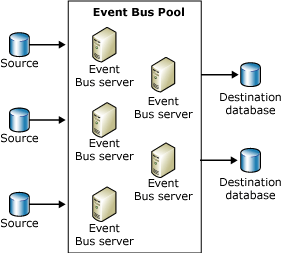

# Managing the BAM Event Bus Service
The BAM Event Bus Service, also known as the Tracking Data Decode Service (TDDS), processes tracking data (streams) stored in a source database and persists that data in such a way that it is easy to query it at a later date.  
  
 The BAM Event Bus service moves Business intelligence data to the BAM Primary Import database and BizTalk Health Monitoring data to the DTA database. The BAM Event Bus service runs as a sub-service within the BizTalk service.  
  
 You monitor the activities of a transactional application, such as Microsoft BizTalk® Server, by collecting event data during execution, and then temporarily storing the data in the same database as the application state—for example, the MessageBox database.  
  
> [!NOTE]
>  Avoid creating more than one application instance that hosts tracking for different BizTalk Groups on the same computer. If instances that track different BizTalk Groups exist on the same computer, you will not be able to distinguish which events belong to which BizTalk Groups in the BizTalk Administration Console or in the event log because all BizTalk Groups are displayed with the same name.  
  
 The BAM Event Bus service reads the event data, decodes it, and then stores it in a Microsoft SQL Server™ database, where you can easily query the data.  
  
 The BAM Event Bus service provides the following advantages:  
  
- Event data always matches the state of the application, and it never exposes uncommitted progress.  
  
- Performance impact on the running application is minimal because the event data saves as few records in the same local transaction as the application state change.  
  
- SQL Server storage for the application state is further optimized for execution performance. The data is decoded by TDDS and stored in a separate database, either the BAM Primary import database or the DTA database. When reports are generated the data is queried from the database and does impact the Message Box database, which stores the application state.  
  
- The work to store the event data in a form that you can query is not done in the application servers and databases. It is offloaded to the machines that run the BAM Event Bus service and the Destination SQL Server database.  
  
- Event data is processed with low latency which allows TDDS queries process faster. The BAM Event Bus services coordinate their resources to achieve the minimum possible latency.  
  
  The BAM Event Bus server coordinates its resources by using a connection to a central database, which contains the configuration information. Every minute, each active BAM Event Bus service sends a message to the central database, which contains the state of the BAM Event Bus service at that point in time.  
  
  This message is referred to as a heartbeat message. Each BAM Event Bus service also checks for new work that needs to be done. For example, the BAM Event Bus service checks for sessions that are not owned, such as a MessageBox database that has been added.  
  
  The BAM Event Bus session is the movement of the event data from the source database, such as the MessageBox, to the destination database that contains the event data in a format that you can query. The same BAM Event Bus service can process one or more sessions.  
  
  The following figure shows a group of BAM Event Bus servers, which make up a BAM Event Bus server pool.  
  
    
  Diagram of a BAM Event Bus server pool  
  
## In This Section  
  
-   [BAM Performance Counters](../core/bam-performance-counters.md)  
  
-   [BAM Event Bus Service Stored Procedures](../core/bam-event-bus-service-stored-procedures.md)  
  
-   [BAM Event Bus Service Server Failover](../core/bam-event-bus-service-server-failover.md)  
  
-   [Creating Instances of the BAM Event Bus Service](../core/creating-instances-of-the-bam-event-bus-service.md)