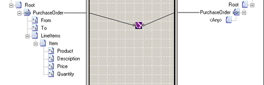

# Mass Copy Functoid
The **Mass Copy** functoid enables your maps to use schemas that include **any** and **anyAttribute** elements. These elements are, in essence, wildcards provided in the XML Schema definition language to match unknown structures or attributes.  
  
 In addition to handling data with unknown structure, the **Mass Copy** functoid enables you to simplify schema development: only the portions of a schema that will be processed need to be specified in detail.  
  
 The **Mass Copy** functoid copies the element in the input instance message corresponding to the source schema node connected to the **Mass Copy** functoid. The functoid also copies any and all of its substructure, and re-creates it in the output instance message at the linked node in the destination schema. Thus, you can also use the **Mass Copy** functoid to copy any source and destination records having identical substructures.  
  
 The following figure shows the **Mass Copy** functoid used in a map.  
  
   
Mass Copy Functoid Map  
  
 Consider the following input instance message.  
  
```  
<ns0:Root xmlns:ns0="http://MassCopy.ComplexDocument">  
    <PurchaseOrder>  
        <From>Kevin F. Browne</From>  
        <To>Northwind Traders</To>  
        <LineItems>  
            <Item>  
                <Product>Laptop Computer</Product>  
                <Description>Thin profile laptop</Description>  
                <Price>1999.95</Price>  
                <Quantity>1</Quantity>  
            </Item>  
        </LineItems>  
    </PurchaseOrder>  
</ns0:Root>  
```  
  
 If the preceding map were used to process this message, the output instance message would be identical to the input instance message.  
  
## See Also  
 [How to Add Mass Copy Functoids to a Map](../core/how-to-add-mass-copy-functoids-to-a-map.md)   
 [Advanced Functoids](../core/advanced-functoids.md)   
 [Basic Functoids](../core/basic-functoids.md)   
 [Links To and From the Any Element and anyAttribute Nodes](../core/links-to-and-from-the-any-element-and-anyattribute-nodes.md)
