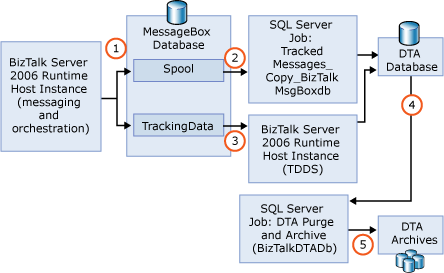

# Measuring Maximum Sustainable Tracking Throughput
After you deploy a line of business solution onto the [!INCLUDE[btsBizTalkServerNoVersion](../includes/btsbiztalkservernoversion-md.md)] platform, you should track and monitor the system to understand the following:  
  
- How the system is performing  
  
- What exceptions and errors may be occurring and why  
  
- The current state of the business processes implemented as BizTalk solutions  
  
  For many organizations, it is also important to record the actual raw messages flowing through the system for non-repudiation purposes. [!INCLUDE[btsBizTalkServerNoVersion](../includes/btsbiztalkservernoversion-md.md)] provides two types of tracking functionality that address these requirements:  
  
- **Data Tracking and Activity (DTA) tracking**. DTA tracks a variety of user-defined message properties, orchestration debug events, message flow events, and service instance status. You use tracking to query the data stored in the BizTalk DTA Tracking database (BizTalkDTADb). DTA tracking also includes the tracking of raw messages, known as message bodies, for non-repudiation and problem resolution purposes.  
  
- **Business Activity Monitoring (BAM) tracking**. BAM uses a user-defined tracking profile to track the state of a business process into a special set of BAM databases.  
  
  In this topic, we describe the DTA architecture and a systematic approach to determine the maximum sustainable throughput that a system employing DTA can sustain indefinitely. Although DTA and BAM share some architectural components, this topic covers the behavior of DTA only. For information about BAM architecture, see [Business Activity Monitoring (BAM)](../core/business-activity-monitoring-bam.md).  
  
## Overview of DTA Tracking Architecture  
 As messages flow through the system, various tracked elements such as message bodies, properties, and events, pass through a series of processes and databases that ultimately result in writing them to the BizTalkDTADb database. After the elements are written to the BizTalkDTADb database, you can use tracking to query the tracked information. For information about setting up and using the BizTalkDTADb database and tracking, see [Viewing Historical and Tracked Data](../core/viewing-historical-and-tracked-data.md).  
  
 To ensure that the system is sustainable and will run indefinitely at a given message flow rate, the pathway that tracked elements pass through on their way to the BizTalkDTADb database, and the database itself, need to remain healthy. For example, messages building up in database tables along the way, or in the DTA, can cause unbounded database file growth that would not be sustainable if not properly managed.  
  
 So, let's start by understanding the architecture and pathways that tracked information flows through. This will expose the key resources and performance indicators that you must monitor to determine how well the tracking system is keeping up with the message traffic flowing through the [!INCLUDE[btsBizTalkServerNoVersion](../includes/btsbiztalkservernoversion-md.md)] engine.  
  
 The following figure shows an overview of the DTA tracking architecture and pathways.  
  
   
  
 Taking the numbered processes from the figure in order, all DTA tracked data flows into and out of the BizTalkDTADb database as follows:  
  
1. The BizTalk Server runtime process includes a component called the interceptor. The interceptor’s job is to cache the tracked elements at runtime and, upon the next MessageBox database roundtrip (for example, en-queuing a message to the MessageBox database), forwards the cached elements to the MessageBox database. The interceptor determines what elements to track by looking at the tracking configuration (also known as a tracking profile) which is obtained from the management database and cached in each host runtime instance for use by the interceptor.  
  
    As shown in the above figure, there are two data streams inserted into the MessageBox database:  
  
   - One represented by the Spool table  
  
   - One by the TrackingData table  
  
     Tracked message bodies use both streams. That is, the message bodies themselves (think of them as blobs of data) are handled via a set of tables represented by the spool table. The message events associated with the message bodies (for example, message identifiers, when the message bodies were tracked, what instances the message bodies are associated with) are handled via the TrackingData table. All tracked elements not associated with message body tracking are handled via the TrackingData table only.  
  
2. The MessageBox database is just the first stop for tracked data and is used to cache the tracked data so that the runtime can continue processing without being directly blocked by further tracking data processing.  
  
    To get the tracked message bodies (blobs) transferred to the BizTalkDTADb database where you can view and archive them to more permanent storage, [!INCLUDE[btsBizTalkServerNoVersion](../includes/btsbiztalkservernoversion-md.md)] employs a SQL Agent job called TrackedMessages_Copy_BizTalkMsgBoxDb which runs on each MessageBox database server. It is the responsibility of this job to copy the message bodies marked for tracking to the BizTalkDTADb database.  
  
3. All of the tracked data other than message bodies are moved from the MessageBox database to the BizTalkDTADb database by a service called TDDS which runs in one or more of the [!INCLUDE[btsBizTalkServerNoVersion](../includes/btsbiztalkservernoversion-md.md)] hosts. Whenever a host is configured as Hosts Tracking via the host property pages in the BizTalk Server administration console, the TDDS sub-service will run in every instance of that host.  
  
4. Unless the BizTalkDTADb database is purged periodically, it will grow unbounded which will eventually lead to operational problems. There is a single SQL Agent job called DTA Purge and Archive (BizTalkDTADb) that performs the task of purging the BizTalkDTADb database. By default, this job runs every minute and purges all completed instances older than some user configured time (for example, 24hours).  
  
    For more information abut the DTA Purge and Archive job, see [How to Configure the DTA Purge and Archive Job](../core/how-to-configure-the-dta-purge-and-archive-job.md).  
  
5. Optionally, the DTA Purge and Archive job can also archive the BizTalkDTADb data as a SQL Backup for longer term storage and/or off-line viewing of the data. If the archived BizTalkDTADb data needs to be queried, it must first be restored as a new database in SQL Server and then you can use tracking or the SQL Query Analyzer to query it.  
  
## In This Section  
  
-   [Understanding DTA Tracking Performance Behavior](../core/understanding-dta-tracking-performance-behavior.md)  
  
-   [Test Scenarios for Measuring MST of DTA Tracking](../core/test-scenarios-for-measuring-mst-of-dta-tracking.md)  
  
-   [Tips and Tricks for Finding MST of DTA Tracking](../core/tips-and-tricks-for-finding-mst-of-dta-tracking.md)  
  
## See Also  
 [Tracking Database Sizing Guidelines](../core/tracking-database-sizing-guidelines.md)