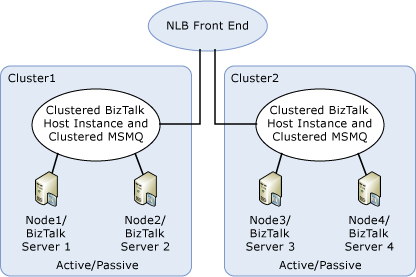

# Migrate from the MSMQT Adapter to the MSMQ Adapter
This topic discusses points to consider regarding end-to-end ordered delivery, transactional consistency, high availability, and scalability before migrating solutions from the BizTalk Message Queuing (MSMQT) adapter to the Message Queuing (MSMQ) adapter. For purposes of this topic ordered delivery, transactional consistency, high availability, and scalability are defined as follows:  
  
-   **Ordered delivery.** Guarantee that messages are sent out of BizTalk Server in the same order that they are received.  
  
-   **Transactional consistency.** Guarantee that messages being processed are not lost or duplicated due to hardware, software, or network failure.  
  
-   **High availability.** Guarantee that services used to process messages are always available for processing.  
  
-   **Scalability.** Ability to increase existing message-processing capacity.  
  
## End-to-End Ordered Delivery  
 The MSMQT adapter ensures end-to-end ordered delivery of messages. This means that if an MSMQ application sends messages 1, 2, and 3 to a receive location bound to the MSMQT adapter, then these messages are delivered to an orchestration or send port in BizTalk Server in the same order: 1, 2, 3. One use of this functionality might include stock market trades that must be submitted and executed in the same order that they are received.  
  
 End-to-end in-order delivery with MSMQT requires many components to be working together. The following sequence of events illustrates how this is done with the MSMQT adapter:  
  
1. The MSMQ API on a remote computer receives messages 1, 2, and 3 in order and pushes them into a transactional, local queue in the same order: 1, 2, 3.  
  
2. An MSMQ client on the remote computer takes the messages from the queue and sends them to the MSMQT queue in order: 1, 2, 3.  
  
3. The MSMQT adapter receives the messages in order 1, 2, 3 and hands them to the BizTalk MessageAgent component in the same order: 1, 2, 3.  
  
4. The BizTalk MessageAgent component ensures that the messages are sent to the MessageBox in order: 1, 2, 3.  
  
5. The MessageBox routes the messages and ensures that if they are routed to the same instance of an orchestration or a send port, that they are delivered to this instance in the same order: 1, 2, 3.  
  
   In BizTalk Server 2004, MSMQT was the only adapter capable of guaranteeing end-to end ordered delivery. All of the other integrated BizTalk adapters can potentially change the order of the messages in steps 3 through 5 listed above. Most of the other integrated adapters complete step 3 by the use of a component known as the End Point Manager, which is inherently multithreaded and therefore does not preserve order. The BizTalk Server 2004 MSMQ adapter used a "Serial Processing" feature that preserves order for step 3, but it does not then ask the MessageAgent to preserve order going forward, so the messages may be routed to an orchestration or send port out of order.  
  
   **End-to-end ordered delivery with the MSMQ adapter**  
  
   To achieve end-to-end ordered delivery with the MSMQ adapter, follow these steps:  
  
6. Enable the **Ordered Delivery** property on the receive port for the subscribing orchestration or send port. In BizTalk Server, receive ports in orchestrations and send ports have an **Ordered Delivery** configuration option. If this option is enabled, then the orchestration receive port or the send port asks the MessageBox to deliver messages to it in the same order they were submitted into the MessageBox.  
  
7. Set the **Ordered Processing** property for the receive location that is bound to the MSMQ adapter to `True`. In BizTalk Server, receive locations that use the MSMQ transport can be configured to use Ordered Processing which, if enabled, ensures that messages are sent to the MessageBox in the same order that they were received.  
  
8. Set the **Transactional** property for the receive location that is bound to the MSMQ adapter to `True`.  
  
9. Ensure that any MSMQ queues that are being monitored by the MSMQ receive locations are marked as "Transactional". This property must be set on the queues to ensure ordered delivery of messages.  
  
> [!NOTE]
>  Ordered delivery is guaranteed only if the MSMQ queue or queues that are being monitored by BizTalk receive locations is/are serviced by only one computer. This can present problems for scalability, as described below.  
  
## Transaction Usage When Processing Messages with the MSMQT Adapter vs. the MSMQ Adapter  
 With regard to transaction usage, there is a key difference between how the MSMQT and MSMQ adapters process messages.  
  
 When using the MSMQT adapter, the process of receiving a message from the network and processing it with BizTalk Server is handled under a single transaction. When using the MSMQT adapter, ACK messages generated for the sender are an indication that the message has been received and has been successfully processed by BizTalk Server.  
  
 When using the MSMQ adapter, the processes of receiving a message from the network and processing it with BizTalk Server are handled under two separate transactions, one for receiving from the network and one for processing it with BizTalk Server. When using the MSMQ adapter, ACK messages generated for the sender are only an indication that the message has been successfully received from the network, not that the message has been successfully processed by BizTalk Server. The sender receives an ACK from the Microsoft Message Queuing server when the message is received from the network and persisted into the local MSMQ queue regardless of whether BizTalk Server is installed. After the message has been persisted to the MSMQ queue, the BizTalk MSMQ adapter picks it up, processes it, and publishes it to the MessageBox. If this process fails, the message is either sent to the BizTalk suspended queue or left in the local MSMQ queue (when using transactional processing), and the sender has no indication that the message failed processing in BizTalk Server.  
  
 If your architecture requires that you receive ACKs when your messages are successfully processed by BizTalk Server, then you must add application-level ACKs if you are migrating from the MSMQT adapter to the MSMQ adapter. You will need to update your orchestration and sending application to implement application-level ACKs.  
  
## High Availability (Transactional, in Order)  
 To provide high availability for the MSMQT adapter you can either add multiple computers to the receive host and configure Network Load Balancing (NLB) for fault tolerance or you can cluster the default BizTalk Host. If you are running the MSMQT adapter in conjunction with NLB, if one server goes down the other servers handle the load. If you are running the MSMQT adapter handlers on a clustered host, if one host node fails, cluster software fails over the clustered host to the other node. When using the MSMQ adapter, NLB does not work if you need transactional processing with no data loss because the MSMQ adapter uses local MSMQ queues for intermediate storage. In this scenario, if a message has been delivered to the local MSMQ queue but has not been consumed by the MSMQ adapter, the message is lost if the computer fails.  
  
 To provide high availability and transactional consistency with the MSMQ adapter, you should do the following:  
  
1. Configure Microsoft Message Queuing (MSMQ) as a clustered resource in a Windows Server cluster group on your BizTalk servers.  
  
2. Configure the MSMQ adapter receive handler in a BizTalk Host instance that has been configured as a cluster resource in the same cluster group as the clustered MSMQ resource.  
  
3. Configure the cluster resource for the BizTalk Host instance so that it maintains a dependency on the clustered MSMQ resource.  
  
   To implement ordered delivery with this architecture, follow the steps presented earlier under "End-to-end ordered delivery with the MSMQ adapter."  
  
## High Availability (Nontransactional, Not in Order)  
 If you need high availability but do not need transactional processing, you can achieve this with the MSMQ adapter by implementing NLB and running instances of a host configured with the MSMQ send and receive handlers on multiple BizTalk servers behind NLB. When implementing NLB with MSMQ you should follow best practices as documented in Microsoft Knowledge Base article [899611 : How Message Queuing can function over Network Load Balancing (NLB)](https://support.microsoft.com/help/899611/how-message-queuing-can-function-over-network-load-balancing-nlb). In this scenario, if one of the BizTalk servers fails, the messages that are running in the host instance on that BizTalk server will be unavailable until the BizTalk server is recovered. This configuration provides high availability because if one of the BizTalk servers is not available, NLB routes requests to the other BizTalk server.  
  
## Scalability (Nontransactional, Not in Order)  
 You can achieve scalability by following the guidelines for high availability (nontransactional) and adding additional host instances. This architecture provides fast delivery as well as scalability, but does not provide ordered delivery.  
  
## Scalability (Transactional, Not in Order)  
 For transactional delivery of messages without ordered delivery, you can combine the use of NLB with MSMQ and Windows clustering. This architecture requires that you configure at least two cluster groups on two separate Windows Cluster environments following the steps under "High Availability (Transactional, in Order)" for each Windows Cluster. You then implement NLB to distribute load between the cluster groups. Because Windows NLB is not supported running on a Windows Cluster, this scenario requires a hardware NLB solution. The following diagram illustrates this architecture.  
  
   
  
> [!NOTE]
>  This architecture does not provide ordered delivery.  
  
## Scalability (Transactional, in Order)  
 Scaling out an architecture that provides high availability, transactional consistency, and ordered delivery is problematic when using MSMQ 3.0 or earlier because remote transactional reads are not supported unless both the BizTalk Server computer and the remote MSMQ server are running MSMQ 4.0. When using MSMQ 3.0 or earlier, scale out must be achieved using multiple local MSMQ queues. Furthermore, in this scenario, if the TCP/IP connection for the MSMQ session to the NLB is broken, it may subsequently be restored by NLB to a different computer, which can cause out-of-order delivery.  
  
 One possible workaround to this limitation is to manually load balance message delivery by allocating destination queues to different computers. You can so this by tying specific BizTalk Host instances to specific MSMQ queues. So for example, if you receive a large number of documents from one particular trading partner, create a separate host and receive queue on a particular BizTalk server for just that trading partner.  
  
 If possible, run MSMQ 4.0 on remote computers when both remote transactional reads and load balancing are required.  
  
## Summary  
 The following table summarizes the architectures that you can implement to accommodate specific functionality.  
  
|**Functionality**|**Neither NLB nor cluster**|**NLB**|**Cluster**|**NLB and cluster**|  
|-----------------------|---------------------------------|-------------|-----------------|-------------------------|  
|End-to-end ordered delivery|Yes|No|Yes|Possible with manual configuration|  
|Transactional consistency|No (messages can be lost or duplicated if service failure occurs)|No|Yes|Yes|  
|Highly available|No|Yes|Yes|Yes|  
|Scalable|No|Yes|No|Yes|  
  
## See Also  
 [Using Windows Server Cluster to Provide High Availability for BizTalk Server Hosts2](../core/use-windows-cluster-to-provide-high-availability-for-biztalk-hosts.md)