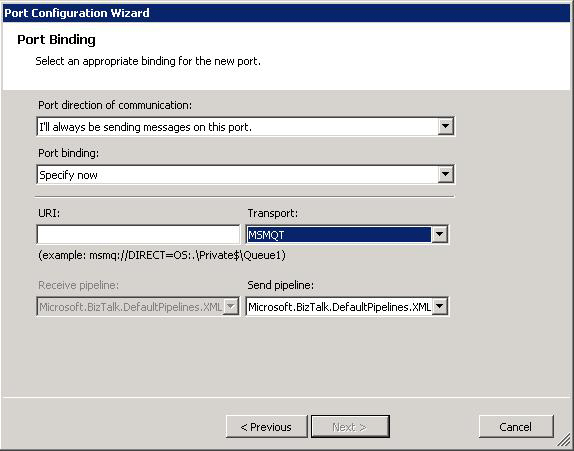

# MSMQT Deprecation
The MSMQT feature has been removed from BizTalk Server. In Orchestration Designer, the MSMQT transport option remains available in the design-time Port Configuration Wizard as shown in the image below when you choose the **Specify now** option for **Port binding**.  
  
 **Port Configuration Wizard showing MSMQT transport**  
  
   
  
## BizTalk Server Projects  
 New [!INCLUDE[btsBizTalkServerNoVersion](../includes/btsbiztalkservernoversion-md.md)] projects should not use the MSMQT transport option. Application deployment to [!INCLUDE[btsBizTalkServer2006r3](../includes/btsbiztalkserver2006r3-md.md)] will fail with the error **Protocol type “MSMQT” not found**.  
  
## Migrated BizTalk Server Projects  
 [!INCLUDE[btsBizTalkServerNoVersion](../includes/btsbiztalkservernoversion-md.md)] projects can be migrated to [!INCLUDE[btsBizTalkServer2006r3](../includes/btsbiztalkserver2006r3-md.md)] by using the [!INCLUDE[btsVStudioNoVersion](../includes/btsvstudionoversion-md.md)] Conversion Wizard as documented in [Migrating a BizTalk Server Project](../core/migrating-a-biztalk-server-project.md). Projects containing ports configured to use the MSMQT transport must be manually reconfigured before deployment to [!INCLUDE[btsBizTalkServer2006r3](../includes/btsbiztalkserver2006r3-md.md)]. The recommended reconfiguration is to use the MSMQ adapter.  For more information about the MSMQ adapter see [What Is the MSMQ Adapter?](../core/what-is-the-msmq-adapter.md).  
  
## See Also  
 [Migrating from the MSMQT Adapter to the MSMQ Adapter](../core/migrating-from-the-msmqt-adapter-to-the-msmq-adapter.md)