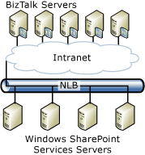

# Multiserver Deployment
This topic discusses multiserver setup and deployment considerations for the [!INCLUDE[btsBizTalkServerNoVersion](../includes/btsbiztalkservernoversion-md.md)] adapter for Windows SharePoint Services.  
  
## Installing the Windows SharePoint Services adapter in a multiserver deployment  
 Selecting the Windows SharePoint Service Adapter Web Service component installs the necessary software for the Windows SharePoint Services adapter to process incoming and outgoing documents through Windows SharePoint Services. This Web service must be installed on the server where Windows SharePoint Services is installed.  
  
 The adapter Web service can handle multiple SharePoint sites regardless of whether they are on the same IIS site or on different IIS sites.  
  
 The Windows SharePoint Services Adapter has three components:  
  
- Runtime components  
  
- Design time components  
  
- Adapter Web service  
  
  The adapter runtime is installed and configured automatically by the [!INCLUDE[btsBizTalkServerNoVersion](../includes/btsbiztalkservernoversion-md.md)] Runtime feature. The adapter design time components are installed and configured with other [!INCLUDE[btsBizTalkServerNoVersion](../includes/btsbiztalkservernoversion-md.md)] features. You interact with the design time components by creating Windows SharePoint Services ports through tools that are included in the Administration Tools, Developer Tools, and SDK or [!INCLUDE[btsBizTalkServerNoVersion](../includes/btsbiztalkservernoversion-md.md)] Runtime features. You cannot customize any configuration options for runtime and design time components. You can customize only the Windows SharePoint Services adapter Web Service options.  
  
  Only members of the SharePoint Enabled Hosts group will have permissions to invoke the adapter Web service. For more information about the Windows SharePoint Services permissions needed by the Windows SharePoint Services adapter runtime, see the security section in [What Is the Windows SharePoint Services Adapter?](../core/what-is-the-windows-sharepoint-services-adapter.md).  
  
> [!NOTE]
>  The Windows SharePoint Services adapter Web service component will be automatically selected if you choose to install BAS.  
  
#### To install the Windows SharePoint Services adapter  
  
1. Install [!INCLUDE[btsBizTalkServerNoVersion](../includes/btsbiztalkservernoversion-md.md)]. For more information, see [Installation Overview for BizTalk Server 2013 and 2013 R2](http://msdn.microsoft.com/library/8041926c-cfc9-4eaf-9c28-a2c6e8015bc5).  
  
2. On the **Component Installation** screen, under **Available Components**, under **Additional Software**, select **Windows SharePoint Services Adapter Web service**.  
  
> [!NOTE]
>  You must run setup and configuration on the computer that hosts the [!INCLUDE[btsBizTalkServerNoVersion](../includes/btsbiztalkservernoversion-md.md)] runtime and the computer running Windows SharePoint Services.  
  
## Configuring the Windows SharePoint Services adapter Web service in a multiserver deployment  
 You configure the Windows SharePoint Services adapter using the BizTalk Server Configuration. For more information about these tools, see [Configuration Overview for BizTalk Server 2013 and 2013 R2](http://msdn.microsoft.com/library/aa58c43f-8f0e-4a5c-89b9-db7b8a852a72).  
  
### Using a custom configuration  
 The BizTalk Server Configuration provides a high-level analysis of the configuration state of the features you have installed on the local computer. The tool allows you to configure and unconfigure features, configure security settings, and import and export configurations from other computers.  
  
 Use the **Windows SharePoint Services** page to configure the Windows SharePoint Services adapter on this computer. The following table lists the configuration options.  
  
|Use this|To do this|  
|--------------|----------------|  
|**Enable Windows SharePoint Services Adapter on this computer**|Select **Enable Windows SharePoint Services Adapter on this computer** to enable the adapter on this computer.|  
|**Windows group**|The **Windows group** list provides a view that you can edit of the BizTalk SharePoint Adapter Enabled Hosts Windows group.|  
|**Windows SharePoint Services Adapter Web site**|Select the Web site that will host the Windows SharePoint Services adapter Web service.|  
  
 When you configure the Windows SharePoint Services adapter using custom configuration, the following happens:  
  
-   The SharePoint Enabled Hosts Windows group is created by default unless you specify another Windows group  
  
-   The Default Web Site is used to host the Windows SharePoint Services adapter unless you specify another Web site  
  
-   The BTSSharePointAdapterWSAppPool application pool is created and configured to run under the account that is also used to run the Windows SharePoint Services application pool  
  
-   The BTSharePointAdapterWS virtual application is created and configured to run in the BTSSharePointAdapterWSAppPool application pool  
  
> [!NOTE]
>  If this virtual directory already exists, configuration will not update the properties in the metabase. You must delete the virtual directory and run configuration again.  
  
- The BTSharePointAdapterWS virtual application contains the Web service  
  
  For more information about the BizTalk Server Configuration, see [Import and Export BizTalk Server Configuration](../install-and-config-guides/import-and-export-biztalk-server-configuration.md).  
  
##### To configure the Windows SharePoint Services adapter by using custom configuration  
  
1. In the **BizTalk Server Configuration**, select the **SharePoint adapter** node.  
  
2. Select **Enable Windows SharePoint Services Adapter on this computer**.  
  
3. Under **Windows Group**, select the Windows group you will be using for the Windows SharePoint Services adapter. By default, this is SharePoint Enabled Hosts.  
  
4. In the **Windows SharePoint Services Adapter Web Site** drop-down box, select the Web site where the adapter components will be installed. By default, this is the Default Web Site.  
  
   > [!NOTE]
   >  The installation of the Windows SharePoint Services Adapter Web site on a remote SharePoint Server computer that does not have any other [!INCLUDE[btsBizTalkServerNoVersion](../includes/btsbiztalkservernoversion-md.md)] components installed is a fully supported configuration.  
  
5. Click **Apply Configuration**.  
  
## Considerations for a multiserver deployment  
   
  
### General considerations  
 When you set up and deploy the Windows SharePoint Services adapter in a multiserver environment, consider the following:  
  
- Add the BizTalk Service account to the SharePoint Enabled Hosts Windows group on each server.  
  
- Add the SharePoint Enabled Hosts group to the SharePoint Contributors role using the SharePoint Central Administration tool.  
  
- On [!INCLUDE[btsWinSvrNoVersion](../includes/btswinsvrnoversion-md.md)], the identity under which the SharePoint Adapter Web Service runs needs the following permissions:  
  
   **Read** permissions on the **Program Files\Microsoft BizTalk Server \<version\>\Business Activity Services\BTSharePointV3AdapterWS** folder. If using a 64-bit version of Windows and [!INCLUDE[btsBizTalkServerNoVersion](../includes/btsbiztalkservernoversion-md.md)], permissions need to be set on the **Program Files (x86)\Microsoft BizTalk Server \<version\>\Business Activity Services\BTSharePointV3AdapterWS**  
  
   **Read** permission on the following registry key: **HKEY_LOCAL_MACHINE\SOFTWARE\Microsoft\Shared Tools\Web Server\Extensions\12.0\Secure\ConfigDB**.  
  
   Logon permissions on the SQL Server that contains the Sharepoint databases.  
  
   A member of the **Public** and **WSS_Content_Application_Pools** roles within the SharePoint configuration database.  
  
   A member of the **Public** and **db owner** roles within the SharePoint content database.  
  
- The Web site that you install the Web service on must be extended as a SharePoint Services Web site.  
  
- You can install and configure the Windows SharePoint Services adapter using a silent installation. For more information, see [Appendix A: Silent Installation](../install-and-config-guides/appendix-a-silent-installation.md).  
  
### Considerations for network load balancing (NLB)  
 The [!INCLUDE[btsBizTalkServerNoVersion](../includes/btsbiztalkservernoversion-md.md)] adapter for Windows SharePoint Services supports NLB clustering of the Windows SharePoint Services servers along with multiple BizTalk servers that are configured in the same group. For this, Windows SharePoint Services must be installed on the NLB cluster as recommended by SharePoint documentation.  
  
 When you set up and deploy the Windows SharePoint Services adapter in a multiserver environment with NLB, consider the following:  
  
-   Configure Windows SharePoint Services by selecting the option to point to an existing BizTalk Management database. Point to the BizTalk Management database created on the first computer. This indicates to Windows SharePoint Services that you intend to have a Web server environment. Extend the Web site by pointing to the existing content database.  
  
-   You must extend the same Web site (for example, the default Web site on port 80) on each Windows SharePoint Services computer in the Web server environment.  
  
-   The BTSharePointAdapterWS must be installed and configured the same way on each of the NLB hosts. You must configure the following NLB settings:  
  
    -   Protocol: TCP  
  
    -   Ports: 80 (The HTTP Port of the IIS Web site where the Windows SharePoint Services adapter Web service has been installed and configured)  
  
    -   Filtering mode: Multiple host  
  
    -   Affinity: None  
  
> [!NOTE]
>  This setting can be used only if the site is not configured for HTTPS. If the BTSharePointAdapterWS Web service is installed on a site with HTTPS, then you must use Single-client affinity.  
  
## See Also  
 [Windows SharePoint Services Adapter](../core/windows-sharepoint-services-adapter.md)   
 [Single-Server Deployment](../core/single-server-deployment.md)