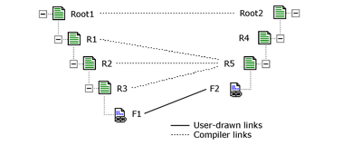
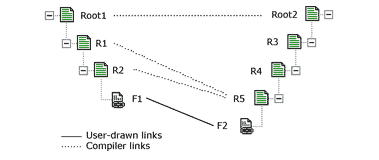
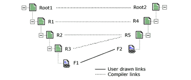
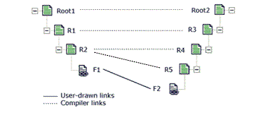
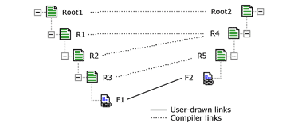
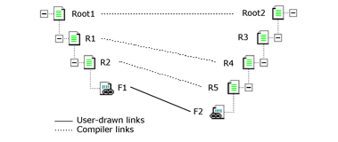

# Node-Hierarchy Level Matching
BizTalk Mapper enables you to configure a link property to control how the compiler matches node hierarchies between the source and destination schemas. When you create a link from a field in the source schema to a field in the destination schema, BizTalk Mapper automatically adds compiler links. These compiler links depend on the matching you select.  
  
 When you select a link in the displayed grid page, one of the properties displayed in the [!INCLUDE[btsVStudioNoVersion](../includes/btsvstudionoversion-md.md)] Properties window is the **Target Links** property. You can choose among the following possible values for each link in your map:  
  
-   **Flatten links.** Use this value to flatten all source hierarchies to the parent record in the destination schema node.  
  
-   **Match links top down.** Use this value to match node levels from the top of the schemas to the bottom of the schemas.  
  
-   **Match links bottom up.** Use this value to match node levels from the bottom of the schemas to the top of the schemas.  
  
## Flatten Links  
 In this mode, all the source hierarchies are flattened to the parent record of the destination node. In the first case, the source schema is more complex than the destination schema. In the second case, the destination schema is more complex.  
  
   
Flatten Links  
  
   
Flatten Links, Second Case  
  
## Match Links Top-Down  
 This mode matches level to level from the top down. In the first case, the source schema is more complex than the destination schema. In the second case, the destination schema is more complex.  
  
   
Top-Down Matching  
  
   
Top-Down Matching, Second Case  
  
## Match Links Bottom-Up  
 This mode matches level to level from the bottom up. In the first case, the source schema is more complex than the destination schema. In the second case, the destination schema is more complex.  
  
   
Bottom-Up Matching  
  
   
Bottom-Up Matching, Second Case  
  
## How BizTalk Mapper Processes Link Types  
 Because you can set the **Target Links** property to different values for different links, BizTalk Mapper needs a way to resolve the different settings when they may conflict.  
  
 For example, if you use a flatten compiler directive, a top-down compiler directive, and a bottom-up compiler directive for links from **Field** nodes to **Field** nodes in the destination schema, and these nodes share the same parent **Record** node, BizTalk Mapper ignores the conflicting top-down and bottom-up compiler directives and treats all the links as if they were set to the flatten compiler directive.  
  
 The following table shows how BizTalk Mapper treats links to **Field** nodes in the same **Record** node in the destination schema, based on the settings for the **Target Links** property for the links within the same **Record** node.  
  
|Flatten|Top-down|Bottom-up|Result|  
|-------------|---------------|----------------|------------|  
|0 or more|1 or more|1 or more|BizTalk Mapper treats all the links as if they were set to the flatten compiler directive.|  
|1 or more|1 or more|0|BizTalk Mapper treats all the links as if they were set to the top-down compiler directive.|  
|1 or more|0|1 or more|BizTalk Mapper treats all the links as if they were set to the bottom-up compiler directive.|  
  
 The top-down and bottom-up compiler directives take precedence over the flatten compiler directive, but cancel each other out when both are present.  
  
## See Also  
 [Mass Copy Functoid](../core/mass-copy-functoid.md)   
 [How to Set the Source Links Compiler Value](../core/how-to-set-the-source-links-compiler-value.md)   
 [Compiling Maps](../core/compiling-maps.md)