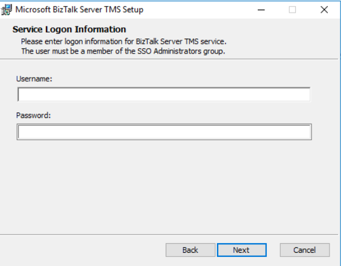
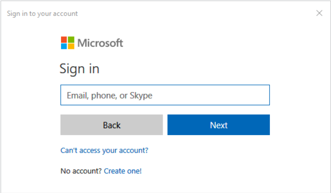
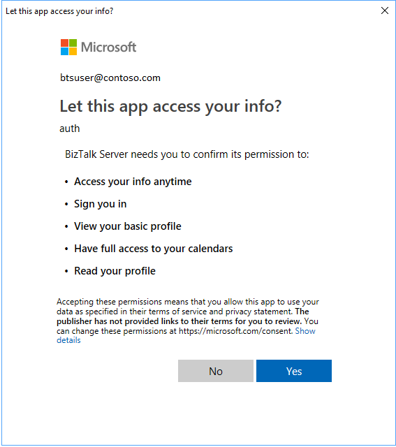

# Office 365 Outlook adapters in BizTalk

## Overview
**Starting with [!INCLUDE[bts2016_md](../includes/bts2016-md.md)] Feature Pack 3**, you can send and receive messages between BizTalk Server and Office 365 Outlook features. The following adapters are included in Feature Pack 3:

- [Office 365 Outlook Email adapter](office365-mail-adapter.md)
- [Office 365 Outlook Calendar adapter](office365-calendar-adapter.md)
- [Office 365 Outlook Contact adapter](office365-contact-adapter.md)

## Prerequisites

* Have an [Office 365 account](https://outlook.office365.com)
* Install [Feature Pack 3](https://aka.ms/bts2016fp3) on your BizTalk Server
* Use an account that is a member of the SSO Administrators group

## TMS overview

BizTalk Server TMS is a service that refreshes the Office 365 OAuth tokens used by BizTalk. It refreshes these tokens periodically, ensuring that the tokens always remain valid. It has a dependency on Enterprise Single Sign On service (ENT SSO), and must be installed on a computer that hosts the master secret server. 

## Install BizTalk Server TMS

1. Install [Feature Pack 3](https://aka.ms/bts2016fp3).
2. In `\Program Files (x86)\Microsoft BizTalk Server <your version>`, run BizTalkTMS.msi.
3. Enter the username and password of a user that's a member of the SSO Administrators group. 

## Sign-in to Office 365

When you're creating a [send port](how-to-create-a-send-port2.md) or [receive location](how-to-create-a-receive-location.md) in BizTalk Administration, you can **Sign-in...** to your Office 365 account:

  

You enter the Office 365 credentials, and confirm permissions. These credentials authorize BizTalk to connect to, and access the Office 365 account. In the following example, you see the permissions for Office 365 Outlook Calendar:

  

## Get started
After BizTalk Server TMS is installed, you're ready to create the artifacts, and start using the adapters:

- [Office 365 Outlook Email adapter](./office365-mail-adapter.md)
- [Office 365 Outlook Calendar adapter](./office365-calendar-adapter.md)
- [Office 365 Outlook Contact adapter](./office365-contact-adapter.md)
