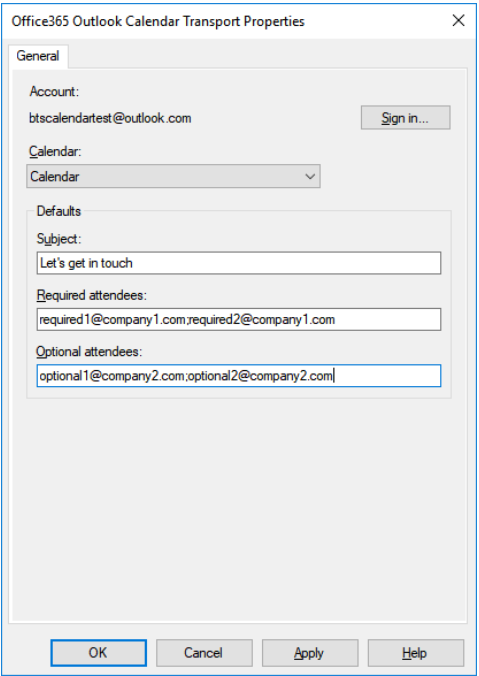

# Create calendar events with the Office 365 Outlook Calendar adapter - BizTalk Server

Use the Office 365 Outlook Calendar adapter in BizTalk Server to create and receive calendar events from your Office 365 Outlook Calendar.

## Create events using a send port

1. In the BizTalk Server Administration console, right-click **Send Ports**, select **New**, and select **Static One-way send port**.

    [Create a Send Port](../core/how-to-create-a-send-port2.md) provides some guidance.

2. Enter a **Name**. In **Transport**, set the **Type** to **Office 365 Outlook Calendar**, and select **Configure**.

3. Select **[Sign in …**, and sign in to your Office 365 Account. The account is auto-populated with your email address.

4. Allow BizTalk Server approval for permission to access:

    

5. Configure your Office365 Outlook Calendar default properties:

    |Use this|To do this|  
    |---|---|  
    | **Calendar** | Select the calendar in which events will be created. |
    | **Subject** | Set the default subject for events created. (256 character max) |
    | **Required Attendees** | Enter your default required attendees email addresses separated by ';'. (256 character max) |
    | **Optional Attendees** | Enter your default optional attendees email addresses separated by ';'. (256 character max) |

6. Select a calendar: 

    

    When finished, your properties look similar to the following:

    

7. Select **Ok** to save your changes.

### Test your send port

You can use a simple File receive port and location to create an event on your Office 365 Outlook Calendar.

1. Create a receive port using the File adapter. Within your receive location,  set the **Receive folder** to **C:\Temp\In\**, and set the file mask to **\*.xml**.
2. In your Office 365 Outlook Calendar adapter send port properties, set the **Filters** to `BTS.ReceivePortName == <Receive Port Name>`.
3. Paste the following into a text editor, and save the file as **Office365Calendar.xml**. This is your sample message.

    ```xml
    <Event xmlns="http://schemas.microsoft.com/BizTalk/Office365OutlookCalendar/Send"> 
        <subject>Test event 1</subject> 
        <body> 
        <contentType>html</contentType> 
        <content>&lt;html&gt; 
        &lt;head&gt; 
        &lt;meta http-equiv="Content-Type" content="text/html; charset=utf-8"&gt; 
        &lt;meta content="text/html; charset=us-ascii"&gt; 
        &lt;/head&gt; 
        &lt;body&gt; 
        Test body for event Test event 1 
        &lt;/body&gt; 
        &lt;/html&gt; 
        </content> 
        </body> 
    </Event> 
    ```
    **The XML schema is provided as part of the SDK inside < BizTalk Installation Folder\SDK\Schemas >**

4. Start the File receive location and the Office 365 Outlook Calendar adapter send port.
5. Copy **Office365Calendar.xml** sample message into the receive folder (C:\Temp\In\). The send port creates an event in your Office 365 Outlook calendar based on the xml.

## Receive events using a receive port

1. In the BizTalk Server Administration console, right-click **Receive Ports**, select **New**, and select **One-Way receive port**.

    [Create a receive port](../core/how-to-create-a-receive-port.md) provides some guidance.

2. Enter a name, and select **Receive Locations**.

3. Select **New**, and **Name** the receive location. In **Transport**, select **Office 365 Outlook Calendar** from the **Type** drop-down list, and then select **Configure**.

4. Select **Sign in …**, and sign in to your Office 365 Account. The account is auto-populated with your email address.

5. Allow BizTalk Server approval for permission to access:

    

6. Configure the **Endpoint** properties:

    |Use this|To do this|  
    |---|---|  
    | **Calendar** | Select the calendar from which events will be fetched.  |
    | **Starting within** | Select the time interval within which a calendar event has to start in order to be received by BizTalk (default is 15 minutes).  |

7. Selecting a calendar:

    

    When finished, your properties look similar to the following:

    

8. Select **Ok** to save your changes.

### Test your receive settings

You can use a simple File send port to receive messages from your Office 365 Outlook Calendar.

1. Create a send port using the File adapter. Within your send port properties, set the **Destination folder** to **C:\Temp\Out\**, and set the and **File name** to **%MessageID%.xml**.
2. In your File send port properties, set the **Filters** to  `BTS.ReceivePortName == <Receive Port Name>`.
3. Start the Office 365 Outlook Calendar receive location and the File send port.
4. Look for messages in the destination folder (c:\temp\out). 
**The XML schema is included in the SDK at `\Program Files (x86)\Microsoft BizTalk Server <your version>\SDK\Schemas`.**

### Example of a received calendar event xml

```xml
<ns0:Event xmlns:ns0="http://schemas.microsoft.com/BizTalk/Office365OutlookCalendar/Receive"> 
<reminderMinutesBeforeStart>20160</reminderMinutesBeforeStart> 
<importance>normal</importance> 
<subject>Let's meet</subject> 
<id>AQMkADAwATNiZmYAZC0xMQBlOC0yODQ1LTA</id> 
<body> 
<contentType>html</contentType> 
<content>&lt;html&gt; 
&lt;head&gt; 
&lt;meta http-equiv="Content-Type" content="text/html; charset=utf-8"&gt; 
&lt;meta content="text/html; charset=us-ascii"&gt; 
&lt;meta name="ProgId" content="Word.Document"&gt; 
&lt;meta name="Generator" content="Microsoft Word 15"&gt; 
&lt;meta name="Originator" content="Microsoft Word 15"&gt; 
&lt;link rel="File-List" href="cid:filelist.xml@01D40724.27036CE0"&gt;&lt;style&gt; 
&lt;!-- 
@font-face 
  {font-family:"Cambria Math"} 
@font-face 
  {font-family:Calibri} 
p.MsoNormal, li.MsoNormal, div.MsoNormal 
  {margin:0in; 
  margin-bottom:.0001pt; 
  font-size:11.0pt; 
  font-family:"Calibri",sans-serif} 
a:link, span.MsoHyperlink 
  {color:#0563C1; 
  text-decoration:underline} 
a:visited, span.MsoHyperlinkFollowed 
  {color:#954F72; 
  text-decoration:underline} 
span.EmailStyle17 
  {font-family:"Calibri",sans-serif; 
  color:windowtext} 
.MsoChpDefault 
  {font-family:"Calibri",sans-serif} 
@page WordSection1 
  {margin:1.0in 1.0in 1.0in 1.0in} 
div.WordSection1 
  {} 
--&gt; 
&lt;/style&gt; 
&lt;/head&gt; 
&lt;body lang="EN-US" link="#0563C1" vlink="#954F72" style=""&gt; 
&lt;div class="WordSection1"&gt; 
&lt;p class="MsoNormal"&gt;Let’s sync up.&lt;/p&gt; 
&lt;/div&gt; 
&lt;/body&gt; 
&lt;/html&gt; 
</content> 
</body> 
<bodyPreview>Let’s sync up.</bodyPreview> 
<attendees> 
<type>required</type> 
<status> 
<response>none</response> 
<time>0001-01-01T00:00:00Z</time> 
</status> 
<emailAddress> 
<name>someone@contoso.com</name> 
<address>someone@contoso.com</address> 
</emailAddress> 
</attendees> 
<start> 
<dateTime>2018-06-25T17:00:00</dateTime> 
<timeZone>UTC</timeZone> 
</start> 
<end> 
<dateTime>2018-06-25T17:30:00</dateTime> 
<timeZone>UTC</timeZone> 
</end> 
<location> 
<displayName>Your office</displayName> 
<locationType>default</locationType> 
<uniqueId>Your office</uniqueId> 
<uniqueIdType>private</uniqueIdType> 
</location> 
<responseRequested>true</responseRequested> 
<seriesMasterId /> 
<isCancelled>false</isCancelled> 
<isOrganizer>true</isOrganizer> 
<createdDateTime>2018-06-18T23:48:35.0164728Z</createdDateTime> 
<lastModifiedDateTime>2018-06-18T23:48:22.178Z</lastModifiedDateTime> 
<hasAttachments>false</hasAttachments> 
<responseStatus> 
<response>none</response> 
<time>0001-01-01T00:00:00Z</time> 
</responseStatus> 
<changeKey>SFa3sLJfdiDEIpfwAAIAU=</changeKey> 
<originalStartTimeZone>Pacific Standard Time</originalStartTimeZone> 
<originalEndTimeZone>Pacific Standard Time</originalEndTimeZone> 
<isReminderOn>false</isReminderOn> 
<sensitivity>normal</sensitivity> 
<isAllDay>false</isAllDay> 
<showAs>busy</showAs> 
<type>singleInstance</type> 
<onlineMeetingUrl /> 
<recurrence /> 
<locations> 
<displayName>Your office</displayName> 
<locationType>default</locationType> 
<uniqueId>Your office</uniqueId> 
<uniqueIdType>private</uniqueIdType> 
</locations> 
<organizer> 
<emailAddress> 
<name>someone@contoso.com</name> 
<address>/O=FIRST ORGANIZATION/OU=EXCHANGE ADMINISTRATIVE GROUP(FYDIBOH3SPDLT)/CN=RECIPIENTS/CN=0003B11E8245</address> 
</emailAddress> 
</organizer> 
</ns0:Event> 
```

## Next steps
See all the [Office 365 adapters](office365-adapters.md), or install [Feature Pack 3](https://aka.ms/bts2016fp3).