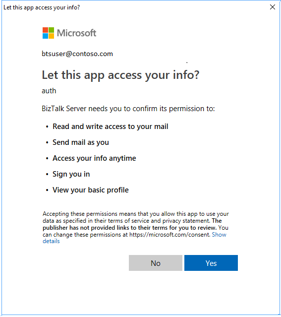
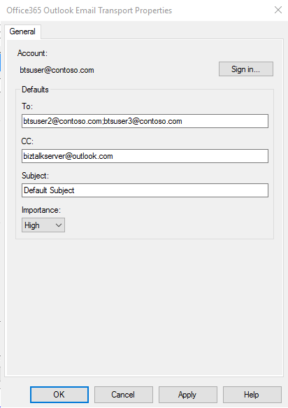
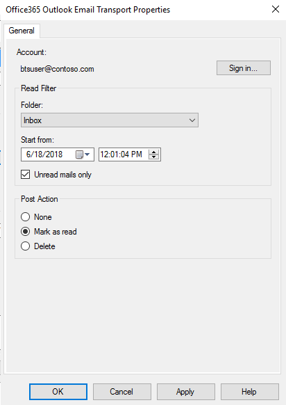

# Office365 Outlook Email Adapter

The Office365 Outlook Email Adapter allows you to send and receive mails from your Office 365 Outlook Email from BizTalk.

## Send mails via Office365 Outlook Email Adapter

1.  In the BizTalk Server Administration console, right-click **Send Ports**, select **New**, and select **Static One-way send port**.

    [Create a Send Port](../core/how-to-create-a-send-port2.md) provides some guidance.

2. Enter a **Name**. In **Transport**, set the **Type** to **Office365 Outlook Email**, and select **Configure**. 

3. Press the **[Sign in …](./office365-adapters.md)** button and sign into your Office 365 Account. You will see that the Account: will be auto-populated with your email address. 

4. Allow BizTalk Server approval for permission to access.

    

5. Configure your Office365 Outlook Email default properties: 

    |Use this|To do this|  
    |---|---|  
    | **To** | Specify your default To mail addresses separated by ';' (256 character max)|
    | **CC** | Specify your default CC mail addresses separated by ';' (256 character max)|
    | **Subject** | Mention your default mail subject. (256 character max) |
    | **Importance** | Select your value of Importance. Dropdown contains values **Low**, **Normal** and **High** with **Normal** being the default. |
    |||

    When finished, your properties look similar to the following: 

    

6. Select **Ok** to save your changes. 

### Note:

1. You may only send plain text messages via the send adapter. 
2. The default properties may also be updated via promoted properties.

|Property|Promoted property|
|---|---|
| **To** | OfficeMail.To |
| **CC** | OfficeMail.CC |
| **Subject** | OfficeMail.Subject |
| **Importance** | OfficeMail.Importance |
|||

### Test your send port:

You can use a simple File receive port and location to send messages to your Office365 Outlook Email. 

1. Create a receive port using the File adapter. Within your receive location,  set the **Receive folder** to **C:\Temp\In\**, and set the file mask to **\*.xml**.
2. In your Office365 Outlook Email adapter send port properties, set the **Filters** to `BTS.ReceivePortName == <Receive Port Name>`.
3. Paste the following into a text editor, and save the file as **Office365Mail.xml**. This is your sample message. 

    ```xml
    <ns0:Root xmlns:ns0="http://BizTalk_Server_Project1.Schema1"> 
        <Record> 
            <Name>BizTalk User</Name> 
            <ID>001</ID> 
        </Record> 
    </ns0:Root> 
    ```

4. Start the File receive location and the Office365 Outlook Email adapter send port.
5. Copy **Office365Mail.xml** sample message into the receive folder (C:\Temp\In\). The send port sends the XML file as mail body to your Office365 Outlook Email.

## Receive messages from Office365 Outlook Email:

1. In the BizTalk Server Administration console, right-click **Receive Ports**, select **New**, and select **One-Way receive port**. 

    [Create a receive port](../core/how-to-create-a-receive-port.md) provides some guidance.

2. Enter a name, and select **Receive Locations**. 

3. Select **New**, and **Name** the receive location. In **Transport**, select **Office365 Outlook Email** from the **Type** drop-down list, and then select **Configure**. 

4. Press the  **[Sign in …](./office365-adapters.md)** button and sign into your Office365 Account. You will see that the **Account:** will be auto-populated with your email address. 

5. Allow BizTalk Server approval for permission to access.

    

6. Configure the **Endpoint** properties: 

    |Use this|To do this|  
    |---|---|  
    | **Folder** | Select the Folder from which you will be fetching mails. The default Folder is Inbox. Note: Folders aren’t recursive in nature (i.e. Mails from subfolders aren’t fetched). |
    | **Start from** | Use this value to specify how emails will be fetched from Office 365. This value indicates receivedTimeStamp of mails in Office365 Outlook. Mails more recent than the specified values are fetched.  |    
    | **Unread mails only** | Check this to read only Unread mails. Keep it unchecked to read all mails. |
    | **Post Action** | Select a post action to be performed after the mail is read. **None** is the default, and does nothing after mail is received by BizTalk. **Mark as read** implies, that after a mail is received by BizTalk, the mail in your mailbox will be marked as read. **Delete** implies, that after a mail is received by BizTalk, the mail in your mailbox will be deleted. Post actions are performed on a best effort basis.|
    |||

    When finished, your properties look similar to the following: 

    

7. Select **Ok** to save your changes. 

### Test your receive settings

You can use a simple File send port to receive messages from your Office365 Outlook Email. 

1. Create a send port using the File adapter. Within your send port properties, set the **Destination folder** to **C:\Temp\Out\**, and set the and **File name** to **%MessageID%.xml**.
2. In your File send port properties, set the **Filters** to  `BTS.ReceivePortName == <Receive Port Name>`.
3. Start the Office365 Outlook Email receive location and the File send port.
4. Look for messages in the destination folder (c:\temp\out).

### Promoted Properties from receive pipeline

The following properties from the Receive Pipeline are promoted by default:

|Property Name| Promoted Property|
|---|---|
| **Importance** | OfficeMail.ReceivedMailImportance |
| **Subject** | OfficeMail.ReceivedMailSubject |
| **SenderName** | OfficeMail.SenderName |
| **SenderAddress** | OfficeMail.SenderAddress |
| **HasAttachments**| OfficeMail.HasAttachments |
|||

### Note
Only the body content of the Email is passed through to the message.