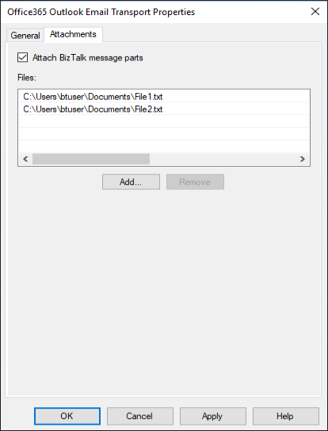
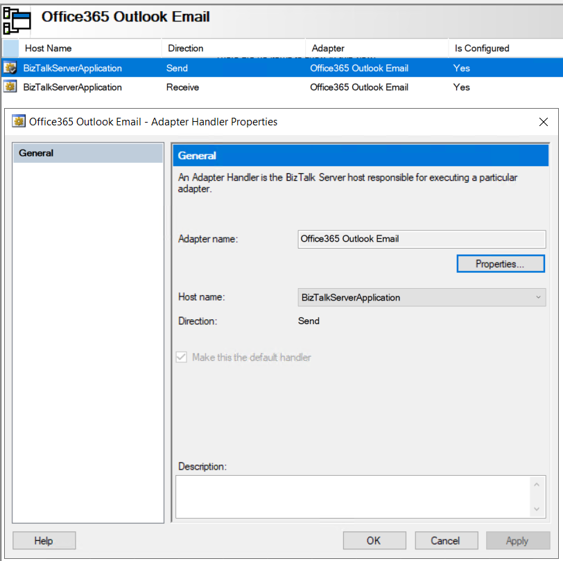
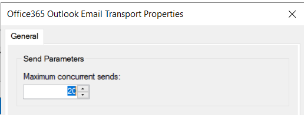
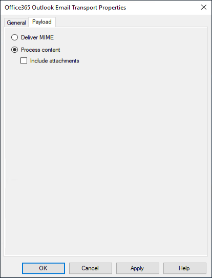

# Send and receive email with Office 365 Outlook Email adapter - BizTalk Server

The Office 365 Outlook Email Adapter allows you to send and receive mails from your Office 365 Outlook Email from BizTalk.

## Send mail using a send port

1. In the BizTalk Server Administration console, right-click **Send Ports**, select **New**, and select **Static One-way send port**.

    [Create a Send Port](../core/how-to-create-a-send-port2.md) provides some guidance.

2. Enter a **Name**. In **Transport**, set the **Type** to **Office 365 Outlook Email**, and select **Configure**.

3. Select **Sign in …**, and sign in to your Office 365 Account. The account is auto-populated with your email address.

4. Allow BizTalk Server approval for permission to access:

    > [!div class="mx-imgBorder"]
    > 

5. Configure your Office 365 Outlook Email **General** properties:

    - **To**: Enter your default To mail addresses separated by ';' (256 character max)
    - **CC**: Enter your default CC mail addresses separated by ';' (256 character max)
    - **Subject**: Mention your default mail subject. (256 character max)
    - **Importance**: Select your value of Importance. Dropdown contains values **Low**, **Normal**, and **High** with **Normal** being the default.

    When finished, your properties look similar to the following:

    > [!div class="mx-imgBorder"]
    > 

6. Configure your Office 365 Outlook Email **Attachments** properties:

    The body of the email being sent corresponds to the body part of the BizTalk message. To add attachments to the email, do the following:

    - **Attach BizTalk message parts**: If checked, BizTalk message non-body parts are added as attachments to the email sent.
    - **Files**: Specifies that a file or files are attached to the e-mail message and the full path to the file or files. The specified path or paths must be accessible to the host for the adapter at run time. Default value: empty.

    After selecting some files, the attachments properties look similar to the following:

    > [!div class="mx-imgBorder"]
    > 

7. Select **Ok** to save your changes.

### Important details

1. The default properties may also be updated using promoted properties:

    |Property Name| Promoted Property|
    |---|---|
    | **To** | OfficeMail.To|
    | **CC** | OfficeMail.CC|
    | **Subject** | OfficeMail.Subject|
    | **Importance** | OfficeMail.Importance|
    | **Attached Files** | OfficeMail.AttachedFiles|

2. The **OfficeMail.AttachedFiles** property value is list of files with "|" as delimiter in between different files. For instance: "C:\\Attachments\File1.pdf|C:\\Attachments\File2.xml".

3. The ContentType property of the BizTalk message body part can be set to "Text" or "Html" to indicate the type of the email body. By default, it will be "Text".

4. When parts of a multi-part BizTalk message are attached, the ContentType property of a part, if provided, is used as the MIME type for the attachment created. By default, the MIME type of the attachment is set to "application/octet-stream".

5. When attaching files, the MIME type of the attachment is determined from the filename extension. The default MIME type is "application/octet-stream".

### Test your send port

You can use a simple File receive port and location to send messages to your Office 365 Outlook Email.

1. Create a receive port using the File adapter. Within your receive location, set the **Receive folder** to **C:\\Temp\\In\\**, and set the file mask to **\*.xml**.
2. In your Office 365 Outlook Email adapter send port properties, set the **Filters** to `BTS.ReceivePortName == <Receive Port Name>`.
3. Paste the following into a text editor, and save the file as **Office365Mail.xml**. This is your sample message.

    ```xml
    <ns0:Root xmlns:ns0="http://BizTalk_Server_Project1.Schema1"> 
        <Record> 
            <Name>BizTalk User</Name> 
            <ID>001</ID> 
        </Record> 
    </ns0:Root> 
    ```

4. Start the File receive location and the Office 365 Outlook Email adapter send port.
5. Copy **Office365Mail.xml** sample message into the receive folder (C:\\Temp\\In\\). The send port sends the XML file as mail body to your Office 365 Outlook Email. Files specified in the Attachments tab of the port configuration are attached to the email.

### Additional configuration in the send handler

Available starting with BizTalk Server 2020 cumulative update 4.

You can adjust the maximum number of emails that the Office 365 Outlook Email adapter sends at a time across all its send ports in the host instance. The value is set to 20 by default, and it can be changed by setting the **Maximum concurrent sends** property in the Send handler properties for the Office 365 Outlook Email adapter.

1. In the BizTalk Server Administration console, expand BizTalk Server Administration, expand BizTalk Group, expand Platform Settings, and then expand Adapters.

2. In the expanded adapter list, click Office365 Outlook Email. 

3. In the right pane right-click the send handler that you want to configure, and then click Properties.

    > [!div class="mx-imgBorder"]
    > 

4. Set the **Maximum concurrent sends** property.

    > [!div class="mx-imgBorder"]
    > 

5. Select **Ok** to save your changes.

## Receive email using a receive port

1. In the BizTalk Server Administration console, right-click **Receive Ports**, select **New**, and select **One-Way receive port**.

    [Create a receive port](../core/how-to-create-a-receive-port.md) provides some guidance.

2. Enter a name, and select **Receive Locations**.

3. Select **New**, and **Name** the receive location. In **Transport**, select **Office 365 Outlook Email** from the **Type** drop-down list, and then select **Configure**.

4. Select **Sign in …**, and sign in to your Office 365 Account. The account is auto-populated with your email address.

5. Allow BizTalk Server approval for permission to access:

    > [!div class="mx-imgBorder"]
    > 

6. Configure the endpoint **General** properties:

    - **Folder**: Select the folder to get email. The default folder is Inbox. Note that folders aren’t recursive in nature. For example, email from subfolders are not retrieved.
    - **Start from**: Enter how email is received from Office 365. This value indicates receivedTimeStamp of an email in Office 365 Outlook. Email more recent than the entered values are received.
    - **Unread mails only**: Check this to read only unread email. Keep it unchecked to read all email.
    - **Post Action**: Select a post action to be performed after an email is read. **None** is the default, and does nothing after email is received by BizTalk. **Mark as read** implies, that after an email is received by BizTalk, the email in your mailbox is marked as read. **Delete** implies, that after an email is received by BizTalk, the email in your mailbox is deleted. Post actions are performed on a best-effort basis.

    When finished, your properties look similar to the following:

    > [!div class="mx-imgBorder"]
    > 

7. Configure the endpoint **Payload** properties (available starting with BizTalk Server 2020 and newer):

    - **Deliver MIME**: Saves the MIME representation of an email. The MIME content includes email body and all attachments.
    - **Process content**: Saves the email body. It is selected by default. The content type of the email body is saved in the ContentType property of the created BizTalk message.
    - **Include attachments**: Saves email attachments as parts of the BizTalk message. It is unchecked by default. Each BizTalk message part has the ContentType property set to the MIME type of the attachment. Attachments that are Outlook items (emails, calendar events, contacts) are saved in their MIME representation.

    When finished, your properties look similar to the following:

    > [!div class="mx-imgBorder"]
    > 

8. Select **Ok** to save your changes.

### Test your receive settings

You can use a simple File send port to receive messages from your Office 365 Outlook Email.

1. Create a send port using the File adapter. Within your send port properties, set the **Destination folder** to **C:\\Temp\\Out\\**, and set the and **File name** to **%MessageID%.xml**.
2. In your File send port properties, set the **Filters** to  `BTS.ReceivePortName == <Receive Port Name>`.
3. Start the Office 365 Outlook Email receive location and the File send port.
4. Look for messages in the destination folder (c:\temp\out).

### Promoted Properties from receive pipeline

The following properties from the Receive Pipeline are promoted by default:

|Property Name| Promoted Property|
|---|---|
| **Importance** | OfficeMail.ReceivedMailImportance |
| **Subject** | OfficeMail.ReceivedMailSubject |
| **SenderName** | OfficeMail.SenderName |
| **SenderAddress** | OfficeMail.SenderAddress |
| **HasAttachments**| OfficeMail.HasAttachments |

## Next steps

See all the [Office 365 adapters](office365-adapters.md).
