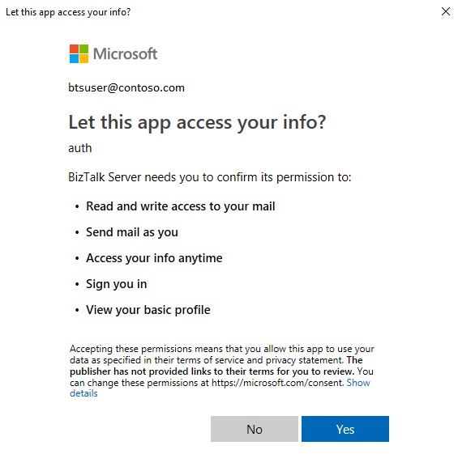

# Send and receive email with Office 365 Outlook Email adapter - BizTalk Server

The Office 365 Outlook Email Adapter allows you to send and receive mails from your Office 365 Outlook Email from BizTalk.

## Send mail using a send port

1. In the BizTalk Server Administration console, right-click **Send Ports**, select **New**, and select **Static One-way send port**.

    [Create a Send Port](../core/how-to-create-a-send-port2.md) provides some guidance.

2. Enter a **Name**. In **Transport**, set the **Type** to **Office 365 Outlook Email**, and select **Configure**.

3. Select **Sign in …**, and sign in to your Office 365 Account. The account is auto-populated with your email address.

4. Allow BizTalk Server approval for permission to access:

    

5. Configure your Office 365 Outlook Email default properties:

    |Use this|To do this|  
    |---|---|  
    | **To** | Specify your default To mail addresses separated by ';' (256 character max)|
    | **CC** | Specify your default CC mail addresses separated by ';' (256 character max)|
    | **Subject** | Mention your default mail subject. (256 character max) |
    | **Importance** | Select your value of Importance. Dropdown contains values **Low**, **Normal** and **High** with **Normal** being the default. |

    When finished, your properties look similar to the following:

    

6. Select **Ok** to save your changes.

### Important details

1. You can only send plain text messages using the send adapter.
2. The default properties may also be updated using promoted properties:

|Property|Promoted property|
|---|---|
| **To** | OfficeMail.To |
| **CC** | OfficeMail.CC |
| **Subject** | OfficeMail.Subject |
| **Importance** | OfficeMail.Importance |

### Test your send port

You can use a simple File receive port and location to send messages to your Office 365 Outlook Email.

1. Create a receive port using the File adapter. Within your receive location, set the **Receive folder** to **C:\\Temp\\In\\**, and set the file mask to **\*.xml**.
2. In your Office 365 Outlook Email adapter send port properties, set the **Filters** to `BTS.ReceivePortName == <Receive Port Name>`.
3. Paste the following into a text editor, and save the file as **Office365Mail.xml**. This is your sample message.

    ```xml
    <ns0:Root xmlns:ns0="http://BizTalk_Server_Project1.Schema1"> 
        <Record> 
            <Name>BizTalk User</Name> 
            <ID>001</ID> 
        </Record> 
    </ns0:Root> 
    ```

4. Start the File receive location and the Office 365 Outlook Email adapter send port.
5. Copy **Office365Mail.xml** sample message into the receive folder (C:\\Temp\\In\\). The send port sends the XML file as mail body to your Office 365 Outlook Email.

## Receive email using a receive port

1. In the BizTalk Server Administration console, right-click **Receive Ports**, select **New**, and select **One-Way receive port**.

    [Create a receive port](../core/how-to-create-a-receive-port.md) provides some guidance.

2. Enter a name, and select **Receive Locations**.

3. Select **New**, and **Name** the receive location. In **Transport**, select **Office 365 Outlook Email** from the **Type** drop-down list, and then select **Configure**.

4. Select **[Sign in …**, and sign in to your Office 365 Account. The account is auto-populated with your email address.

5. Allow BizTalk Server approval for permission to access:

    

6. Configure the **Endpoint** properties:

    |Use this|To do this|  
    |---|---|  
    | **Folder** | Select the folder to get email. The default folder is Inbox. Note that folders aren’t recursive in nature. For example, email from subfolders aren’t retreived. |
    | **Start from** | Enter how email is received from Office 365. This value indicates receivedTimeStamp of an email in Office 365 Outlook. Email more recent than the entered values are received.  |
    | **Unread mails only** | Check this to read only unread email. Keep it unchecked to read all email. |
    | **Post Action** | Select a post action to be performed after an email is read. **None** is the default, and does nothing after email is received by BizTalk. **Mark as read** implies, that after an email is received by BizTalk, the email in your mailbox is marked as read. **Delete** implies, that after an email is received by BizTalk, the email in your mailbox is deleted. Post actions are performed on a best-effort basis.|

    When finished, your properties look similar to the following:

    

7. Select **Ok** to save your changes.

### Test your receive settings

You can use a simple File send port to receive messages from your Office 365 Outlook Email.

1. Create a send port using the File adapter. Within your send port properties, set the **Destination folder** to **C:\\Temp\\Out\\**, and set the and **File name** to **%MessageID%.xml**.
2. In your File send port properties, set the **Filters** to  `BTS.ReceivePortName == <Receive Port Name>`.
3. Start the Office 365 Outlook Email receive location and the File send port.
4. Look for messages in the destination folder (c:\temp\out).

### Promoted Properties from receive pipeline

The following properties from the Receive Pipeline are promoted by default:

|Property Name| Promoted Property|
|---|---|
| **Importance** | OfficeMail.ReceivedMailImportance |
| **Subject** | OfficeMail.ReceivedMailSubject |
| **SenderName** | OfficeMail.SenderName |
| **SenderAddress** | OfficeMail.SenderAddress |
| **HasAttachments**| OfficeMail.HasAttachments |

> [!NOTE]
> Only the body content of the Email is passed through to the message.

## Next steps
See all the [Office 365 adapters](office365-adapters.md), or install [Feature Pack 3](https://aka.ms/bts2016fp3).