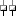

# Orchestration Shapes
Orchestration Designer is a visual tool for creating orchestrations. It provides several shapes that you can place on the design surface as visual representations of underlying actions, and they can help you to efficiently design and implement an orchestration.  
  
 **Insufficient Configuration Action**  
  
   
  
> [!NOTE]
>  The Insufficient Configuration Action is displayed in the Orchestration designer when the Orchestration Designer detects that the associated shape is not completely configured. If a shape in an Orchestration is not completely configured then the associated Orchestration will not compile.  
  
 The following table lists the available shapes, along with a brief description of the function of each shape.  
  
|Shape|Shape Name|Purpose|  
|-----------|----------------|-------------|  
||**Call Orchestration**|Enables your orchestration to call another orchestration synchronously.|  
||**Call Rules**|Enables you to configure a Business Rules policy to be executed in your orchestration.|  
||**Compensate**|Enables you to call code to undo or compensate for operations already performed by the orchestration when an error occurs.|  
||**Construct Message**|Enables you to construct a message.|  
||**Decide**|Enables you to conditionally branch in your orchestration.|  
||**Delay**|Enables you to build delays in your orchestration based on a time-out interval.|  
||**Expression**|Enables you to assign values to variables or make .NET calls.|  
||**Group**|Enables you to group operations into a single collapsible and expandable unit for visual convenience.|  
||**Listen**|Enables your orchestration to conditionally branch depending on messages received or the expiration of a timeout period.|  
||**Loop**|Enables your orchestration to loop until a condition is met.|  
||**Message Assignment**|Enables you to assign message values.|  
||**Parallel Actions**|Enables your orchestration to perform two or more operations independently of each other.|  
||**Port**|Defines where and how messages are transmitted.|  
||**Receive**|Enables you to receive a message in your orchestration.|  
||**Role Link**|Enables you to create a collection of ports that communicate with the same logical partner, perhaps through different transports or endpoints.|  
||**Scope**|Provides a framework for transactions and exception handling.|  
||**Send**|Enables you to send a message from your orchestration.|  
||**Start Orchestration**|Enables your orchestration to call another orchestration asynchronously.|  
||**Suspend**|Suspends the operation of your orchestration to enable intervention in the event of some error condition.|  
||**Terminate**|Enables you to immediately end the operation of your orchestration in the event of some error condition.|  
||**Throw Exception**|Enables you to explicitly throw an exception in the event of an error.|  
||**Transform**|Enables you to map the fields from existing messages into new messages.|
