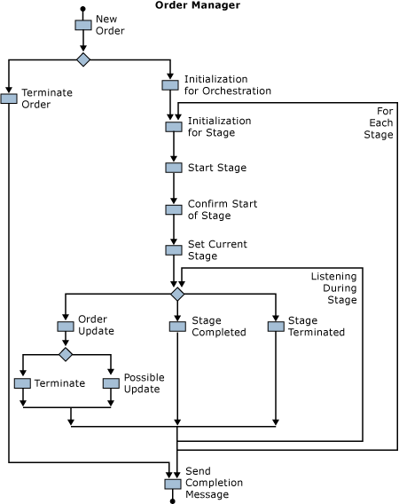

# Order Flow through the Process Manager
This section describes how the Southridge Video order process manager, the **OrderManager** orchestration, processes orders. This section follows a new order through the orchestration. The section also discusses how the orchestration handles updates to orders.  
  
> [!NOTE]
>  The business process manager solution includes only one process manager although it is written so that it can use more than one type of manager.  
  
 The **OrderManager** orchestration coordinates subordinate orchestrations that implement the business process to handle the order. The **OrderManager** sends the order through two stages which, combined, validate the order, send the information to the facilities group, send the order to the order system through remoting components, and update the order history. You can add, delete, or modify these stages without having to change the **OrderManager**.  
  
> [!NOTE]
>  Because of the size and scope of the **OrderManager** orchestration, you may want to read this section with the orchestration open in Microsoft Visual Studio.  
  
## Order Manager Structure  
 The **OrderManager** orchestration begins with a receive shape that activates the orchestration. The following diagram shows the general structure of the **OrderManager** orchestration.  
  
   
  
 The first receive shape leads to two main branches. One branch, the right one, processes new orders. The left branch, handles order cancellations. Because it accepts user input, it is possible for the **OrderManager** to receive an order cancellation after an order has already completed. This is the case the left main branch handles. The branch handles the isolated cancellation by setting flags for terminating processing and by adding a warning to the event log. The orchestration handles order cancellations that arrive while an order is being processed inside the right-hand branch.  
  
 The order processing branch does some initialization and then enters two nested loops. The outer loop runs once for each stage in the order processing. The inner loop runs while the stage is processing. The order manager also listens for possible updates to the order inside the inner loop. After the loops terminate, the order manager sends a completion message.  
  
 The order processing stages use dynamic, self-correlating ports to communicate back to the **OrderManager** orchestration. This simplifies correlation of the **OrderManager** with the stage instances because it eliminates the need to use a correlation set. For more information about self-correlating ports, see [Port Bindings](../core/port-bindings.md).  
  
## Receiving Orders  
 The **OrderManager** receives order messages from the **OrderBroker** orchestration through the **FromBrokerPort** port. This port is bound directly to the MessageBox database. The orchestration has two **Receive** shapes connected to the port: one for new orders and one for updated orders.  
  
 The **OrderManger** determines which messages to process based on a filter expression. The filter expression tests the value in the message status field and the order manager type field, **OrderMgrType**. If the status field is equal to ACCEPTED, and the **OrderMgrType** is CABLEORDER, the order is new and intended for this process manager.  
  
 The new order activates a new instance of the orchestration. The **OrderManager** next checks the type of the request in a **Decision** shape. If the type is Terminate, the orchestration executes the left-hand branch and terminates the order. Otherwise, the orchestration proceeds with processing the order. Notice that this includes listening for subsequent messages related to this particular order.  
  
## Initialization for New Orders  
 After the **OrderManager** orchestration receives an initial message and begins the main right-hand branch, it gets its configuration information from the **SSOConfigStore**. It does this through a singleton object defined in the **Utilities** assembly. The configuration values are properties of the object. The object manages a local cache of the configuration values similar to the Service Oriented Architecture solution. For more information about the singleton object, see [Using SSO Efficiently in the Business Process Management Solution](../core/using-sso-efficiently-in-the-business-process-management-solution.md).  
  
 Like the Service Oriented solution, the Business Process Management solution uses the secret store because it is present whenever BizTalk is installed, SSO caches the configuration information so that the values are readily available, and it can protect information such as database connection strings and passwords. For all of these reasons, the secret store would be a good place for the configuration information even if Single Sign-On weren't being used for managing connections to the backend applications.  
  
> [!NOTE]
>  The orchestration retrieves configuration information before starting processing. This ensures the orchestration uses the same configuration if it is dehydrated and, later, rehydrated. For more information about dehydration, see [Orchestration Dehydration and Rehydration](../core/orchestration-dehydration-and-rehydration.md).  
  
 The order manager uses one value from the configuration data: **TotalStages**, the total number of stages in the order handling process. The manager assigns this value to a local variable, **numStages**. It also sets two more variables connected to the outer loop, **stage** and **stop**. The **stage** indicates the current stage and is the counter for the outer loop; **stop** the stopping value.  
  
 Finally, the manager sets the **orderStatus** variable to STARTED and enters the outer processing loop.  
  
## New Order Processing Loops  
 The outer loop runs as long as the value of the **stage** variable is less than the value of the **numStages** variable. The outer loops drives the processing for each stage. The inner loop runs so long as a stage is still being processed. It also listens for possible changes to the order.  
  
### Outer Loop  
 The orchestration begins the outer loop by assigning the received message (**NewOrderMgrMsg**) to a variable, **OrderMgrMsg**. It then copies the stage and status to the routing part of the message. The orchestration also sets the return address in the message to the address of the **StageCompletionPort**:  
  
```  
OrderMgrMsg.RoutingPart.OrderMgrReturnAddress =   
       StageCompletionPort(Microsoft.XLANGs.BaseTypes.Address);  
```  
  
 The orchestration then sends the order to the **StagePort**, a solicit-response port. The orchestration then waits for an acknowledgement from the stage that order processing has started. The stage sends an **OrderAck** message when it starts processing the order.  
  
> [!NOTE]
>  The **OrderAck** message is one of several in the solution defined by .NET classes rather than a schema. For more information about using .NET classes to define messages, see [Constructing Messages in User Code](../core/constructing-messages-in-user-code.md).  
  
 When the orchestration receives the acknowledgement, it assigns the stage to the **currentStage** variable and enters the inner loop.  
  
### Inner Loop  
 The inner loop runs as long as the **currentStage** variable is equal to the **stage** variable; that is, as long as the current stage is being processed. The body of the loop is a **Listen** shape with three **Receive** shapes. The leftmost shape in the orchestration, **Order Request**, is part of the order update mechanism, described in the next section.  
  
 When an order processing stage finishes, it sends a message to the **StageCompletion** port of the **OrderManager** orchestration. If the stage abruptly terminates due to an error, it sends a **TerminatedMessage**. In this case, the **OrderManager** throws an exception. The outermost exception handler catches the exception and sends an error message to the **OperatorPort**.  
  
 If the stage sends an **OrderMgrMsg**, the **OrderManager** increments the **stage** variable. If there are more stages (stage less than or equal to numStages), the orchestrations sets the order status in **OrderMgrMsg** to STAGE_n_COMPLETED where n is the number of the current stage. If there are no more stages, it sets the order status to COMPLETED and exits both loops.  
  
## Order Updates  
 The **OrderManager** orchestration listens for order updates inside the inner processing loop. Notice that the **Receive** shape it uses for this, **OrderRequest**, also uses the **FromBrokerPort**. The use of a second receive shape on the same port inside a loop, combined with correlation sets, forms a common BizTalk Server pattern, the convoy pattern. You use the convoy pattern to ensure that the same instance of an orchestration processes the first and subsequent messages connected with a particular operation.  
  
 When the order manager receives the first message connected to an order, it initializes two correlation sets. The first, **OrderCorrelation**, uses the customer ID (**CustID**) and order ID (**OrderID**). The order manager shares this correlation with the order processing stages. The second correlation is the convoy correlation, **OrderConvoyCorrelation**, which uses the order status (**Status**) in addition to the customer ID and order ID. The **OrderRequestReceive** shape uses **OrderConvoyCorrelation** as a Following Correlation Set. Setting the correlation set up this way ensures that the instance of the order manager working on a particular order receives any changes.  
  
> [!NOTE]
>  Recall that a correlation set is a grouping of message properties used to determine whether or not a message belongs to a given instance of an orchestration. For more information, see [Using Correlations in Orchestrations](../core/using-correlations-in-orchestrations.md).  
  
 When the **OrderManager** receives a subsequent message for an order, it first tests the type of request. If the request type is TERMINATE, the Decision shape executes the terminate branch. Otherwise, the orchestration tests the new message to see if it is an update. An update message has a higher sequence number (**SeqNum**) than the original request. If the new message's sequence number is higher, the orchestration starts the order processing over with the new message. If the original and update message have the same or a lower sequence number, there is a sequence error. If the sequence numbers are equal, it is a duplicate order and flagged as a duplicate error.  
  
 For more information about **SeqNum**, see [Key Messages and Fields](../core/key-messages-and-fields.md).  
  
## Final Steps  
 After exiting the loops, the order manager assigns the reply address to the dynamic port **CSRCompletionPort**. The manager then constructs the completion status message, sends it, and then tests if there was an error. If there was an error, the orchestration exectues a Terminate shape; otherwise, it simply ends.  
  
## Coordinating with the Stages  
 Both the **OrderBroker** orchestration and the second processing stage orchestration (**CableOrder2**) make entries in the history database. The CableOrder2 orchestration updates the history information entered by the **OrderBroker** orchestration. In order to ensure there is an entry in the database to update, the **OrderBroker** uses delivery notification on the port it uses for the database.  
  
 Configuration maps the **OrderBroker** send port for the history database to a send port group containing two ports—one port for the test configuration (**HistoryInsert-Test-SP**), one for the regular configuration (**HistoryInsert-SP**). If you leave both ports in the group active, the solution sends messages on both ports. It thus requests two delivery notifications but processes only one.  
  
 To avoid this situation, unenlist the test port (**HistoryInsert-Test-SP**), or stop the test version of the application. For more information about delivery notification, see [Using Acknowledgments](../core/using-acknowledgments.md).  
  
## Errors and Routing Repaired Messages—Design Choices  
 The exception handler orchestration and orchestrations used by the order processing stages use an error handling orchestration (**ErrorHandlerOrch**) to route bad orders for repair. The design supposes that there is a department or group that will fix the order in the form needed. The repaired order is not resubmitted through the order broker orchestration (**OrderBroker**). Rather, the normalized order is repaired in its normalized form. The current design of the solution has the handler orchestration route the error message back to the source of the original order. Repaired orders, however, have to be routed to an MSMQ port on the error handler orchestration. (The test version of the solution uses a file folder.) The error handler then returns the repaired message to the calling orchestration.  
  
 This solution uses this design, because the order broker does significant validation and normalization of the order message. In turn, the order message requiring repair is also in the normalized form. Maintaining the normalized form of the message prevents having to work around the difference between the submitted and normalized forms of the messages.  
  
## See Also  
 [Process Manager Logic](../core/process-manager-logic.md)   
 [Key Messages and Fields](../core/key-messages-and-fields.md)
