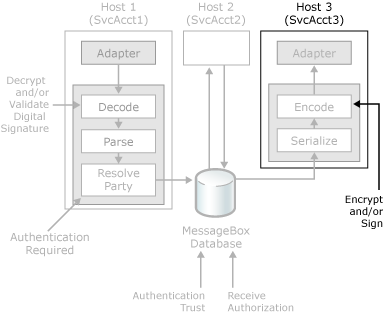

# Outbound Message Protection
The following figure shows the security features in BizTalk Server that you use to help protect outbound messages from being read by unauthorized parties.  
  
   
Security features BizTalk Server uses to protect outbound messages.  
  
 When [!INCLUDE[btsBizTalkServerNoVersion](../includes/btsbiztalkservernoversion-md.md)] sends a message, it takes the following steps to help ensure that it sends the message securely, and that the receiving party can determine the message sender:  
  
1.  If the send pipeline contains an encoding component (such as S/MIME) that is configured to sign all outbound messages, the signing certificate for the BizTalk group is retrieved from the personal certificate store for the host instance service account under which the pipeline is running, and the message is signed using the private key associated with the certificate.  
  
2.  If the send pipeline contains an encoding component (such as S/MIME) that is configured to encrypt all outbound messages, the encryption certificate thumbprint is used to retrieve the public key certificate from the Other People certificate store, and the message is encrypted using that certificate.  
  
> [!IMPORTANT]
>  Although you use one signing certificate for all the send pipelines in your BizTalk environment, you must ensure this signing certificate is available in the certificate store of the service account of each host instance of the hosts where the send pipelines are running.  
  
 For more information about how to send signed messages, see [How to Configure BizTalk Server for Sending Signed Messages](../core/how-to-configure-biztalk-server-for-sending-signed-messages.md).  
  
## See Also  
 [Inbound Message Authentication](../core/inbound-message-authentication.md)   
 [Authentication of Messages Between Processes](../core/authentication-of-messages-between-processes.md)   
 [Authenticating the Sender of a Message](../core/authenticating-the-sender-of-a-message.md)   
 [Authorizing the Receiver of a Message](../core/authorizing-the-receiver-of-a-message.md)   
 [Certificates that BizTalk Server Uses for Signed Messages](../core/certificates-that-biztalk-server-uses-for-signed-messages.md)
