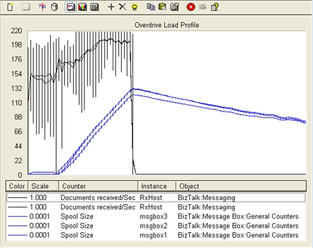

# Overdrive Load Test
The information in this topic refers to the tests explained in [Test Scenarios for Measuring MST of the Engine](../core/test-scenarios-for-measuring-mst-of-the-engine.md).

 The Load Generation tool, LoadGen 2007, enables you to simulate heavy loads on a BizTalk Server system.

> [!NOTE]
>  Download [LoadGen](https://www.microsoft.com/download/details.aspx?id=14925). The previous version of this tool, the BizTalk Server 2004 Load Generation Tool is available for download at [https://go.microsoft.com/fwlink/?linkid=108999](https://go.microsoft.com/fwlink/?linkid=108999).

 To simulate a continuously overdriven system, LoadGen 2007 was configured to send about 410 msgs/sec, 120 msgs/sec more than the measured maximum sustainable throughput.

 The test was designed not only to overdrive the system, but also to get an idea of how long it would take to recover from a spool backlog depth of around 2 million records.

 To accomplish this, the system was driven at the increased rate until the spool depth was around 2 million records. Once the spool depth reached the desired level then no further load was generated.

 To ensure that the BizTalk throttling mechanism did not throttle the receive host, which would prevent the accumulation of a spool table backlog, the **Message count in DB** throttling threshold for the receive host was changed from the default value of 50000 to 2000000. For information on changing the **Message count in DB** throttling threshold, see [How to Modify Resource Based Throttling Settings](../core/how-to-modify-resource-based-throttling-settings.md). For information about the default host throttling settings, see [Using Settings Dashboard for BizTalk Server Performance Tuning](../core/using-settings-dashboard-for-biztalk-server-performance-tuning.md).

 The following graph shows the same indicators as in the graph above.

 **Load profile of overdrive load test**

 

 As can be seen from the graph, the spool depth started building up immediately, peaking at just above 2 million records. At this rate, it took just about 2.5 hours to get to the targeted 2 million record backlog. After the load was stopped, it took around 8 hours for the cleanup jobs to recover from the backlog.

## See Also
 [Test Scenarios for Measuring MST of the Engine](../core/test-scenarios-for-measuring-mst-of-the-engine.md)
 [Using Settings Dashboard for BizTalk Server Performance Tuning](../core/using-settings-dashboard-for-biztalk-server-performance-tuning.md)
 [Sustainable Load Test](../core/sustainable-load-test.md)
