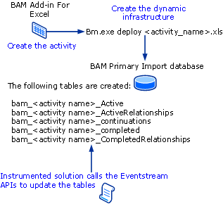

# Overview of the BAM Development Process
This topic describes the development process and the database and tables that store BAM data.

## Prerequisites for Developing with BAM
 Note the following prerequisites before you begin developing with BAM:

-   To instrument an application you must have an activity deployed.

-   You must have DBO rights to the SQL Server databases and be a member of the BAM Event Writer Role security context.

-   You must use Microsoft .NET 4 to develop your application. You can use any .NET language, although we recommend that you use C#.

-   You must have the Microsoft.BizTalk.BAM.EventObservation.dll installed on your computer. You can obtain the DLL in two ways:

    -   Use the BizTalk Server Configuration Manager to install the BAM tools. We recommend that you use the Configuration Manager because it places appropriate entries in the registry that facilitate upgrades. For more information about configuring BAM, see [Configuring BAM Tools Using the Configuration Manager](../install-and-config-guides/configure-biztalk-server.md).

    -   Copy the DLL from a computer on which they have already been installed. The DLL resides in the Microsoft BizTalk Server \<version\>\Tracking folder.

## BAM Development Process
 The following figure describes the BAM development flow.

 

 The following procedure lists the basic steps for developing a solution with BAM.

#### To develop a BAM-enabled solution

1.  Create an observation model with the BAM Add-in for Excel.

    > [!NOTE]
    > You can find examples that show the steps in this procedure in the [BAM API BizTalk Server sample](/biztalk/core/bam-api-biztalk-server-sample).

2.  Use the BAM Management utility to deploy the activity to the PID.

3.  Instrument the application by adding your BAM EventStream code.

4.  Run the application. When you do this, the code will:

    -   Add a placeholder record to the BAM_\<*activity name*\>_Active table.

    -   Update the data items in the record.

    -   End the activity and move the record to the BAM_\<*activity name*\>_completed table.

## Where BAM Data Is Stored
 BAM provides the EventObservation namespace that contains the EventStream classes that are used to handle BAM events.

 BAM tracking data is stored in the BAM Primary Import database (PID). When you deploy an observation model using the BAM Management utility, the following five tables are created in the PID.

|Name|Description|
|----------|-----------------|
|Active table|Named bam_\<*activity name*\>_Active, this table holds the activities of this type that have not yet completed.|
|Active relationships table|Named bam_\<*activity name*\>_ActiveRelationships, this table contains the related activities for the activity that have not yet completed.|
|Continuations table|Named bam_\<*activity name*\>_continuations, this table lists the continuations activities for the activity.|
|Completed table|Named bam_\<*activity name*\>_completed.|
|Completed Relationships table|Named bam_\<*activity name*\>_CompletedRelationships, this table contains the completed related activities for the activity.|

 You capture four types of data in a BAM activity:

-   String

-   Data/Time (commonly referred to as milestones)

-   Integer

-   Float
