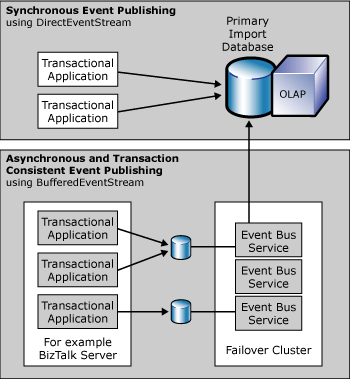

# Performance Considerations for BAM Event Publishing
BAM supports two forms of business event publishing:  
  
- Synchronous  
  
- Asynchronous  
  
  The following diagram illustrates the two models.  
  
    
  BAM Topologies  
  
  The synchronous approach is much simpler for management and using from code, while the asynchronous approach allows for better performance.  
  
## In This Section  
  
-   [Synchronous Business Event Tracking](../core/synchronous-business-event-tracking.md)  
  
-   [Asynchronous Business Event Tracking](../core/asynchronous-business-event-tracking.md)