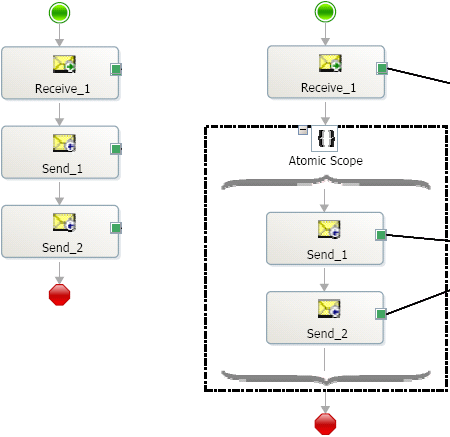

# Persistence in Orchestrations
The orchestration engine saves the entire state of an orchestration instance at various persistence points to allow rehydration of the orchestration instance. The state includes any .NET-based components that may be used in the orchestration, in addition to messages and variables. The engine stores state at the following persistence points:  
  
- End of a transactional scope (atomic or long running)  
  
- At debugging breakpoints  
  
- At the execution of other orchestrations through the Start Orchestration shape  
  
- At the Send shape (except in an atomic transaction)  
  
- When an Orchestration Instance is suspended  
  
- When the system shutdowns in a controlled manner  
  
- When the engine determines it wants to dehydrate  
  
- When an orchestration instance is finished  
  
  The engine optimizes the number of persistence points as they are expensive, especially when dealing with large message sizes. As shown in the two orchestration instances below, in the orchestration with the Send Shapes in an atomic scope, the engine determines a single persistence point between the end of the transaction scope and the end of the orchestration. In the other orchestration, there will be two persistence points, one for the first Send shape and the second for the Send shape plus end of the orchestration.  
  
  **Orchestration persistence**  
  
    
  
  Any .NET-based objects you use in orchestrations, either directly or indirectly, must be marked as serializable unless they are invoked in atomic scopes, or if the objects are stateless and are invoked only through static methods. **System.Xml.XmlDocument** is a special case and does not need to be marked as serializable regardless of the transaction property for a scope.  
  
  How does the special handling for **System.Xml.XmlDocument** work:  
  
  When the user defines a variable **X** of type **T**, where **T** is **System.Xml.XmlDocument** or a class derived from **System.Xml.XmlDocument** then the compiler will treat **X** as a serializable object.  
  
  When serializing **X**, the runtime will keep the following pieces of information: (a) the actual type **Tr** of the object **X** is referring to (b) the **OuterXml** string of the document.  
  
  When de-serializing **X**, the runtime will create an instance of **Tr** (this assumes a constructor that does not take any parameters) and will call **LoadXml** providing the instance with the saved **OuterXml.  X** will then be set to point to the newly created instance of **Tr**.  
  
## See Also  
 [Transactions](../core/transactions.md)