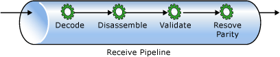
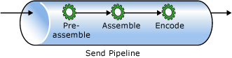

# Pipelines
Pipelines are a component of Microsoft BizTalk Server that provides an implementation of the Pipes and Filters integration pattern. During the receiving and sending of messages, there are business reasons to perform transformations on messages to prepare them to enter or leave BizTalk Server.  
  
 A common example is that you may need to transform a comma-delimited flat file into an XML file in order to take advantage of certain features in BizTalk Server such as maps; the flat file disassembler component does just that. It is common in integration scenarios to have a need to perform several types of transformations to a message before receiving or sending it; pipelines are used to meet this requirement. Pipelines enable the developer to define a series of transformations that will be performed on a message as it is being received or sent.  
  
 There are two types of pipelines, send and receive, and these match the ports in which they execute. *Send pipelines* are executed in send ports and in the response portion of a request/response receive port, while *receive pipelines* are executed in receive locations, and in the response portion of a solicit/response send port. Essentially, receive pipelines are intended to be used to transform messages that are being published to the MessageBox database, while send pipelines are intended to be used on messages which have been subscribed to and are being sent out of BizTalk Server.  
  
 Each pipeline has a set of stages that are executed in order when the pipeline is executed. Each stage can contain zero or more components. The maximum number of components depends on the stage.  
  
## Receive Pipeline Stages  
   
  
|Stage|Purpose|  
|-----------|-------------|  
|**Decode**|Decrypts or decodes the message data|  
|**Disassemble**|Disassembles an interchange into smaller messages and parses message contents|  
|**Validate**|Validates the message data, generally against a schema|  
|**Resolve Party**|Identifies the BizTalk Server party associated with some security token in the message or message context|  
  
## Send Pipeline Stages  
   
  
|Stage|Purpose|  
|-----------|-------------|  
|**Pre-assemble**|Performs any message processing necessary before assembling the message|  
|**Assemble**|Assembles the message and prepares it to be transmitted by taking steps such as adding envelopes, converting XML to flat files, or other tasks complementary to the disassemble stage in a receive pipeline|  
|**Encode**|Encodes or encrypts the message before delivery|  
  
 A stage in a pipeline has an *execution mode* of either All or First Match, which controls the components that get executed if more than one component is added to a stage. For stages with a mode of All, each component is called to process the message in the order in which they are configured in the stage. When the mode is First Match, each component is polled to indicate that it is the right component until a match is found, at which point the component that matches is executed, while the remaining components do not get executed.  
  
 As an example of execution modes, the Disassemble stage of a receive pipeline is a First Match stage, thus each component in the stage is called to see if it recognizes the message and can process it. If the component responds in the affirmative, then no other components in that stage are queried to see if they can also handle the message. However, the Decode stage of a receive pipeline has an execution mode of All, meaning that each component in this stage is called to process the message in the order in which they were configured. The first decoder might be to decrypt the message, while the second might be to decompress the message from a zipped format.  
  
 One common consequence of execution mode in pipeline processing occurs when a developer wants to use multiple disassemblers in a single receive pipeline. Often the disassembling components differ only slightly, for example two flat file disassemblers with similar but different schemas configured. In this case, while the message might actually match the schema defined in the second disassembler, the first disassembler might determine through its probing that it can process the message. It is only after processing the message that the error is discovered and the message suspended. In these cases, you can either create a new disassembler which has more specific probing logic in it, or create two different pipelines and receive the different messages in different receive locations.  
  
## Pipeline Deployment  
 When you deploy an assembly that contains a pipeline, the Management database saves the pipeline. The pipeline is associated with the specific version of the assembly with the following results:  
  
-   If you deploy multiple assemblies that use the same pipeline, the Management database creates one entry for the pipeline for each assembly.  
  
-   When you remove an assembly that contains a pipeline, the Management database removes the pipeline that is associated with the assembly. Because there is a copy of the pipeline for each associated assembly in the Management database, removing one assembly does not affect the others.  
  
## See Also  
 [Artifacts](../core/artifacts.md)
