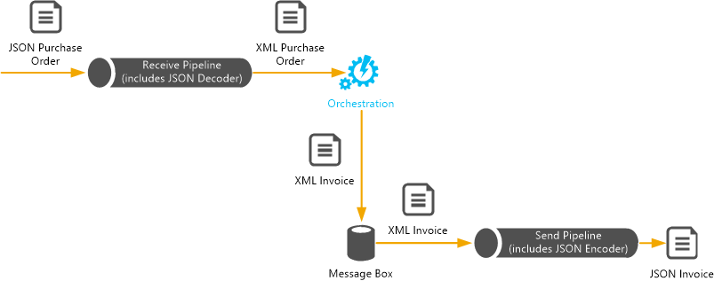

# Processing JSON messages using BizTalk Server
> [!NOTE]
>  This tutorial applies to BizTalk Server only.  
  
 This tutorial demonstrates how to process JSON messages using [!INCLUDE[btsBizTalkServerNoVersion](../includes/btsbiztalkservernoversion-md.md)]. The tutorial uses custom pipeline components, now available with BizTalk Server. These pipeline components convert the JSON message to XML (while receiving the message into [!INCLUDE[btsBizTalkServerNoVersion](../includes/btsbiztalkservernoversion-md.md)] orchestration, and converts the message from XML to JSON while sending the message out.  
  
## What does this tutorial do?  
 To demonstrate JSON processing, we create a [!INCLUDE[btsBizTalkServerNoVersion](../includes/btsbiztalkservernoversion-md.md)] that does the following, in the given order:  
  
1. Receives a JSON purchase order and in the receive pipeline, uses a JSON decoder component to transform the JSON message to XML message.  
  
2. Transforms the XML purchase order into an XML invoice using a map.  
  
3. In the send pipeline, uses a JSON encoder to transform the XML invoice into a JSON invoice and sends it out.  
  
     
  
## How to use this tutorial?  
 This tutorial is built around a sample (**BTSJSON**) that can be downloaded from the [MSDN Code Gallery](http://go.microsoft.com/fwlink/?LinkId=403197). You could use the sample and go through this tutorial to understand how the sample was built. Or, you could use this tutorial to create your own solution ground-up. This tutorial is targeted towards the second approach so that you understand how this solution was built. Also, as much as possible, the tutorial is consistent with the sample and uses the same names for artifacts (for example, schemas, transforms) as used in the sample.  
  
## In This Section  
  
-   [Generate an XSD schema for JSON message](../core/generate-an-xsd-schema-for-json-message.md)  
  
-   [Create custom pipelines to process JSON messages](../core/create-custom-pipelines-to-process-json-messages.md)  
  
-   [Create a BizTalk Server orchestration](../core/create-a-biztalk-server-orchestration.md)  
  
-   [Deploy and test the application](../core/deploy-and-test-the-application.md)  
  
## See Also  
 [BizTalk Server Tutorials](../core/biztalk-server-tutorials.md)