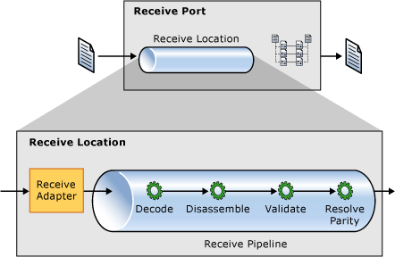
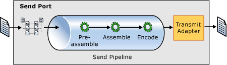

# Processing the Message
All of the components described so far play a part in the processing of messages as they flow through BizTalk Server. This section provides more detail about how these components interact functionally, beginning with receiving a message. The following figure shows the make-up of a receive port and the flow of a message through the receive process.  
  
 A *receive port* consists of one or more receive locations and zero or more maps. Maps are Extensible Stylesheet Language Transformations (XSLT) style sheets used to transform XML messages from one structure or format to another and are often used in the receive process to normalize messages into an internal format. Receive locations control the endpoints that receive the messages. A receive location consists of the configuration of an endpoint for a receive adapter, and a receive pipeline.  
  
   
  
## The Role of the Adapter  
 The receive adapter initiates the process of receiving messages by reading a stream of data and creating a message. For example, the file adapter sees that a file has been placed in its configured location and reads that file in a stream. The adapter creates a message (an implementation of the Microsoft.BizTalk.Message.Interop.IBaseMessage interface), adds a part to it (an implementation of the Microsoft.BizTalk.Message.Interop.IBasePart interface), and provides the stream of data as the part content.  
  
 In addition, the adapter writes and promotes into the message context properties related to the location, adapter type, and others related to the adapter. After the message and its context have been created, the adapter passes the message to the Endpoint Manager. The message is then processed through the receive pipeline, which has been configured for the receive location. After the message has been processed by the pipeline, a map may be used to transform the message into the format desired before the Endpoint Manager publishes the message with the Message Agent.  
  
## The Role of the Pipeline  
 While it is the adapter that creates the initial message, most of the processing that occurs on a received message happens in the receive pipeline. Pipeline processing deals with message content as well as message context. Message content is generally handled in the decoding, disassembling, and validating stages, while message context can be handled in all stages. A pipeline, however, does not necessarily act on either the content or the context. For example, the default pass-through pipeline has no components configured and performs no processing on the message content or context. For simplicity, this document focuses on the disassembling components as they generally have the greatest impact on message routing.  
  
 The job of the *disassembler* is to process an incoming message from an adapter and to disassemble it into many messages, and parse the message data. When an incoming message has many smaller messages, this is known as an *interchange*. Both the flat file disassembler and the XML disassembler handle interchanges by enabling a developer to configure information about the wrapping content (that is, a header and trailing schema for the flat file disassembler and an envelope schema for the XML disassembler) and the (potentially repeating) body content. In addition, both of these disassemblers parse the original message into XML content. A custom disassembler does not necessarily parse the content into XML if further XML processing in BizTalk Server is not required. An example scenario might include a simple routing situation in which messages entering the system at a particular receive location are sent to a specific send port with no mapping or other XML-based processing.  
  
## Routing with the Message Type  
 One of the most common message properties used in routing is the message type. When a developer creates a schema to define the structure of messages, this schema defines the message type for that message. The type is determined by the root node and namespace in the schema definition. For example, an XML document that looks like the following would have a message type of http://tempuri.org/samples/MessageType#Message  
  
```  
<Message xmlns=http://tempuri.org/samples/MessageType>  
<SomeOtherElement type="sample"/>  
</Message>  
```  
  
 To use message type in routing, it must be promoted into the context. Disassemblers are used to promote this value into the message context as well as the pipeline components with the most specific knowledge of message structure. The XML and Flat File disassemblers promote the message type as they are processing messages, and any custom disassembler should also promote this property to ensure proper routing.  
  
 It is important to note that a message is not required to have a type. As mentioned previously, the parts of a message can be any binary data and need not have a schema that defines their structure. This type of message part is generally passed through BizTalk Server without much, if any, processing done on it by BizTalk Server itself, though custom pipeline components, adapters, or code called from orchestrations may interact with these parts.  
  
 Pipeline components, like adapters, also write and promote properties into the message context. In fact, pipeline components are the most common mechanism most developers use to get properties into the message context. Developers create schemas and can promote properties in the schema. This information is stored in the schema as annotations which can then be used by pipeline components. All of the built-in disassembler and assembler components - FlatFile, XML, and BizTalk Framework - use the document schema to retrieve information about the properties that are to be promoted. Using the XML Path Language (XPath) statement from the annotations, the disassembler knows the location in the document of elements to be promoted. During the process of streaming through the document, the disassembler finds those elements that match one of the XPath statements and promotes or writes the value into the context as appropriate.  
  
 Custom pipeline components can also be written to handle getting properties into the context for arbitrary data in a received or sent message. In order to promote a property into the context and have it be useful for routing, which is presumably why the value is being promoted, a property schema with a definition for the property should be created and deployed to BizTalk Server. Before you define a property schema to be used by custom components, you should understand the different types of promoted properties. Promoted properties defined in a property schema can have one of two base types:  
  
- [Microsoft.XLANGs.BaseTypes.MessageContextPropertyBase](http://msdn.microsoft.com/library/microsoft.xlangs.basetypes.messagecontextpropertybase.aspx) or  
  
- [Microsoft.XLANGs.BaseTypes.MessageDataPropertyBase](http://msdn.microsoft.com/library/microsoft.xlangs.basetypes.messagedatapropertybase.messagedatapropertybase.aspx)  
  
  A property with a base type of MessageDataPropertyBase indicates that the value for this property comes from the content of the message. This is the default value for properties defined in a property schema and is the most common usage. MessageContextPropertyBase indicates a property that is intended to be part of the message context but does not necessarily come from the message data directly. Properties with MessageContextPropertyBase as their base type are often promoted by adapters and disassemblers and include common properties such as message type and adapter type.  
  
  It is important to understand the different types and use them appropriately when defining properties. One of the most significant implications occurs when accessing context properties for a message in an orchestration. If a property is identified as a MessageDataPropertyBase, the Orchestration Designer examines the schema of the message being received and ensures that it defines a matching promoted property. If no property is found in the schema tied to the promoted property being accessed, then the Designer does not allow you to access it. On the other hand, if the property is defined as being a MessageContextPropertyBase, the message type does not matter and the property can be accessed.  
  
  In custom pipelines, the mechanism for promoting or writing properties to the context is very similar. For writing properties, you use a call to the IBaseMessageContext Write method to place the value in the context. For promoted properties, you simply use the IBaseMessageContext Promote method instead. Each of these methods takes a property name, a namespace, and value. For the promoted properties, the name and namespace are those of the property defined in the property schema and are most easily accessed by referencing the property schema assembly and using the properties on the class created for the property. Distinguished fields use a common namespace, http://schemas.microsoft.com/BizTalk/2003/btsDistinguishedFields, and the XPath expression used to retrieve the value is usually used as the name.  
  
  The code below shows an example of both promoting and writing properties into the context. Note that in this example, a distinguished field is being written into the context. This is only useful for orchestrations in which the message schema identifies the distinguished field so that the Orchestration Designer knows about the field. It may be useful to write properties into the context for use by other pipeline components on the receiving or sending side.  
  
```  
//create an instance of the property to be promoted  
SOAP.MethodName methodName = new SOAP.MethodName();  
  
//call the promote method on the context using the property class for name   
//and namespace  
pInMsg.Context.Promote(methodName.Name.Name, methodName.Name.Namespace,   
"theSOAPMethodName");  
  
//write a distinguished field to the context  
pInMsg.Context.Write("theDistinguishedProperty",   
"http://schemas.microsoft.com/BizTalk/2003/btsDistinguishedFields",   
"theDistinguishedValue");  
```  
  
 Keep the following facts in mind when writing or promoting values into the context:  
  
- Writing a value into the context with the same name and namespace that were used previously to promote the property causes that property to no longer be promoted. The write essentially overwrites the promotion.  
  
- Writing a value of null into the context deletes the value, because null-valued properties are not permitted.  
  
- Promoted properties are limited to 256 characters in length while written properties have no length limitation.  
  
  Promoted properties are used in message routing and are limited in size for reasons of efficiency in comparison and storage. While written properties have no hard limits on size, using excessively large values in the context will have an impact on performance, because those values must still be processed and passed with the message.  
  
  When a message is ready to be sent from BizTalk Server, it undergoes a complementary process in the send port. Maps are applied to messages before the send pipeline is executed, allowing a message to be transformed to a customer or application-specific format before being processed by the pipeline and sent through the adapter. In the send pipeline, instead of promoting properties into the message context, properties are demoted from the context into the message.  
  
    
  
## See Also  
 [Runtime Architecture](../core/runtime-architecture.md)   
 [How BizTalk Server Processes Large Messages](../core/how-biztalk-server-processes-large-messages.md)