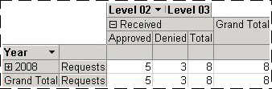
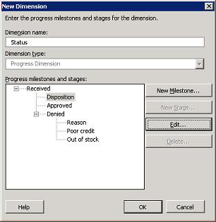

# Progress Dimension
Use a progress dimension to group BAM activities by milestones they have reached. This is best illustrated by an example.  
  
 Consider the orchestration from Tutorial 1 that processes requests for items. (See [Tutorial 1: Enterprise Application Integration](../core/tutorial-1-enterprise-application-integration.md) for more information about this orchestration.) The orchestration contains a Decision shape followed by two branches. In [Tutorial 4: Business Activity Monitoring](https://msdn.microsoft.com/library/81d5e768-f8a6-4eb0-8e6c-64db47455476) you map the business milestone Denied to a shape in the branch that represents the request being denied, and you map the business milestone Approved to a shape in the branch that represents the request being approved. You then create a progress dimension that includes the business milestones Approved and Denied. When you use the progress dimension in a PivotTable, you can display the BAM activities grouped by whether they were approved or denied. This is illustrated in the following figure.  
  
   
  
 You could define sub-milestones within the Denied milestone, although this is not done in the tutorials. For example, if the orchestration identified reasons for denial, you could create sub-milestones named Poor credit and Out-of-stock within the Denied milestone. If you used the progress dimension in a PivotTable, you could drill down into the Denied milestone to see the BAM activities that have reached the Poor-credit milestone and the BAM activities that have reached the Out-of-stock milestone.  
  
 Progress dimensions in BAM consist of *progress milestones* and *progress stages*. A progress milestone represents a classification, a way you want to group BAM activities. Approved and Denied, for example, are progress milestones because you will classify request activities as approved or denied.  
  
> [!NOTE]
>  The use of the word “milestone” for two concepts is unfortunate. A *business milestone* is an activity item in a BAM activity; it represents the date and time at which some event in the application occurred. A *progress milestone* is a way of grouping activity instances. Each progress milestone corresponds to a business milestone. To minimize confusion, consider using the same name for the progress milestone and the business milestone that it corresponds to.  
  
 A progress stage is a group of peer milestones. Our example with sub-milestones contains two progress stages. The first progress stage consists of the progress milestones Approved and Denied. The second progress stage consists of the progress milestones Poor-credit and Out-of-stock.  
  
 A progress dimension starts with a progress milestone as its root. This progress milestone often represents the original message being received. Each progress milestone can contain one progress stage and any number of other progress milestones. All progress milestones in a progress stage must be mutually exclusive. In the following figure, Disposition and Reason are progress stages, whereas Received, Approved, Denied, Poor credit, and Out of stock are progress milestones.  
  
   
  
## How to Create Progress Dimensions  
 Design the progress dimension before you use the BAM View Wizard to create it. The following table identifies the process for designing a progress dimension, and also includes an example of each step.  
  
|Process|Example|  
|-------------|-------------|  
|Draw the hierarchy of categories and sub-categories that you want to report on.   These levels will become progress milestones.|Received:   - Approved   - Denied   - Poor Credit   - Out Of Stock|  
|For each set of categories at the same level, choose a name that represents what those categories are.   These set names will become progress stages.|The level that contains Approved and Denied is called “disposition”.   The level that contains Poor Credit and Out Of Stock is called “reason”.|  
|Identify the business milestone that represents each progress milestone.   **Note:** The BAM activity must include an activity item for each of these business milestones.|Received: Received   Approved: Approved   Denied: Denied   Poor Credit: Denied-poor-credit   Out Of Stock: Denied-out-of-stock|  
  
 You will use these progress milestones, stages, and business milestones when you create the progress dimension.  
  
> [!NOTE]
>  The following procedure begins at the point where you are creating a dimension. You must already have created BAM activities and begun creating a BAM view.  
  
#### To create a progress dimension  
  
1.  Click the **Add-Ins** tab, and then select **BAM View** from the **BAM** drop-down list in the **Menu Commands** group.  
  
2.  In the BAM View Wizard, click **Next** until you see the **New BAM View: Aggregation Dimensions and Measures** page.  
  
3.  Click **New Dimension**.  
  
4.  In the **New Dimension** dialog box, type a name for the dimension in the **Dimension name** box, and then select **Progress Dimension** from the **Dimension type** drop-down list.  
  
5.  Click **New Milestone**.  
  
6.  In the **Progress Milestone** box of the **New Progress Milestone** dialog box, type the name of the progress milestone at the top level of the hierarchy that you designed. For the running example, you would type `Received`.  
  
7.  Select the business milestone that corresponds to the progress milestone, and then click **OK**. For the running example, you would select **Received (\<activity name\>)**.  
  
8.  In the **New Dimension** dialog box, click **New Stage**.  
  
9. In the **Progress stage** box of the **New Progress Stage** dialog box, type the name of the highest-level stage, and then click **OK**.  For the running example, you would type **disposition**.  
  
10. In the **New Dimension** dialog box, click **New Milestone**.  
  
11. In the **Progress milestone** box of the **New Progress Milestone** dialog box, type the name of one of the first-level milestones. For the example we are using, you would type `Approved`.  
  
12. In the **Business milestone** drop-down box, select the business milestone that corresponds to the progress milestone, and then click **OK**. For the running example, you would select **Approved (\<activity name\>)**.  
  
13. Repeat the previous three steps to add any other milestones that are within the same progress stage.  
  
14. If a business milestone contains sub-milestones, select the parent milestone in the **New Dimension** dialog box, click **New Stage**, and then repeat the previous five steps to define the sub-stage and its milestones.  
  
     The following figure shows the **New Dimension** dialog box after you have created the example progress dimension.  
  
       
  
## See Also  
 [Defining Business Activities and Views in Excel](../core/defining-business-activities-and-views-in-excel.md)   
 [Data Dimension](../core/data-dimension.md)   
 [Time Dimension](../core/time-dimension.md)   
 [Numeric Range Dimension](../core/numeric-range-dimension.md)   
 [Defining Dimensions](../core/defining-dimensions.md)
