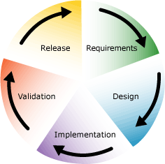

# Project Planning Recommendations by Phase
There are a number of software development lifecycle models in existence today, each with their own approaches, benefits, and limitations. The goal of this section is to provide a set of recommendations that will help you plan appropriately for a successful [!INCLUDE[btsBizTalkServerNoVersion](../includes/btsbiztalkservernoversion-md.md)] development project.  
  
 In this section, we use the lifecycle model employed broadly at Microsoft. This model is a combination of iterative and waterfall lifecycle models.  
  
 In this model, there are five phases whose boundaries define a sequential set of milestones for the project. The phases, in order of execution, are as follows:  
  
- **Requirements**. User requirements are captured in functional specifications that define what is to be built.  
  
- **Design**. Based on the functional requirements, physical design specifications are created and prototyping is conducted to verify design ideas and investigate platform capabilities.  
  
- **Implementation**. Using the design and functional specifications, the software coding is done.  
  
- **Verification**. This is the process of testing the software to verify that it performs according to the specifications.  
  
- **Release**. After the software has been fully verified, it is packed and prepared for release to users.  
  
  The following figure shows this project planning cycle.  
  
    
  
  Most, if not all, of these phases overlap in time and there are typically iterative sub-phases. For example, it is common to complete implementation of a sub-set of the product features and for verification to begin on that subset while implementation of the next sub set of features is under way. Therefore, while the recommendations in this section are associated with certain phases, the intention is not to imply that they cannot happen in parallel, but rather to give some idea of the relative order that the recommendations should be considered and factored into planning.  
  
## In This Section  
  
-   [Requirements Phase Recommendations](../core/requirements-phase-recommendations.md)  
  
-   [Design Phase Recommendations](../core/design-phase-recommendations.md)  
  
-   [Implementation Phase Recommendations](../core/implementation-phase-recommendations.md)  
  
-   [Verification Phase Recommendations](../core/verification-phase-recommendations.md)  
  
-   [Release Phase Recommendations](../core/release-phase-recommendations.md)