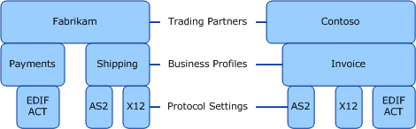

# Protocol Settings
## Overview
After creating the business profiles, which reflect the business divisions within an organization, an enterprise needs to declare the parameters that define how the communication between the business profiles takes place. These communication parameters are defined as protocol settings. Protocol settings define how business transactions are to be supported for a specific B2B protocol. Each business profile defines the various settings for processing messages (encoding) or transmitting messages (transport) for each of the B2B protocols over which the partner can communicate. The communication parameters for the business profiles are defined under the following two categories:  
  
- **Encoding Protocol Settings**: The encoding protocols govern the structure and content of a B2B message. The encoding protocol settings for a business profile define the encoding protocol that a business division uses to send and receive B2B messages. Some examples of encoding protocols are X12, EDIFACT, HL7, etc. For a detailed discussion around supported encoding protocols for [!INCLUDE[btsBizTalkServerNoVersion_md](../includes/btsbiztalkservernoversion-md.md)], see [EDI Standards Support](../core/edi-standards-support.md). As part of the encoding protocol you can provide various settings like whether the sending party expects an acknowledgement, whether the messages will be batched or sent individually, etc. You can always overwrite these settings as part of the trading partner agreement. See [Trading Partner Agreement](../core/trading-partner-agreement.md).  
  
- **Transport Protocol Settings**: The transport protocol governs the transport channel used for sending the messages back and forth between two partners. Since transport is essentially between two transport end points, each business profile defines its own “transport end point” configuration and communicates with a singular “transport end point” of its trading partner’s business profile. For information about the supported transport protocol, see [AS2 Support in BizTalk Server](../core/as2-support-in-biztalk-server.md). As part of the transport protocol, you can provide various settings like whether the message should be signed, whether the message should be encrypted, etc. You can always overwrite these settings as part of the trading partner agreement. For more information about agreements, see [Trading Partner Agreement](../core/trading-partner-agreement.md).  
  
  By defining the protocol settings, the business profiles declare the message format and the transport protocol to be used for sending B2B messages between trading partners.  
  
> [!NOTE]
>  Defining the protocol settings as part of a business profile is optional. If you don’t specify the protocol settings as part of the business profile, you can always specify those in an agreement.  
  
 The following figure illustrates how trading partner, business profiles, and protocol settings gel together in a TPM solution:  
  
   
  
 In the above illustration, the “Shipping” business profile can send and receive messages with X12 encoding format sent over AS2 transport protocol. Similarly, the “Invoice” shipping profile can send and receive messages of both X12 and EDIFACT encoding format over the AS2 transport protocol.  
  
 It is now evident how defining a business profile is helpful in creating a TPM solution in [!INCLUDE[btsBizTalkServerNoVersion](../includes/btsbiztalkservernoversion-md.md)]. Currently, as the illustration shows, the “Shipping” business profile can only send and receive X12 messages. So, any business profile communicating with “Shipping” business profile will have to adhere to the properties setting for the “Shipping” business profile. However, in future, if the “Shipping” business profile starts accepting messages with EDIFACT encoding, it only needs to set the relevant properties to include EDIFACT support. The partner organization does not need to create a new business profile for the same shipping division.  
  
## Do I always need to specify the protocol settings when creating a business profile?  
 In theoretical terms, yes, a business profile must contain the protocol settings definition. However, this does not imply that you must define the protocol settings while creating a business profile in TPM user interface. TPM provides you with the flexibility of specifying the protocol settings while creating the business profile or while creating a trading partner agreement. If you define the protocol settings as part of the business profile, they will be available for you while creating a trading partner agreement for that profile. However, if you define the protocol settings as part of the agreement, you will have to provide all the values as part of the agreement.  
  
> [!IMPORTANT]
>  If you do not define the protocol settings as part of the business profile, you will need to enter the values as part of each agreement for that business profile, thereby defeating the scalability model of the new TPM solution. Hence, Microsoft recommends that you define the protocol settings for each business profile. You can always override those settings, if required, while creating a trading partner agreement.  

## Learn next
[Trading Partner Agreement](../core/trading-partner-agreement.md)  
[Putting it all Together: Defining a Trading Partner Management Solution](../core/putting-it-all-together-defining-a-trading-partner-management-solution.md)  
  
## See Also  
 [Building Blocks of a Trading Partner Management Solution](../core/building-blocks-of-a-trading-partner-management-solution.md)