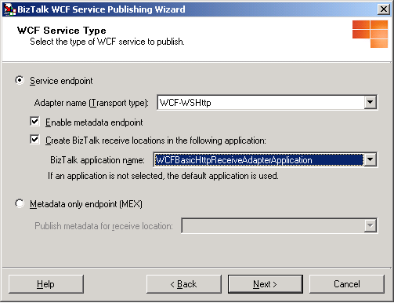
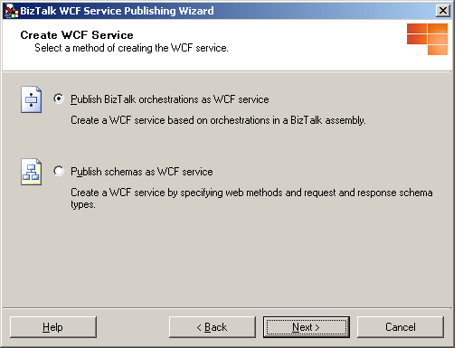
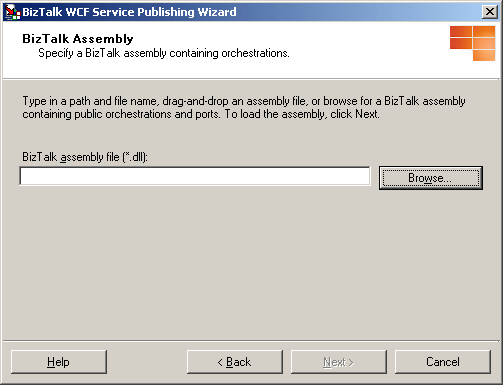
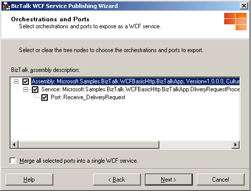
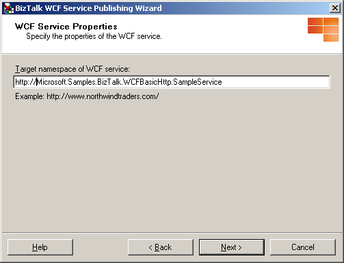
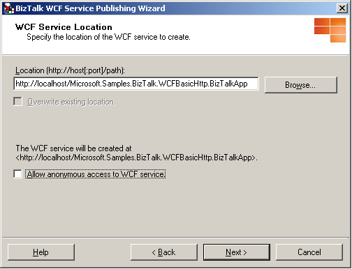

# How to Use the BizTalk WCF Service Publishing Wizard to Publish Orchestrations as WCF Services
You use the BizTalk WCF Service Publishing Wizard to publish orchestrations as WCF services.  
  
> [!NOTE]
>  You must build your BizTalk projects before running the BizTalk WCF Service Publishing Wizard. The BizTalk projects must include orchestrations having at least one receive port whose type modifier is public. This type modifier exists in the properties for the orchestration when the port is created.  
  
### To publish an orchestration as a WCF service  
  
1. Click **Start**, point to **All Programs**, point to [!INCLUDE[btsBizTalkServerNoVersion](../includes/btsbiztalkservernoversion-md.md)], and then click **BizTalk WCF Service Publishing Wizard**.  
  
   > [!NOTE]
   >  To create and publish BizTalk orchestrations and schemas as WCF services with the WCF adapters, you use the BizTalk WCF Service Publishing Wizard. To publish orchestrations and schemas as Web services with the SOAP adapter, you use the BizTalk Web Services Publishing Wizard.  
  
2. On the **Welcome to the BizTalk WCF Service Publishing Wizard** page, click **Next**.  
  
3. On the **WCF Service Type** page, select **Service endpoint** option to publish the WCF services on selected BizTalk orchestrations in a BizTalk assembly.  
  
      
  
4. On the **WCF Service Type** page, select **Enable metadata endpoint** check-box to indicate whether the isolated WCF receive location hosted by Internet Information Services (IIS) publish service metadata for retrieval using an HTTP/GET request. By enabling this check-box, the wizard generates Web.config where the **httpGetEnabled** attribute of the **\<serviceMetadata\>** element is set to **true**. You can use a metadata import tool (such as SvcUtil.exe) to generate the client code required to call this service in the development environment. The address at which the metadata is published is the endpoint address plus a **?wsdl** query string.  
  
   > [!NOTE]
   >  To prevent unintentional disclosure of potentially sensitive service metadata, it is recommended to disable this behavior on the production environment. This can be done by setting httpgetenabled to false, or deleting the MEX virtual directory.  
  
5. On the **WCF Service Type** page, in the **Adapter name (Transport type)** drop-down list, select the isolated WCF adapter with which the WCF services are published. You can select any of the following adapters:  
  
   -   **WCF-BasicHttp.** The WCF-BasicHttp adapter can communicate with WS-I Basic Profile 1.1-conformant Web services like ASMX-based services.  
  
   -   **WCF-WSHttp.** The WCF-WSHttp adapter can communicate with a service through the WS-* standards over HTTP and HTTPS.  
  
   -   **WCF-CustomIsolated.** The WCF-CustomIsolated adapter enables the use of Windows Communication Foundation (WCF) extensibility features over the HTTP transport.  
  
6. On the **WCF Service Type** page, select the **Create BizTalk receive locations in the following application** check-box to create the receive ports and locations corresponding to each generated .svc file for the WCF adapter that you selected in the **Adapter name** drop-down list. If a receive location already exists, it is not replaced. After selecting this option, choose the application where the receive ports and locations will be generated in the **BizTalk application name** drop-down list, and then click **Next**.  
  
7. On the **Create WCF Service** page, select **Publish BizTalk orchestrations as WCF service**, and then click **Next**.  
  
      
  
8. On the **BizTalk Assembly** page, in the **BizTalk assembly file (\*.dll)** text box, type the name of the BizTalk assembly file or click **Browse** to browse to the assembly containing the orchestration(s) to publish, and then click **Next**.  
  
   > [!NOTE]
   >  Before choosing a BizTalk assembly file, copy all of the dependent assemblies into the same folder with the BizTalk assembly or install the dependent assemblies to the global assembly cache (GAC).  
  
   > [!NOTE]
   >  If you installed the BizTalk assembly file into the GAC, make sure that the assembly in the GAC has been updated with the assembly that you will select in the **BizTalk Assembly** dialog box. If the assembly in the GAC has the same fully qualified name, the BizTalk WCF Service Publishing Wizard uses the assembly file in the GAC instead of the one you selected.  
  
   > [!NOTE]
   >  Paths over 260 characters long may cause an error message that the path is too long.  
  
      
  
9. On the **Orchestrations and Ports** page, expand the tree nodes for each assembly and orchestration by clicking the plus sign (+). Select orchestrations and ports to publish by selecting the corresponding tree node check boxes. If you want to create one WCF service (.svc file) for all of the selected receive ports instead of one WCF service for each receive port, select the **Merge all selected ports into a single WCF service** option, and then click **Next**.  
  
    > [!NOTE]
    >  When you merge all selected ports into a single WCF service, all of the selected ports have the same port type, and the operation names in the ports are unique.  
  
       
  
10. On the **WCF Service Properties** page, in the **Targetnamespace of the WCF service** text box, type a target namespace for the WCF services, and then click **Next**.  
  
       
  
11. On the **WCF Service Location** page, in the **Location** text box, type the Web directory name where the WCF services are generated. You can accept the default location (http://localhost/<*BizTalk Assembly Name*>), type a location for the WCF services in the **Location** text box, or click **Browse** and select a Web directory. Select any of the following options:  
  
    - **Overwrite existing project.** This option is only available if the Web directory already exists. You will be able to publish to the same location only if you select this option. Otherwise, you must enter a different project location.  
  
    - **Allow anonymous access to WCF service.** This option adds anonymous access to the created virtual directory. By default, the virtual directory inherits the access privileges from its parent virtual directory or the Web site (if it is a top-level virtual directory).  
  
      When you finish this page, click **Next**.  
  
        
  
    > [!NOTE]
    >  The project location can exist on a different server. To publish the WCF services to a different server, type the project name as http://<*servername*>/<*WCF service location*>.  
  
    > [!NOTE]
    >  The project location can exist on a non-default Web site. When publishing to a non-default Web site, include the port number of the Web site in the URL. For example, http://<*servername*>:8080/<*WCF service location*>.  
  
    > [!NOTE]
    >  When using the wizard to create receive locations, the wizard creates the receive locations using the default values. The default value for the receive pipeline is the **Microsoft.BizTalk.DefaultPipelines.PassThruReceive** pipeline. If messages received through the published WCF services require any special pipeline processing (for example, validation, correlation/property promotion, or inbound/outbound maps) then you should set the receive pipeline to **Microsoft.BizTalk.DefaultPipelines.XMLReceive**, or to a custom pipeline, using the BizTalk Server Administration console.  
  
    > [!NOTE]
    >  If you decide not to use the **Publishing orchestration as WCF service** option after you reach this page, on the **Create WCF Service** page, you may see that the **Web service description** displays the service and method names from the BizTalk assembly that you selected before you changed the publishing option. This is because the in-memory Web service description is not cleared when the publishing method is changed.  
  
12. On the **WCF Service Summary** page, review your settings for the WCF services.  
  
13. Click **Create** to create the WCF services.  
  
14. Click **Finish** to complete the BizTalk WCF Service Publishing Wizard.  
  
15. After publishing WCF services with the BizTalk WCF Service Publishing Wizard, you must configure them properly. For information about how to configure the isolated WCF receive adapter, see [How to Configure WCF Services Published with the BizTalk WCF Service Publishing Wizard](../core/configure-wcf-services-published-with-the-biztalk-wcf-service-publishing-wizard.md).  
  
## See Also  
 [How to Configure WCF Services Published with the BizTalk WCF Service Publishing Wizard](../core/configure-wcf-services-published-with-the-biztalk-wcf-service-publishing-wizard.md)   
 [Walkthrough: Publishing WCF Services with the WCF-BasicHttp Adapter](../core/walkthrough-publishing-wcf-services-with-the-wcf-basichttp-adapter.md)   
 [How to Use the BizTalk WCF Service Publishing Wizard to Publish Schemas as WCF Services](../core/publish-schemas-as-wcf-services--use-the-biztalk-wcf-service-publishing-wizard.md)