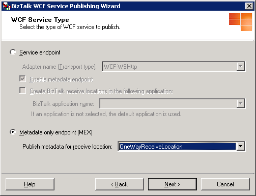

# How to Use the BizTalk WCF Service Publishing Wizard to Publish Service Metadata for a WCF Receive Location Bound to an Orchestration Port
You use the BizTalk WCF Service Publishing Wizard to create a WCF service to publish service metadata for existing WCF receive locations bound to orchestration ports.  

> [!NOTE]
>  You must build your BizTalk projects before running the BizTalk WCF Service Publishing Wizard. The BizTalk projects must include orchestrations having at least one receive port whose type modifier is public. Before you publish service metadata for the WCF adapters, you must also create the WCF receive locations by using the BizTalk Administration console or the BTSTask command-line tool included with [!INCLUDE[btsBizTalkServerNoVersion](../includes/btsbiztalkservernoversion-md.md)]. For more information about how to create a WCF receive location, see the appropriate topic for each WCF adapter in [WCF Adapters](../core/wcf-adapters.md).  

### To publish service metadata for an existing WCF receive location bound to an orchestration port  

1. Click **Start**, point to **All Programs**, point to [!INCLUDE[btsBizTalkServerStartMenuItemui](../includes/btsbiztalkserverstartmenuitemui-md.md)], and then click **BizTalk WCF Service Publishing Wizard**.  

   > [!NOTE]
   >  To create and publish WCF serve metadata for BizTalk orchestrations and schemas, you use the BizTalk WCF Service Publishing Wizard. To publish orchestrations and schemas as Web services with the SOAP adapter, you use the BizTalk Web Services Publishing Wizard.  

2. On the **Welcome to the BizTalk WCF Service Publishing Wizard** page, click **Next**.  

3. On the **WCF Service Type** page, select the **Metdata only endpoint (MEX)** option to publish the WCF services to provide service metadata for the WCF receive location that you will select in the next step.  

      

4. On the **WCF Service Type** page, in the **Publish metadata for receive location** drop-down list, select a WCF receive location to publish service metadata for, and then click **Next**.  

5. On the **Create WCF Service** page, select **Publish BizTalk orchestrations as WCF service**, and then click **Next**.  

      

6. On the **BizTalk Assembly** page, in the **BizTalk assembly file (\*.dll)** text box, type the name of the BizTalk assembly file or click **Browse** to browse to the assembly containing the orchestration(s) to publish service metadata for, and then click **Next**.  

   > [!NOTE]
   >  Before selecting a BizTalk assembly file, copy all of the dependent assemblies into the same folder with the BizTalk assembly or install the dependent assemblies to the global assembly cache (GAC).  

   > [!NOTE]
   >  If you installed the BizTalk assembly file into the GAC, make sure that the assembly in the GAC has been updated with the assembly that you will select in the **BizTalk Assembly** dialog box. If the assembly in the GAC has the same fully qualified name, the BizTalk WCF Service Publishing Wizard uses the assembly file in the GAC instead of the one you selected.  

   > [!NOTE]
   >  Paths over 260 characters long may cause an error message that the path is too long.  

      

7. On the **Orchestrations and Ports** page, expand the tree nodes for each assembly and orchestration by clicking the plus sign (+). Select orchestrations and ports to publish metadata for by selecting the corresponding tree node check boxes. If you want to create one WCF service (.svc file) for all of the selected receive ports instead of one WCF service for each receive port, select the **Merge all selected ports into a single WCF service** option, and then click **Next**.  

   > [!NOTE]
   >  When you merge all selected ports into a single WCF service, all of the selected ports have the same port type, and the operation names in the ports are unique.  

      

8. On the **WCF Service Properties** page, in the **Targetnamespace of the WCF service** text box, type a target namespace for the WCF services, and then click **Next**.  

      

9. On the **WCF Service Location** page, in the **Location** text box, type the Web directory name where the WCF services are generated. You can accept the default location (http://localhost/<*BizTalk Assembly Name*>), type a location for the WCF services in the **Location** text box, or click **Browse** and select a Web directory. Select any of the following options:  

   - **Overwrite existing project.** This option is available only if the Web directory already exists. You will be able to publish to the same location only if you select this option. Otherwise, you must enter a different project location.  

   - **Allow anonymous access to WCF service.** This option adds anonymous access to the created virtual directory. By default, the virtual directory inherits the access privileges from its parent virtual directory or the Web site (if it is a top-level virtual directory).  

     When you finish this page, click **Next**.  

       

     > [!NOTE]
     >  The project location can exist on a different server. To publish the WCF services to a different server, type the project name as http://<*servername*>/<*WCF service location*>.  

     > [!NOTE]
     >  The project location can exist on a non-default Web site. When publishing to a non-default Web site, include the port number of the Web site in the URL. For example, http://<*servername*>:8080/<*WCF service location*>.  

     > [!NOTE]
     >  The BindingInfo.xml file that the wizard creates in the App_DataTemp folder of the Web application uses the default values for the pipelines. The default value for the receive pipeline is the **Microsoft.BizTalk.DefaultPipelines.XMLReceive** pipeline, and the default value for the send pipeline is the **Microsoft.BizTalk.DefaultPipelines.PassThruTransmit** pipeline.  

10. On the **WCF Service Summary** page, review your settings for the WCF services.  

11. Click **Create** to create the WCF services.  

12. Click **Finish** to complete the BizTalk WCF Service Publishing Wizard.  

### To configure the Web application for publishing service metadata  

1. Enable ASP.NET for the Web application that the BizTalk WCF Service Publishing Wizard created. For more information, see [Enabling Web Services](../core/enabling-web-services.md).  

   > [!NOTE]
   >  If you are using Windows Server 2008 or Windows Vista, you must add the Identity Account of the Application Pool to the BizTalk Server Administrators group. After you add the appropriate account to the BizTalk Server Administrators group, you need to restart the IIS service fro the setting to take effect.  

2. Open a command prompt, go to the folder where the BizTalk WCF Service Publishing Wizard created the WCF services in %SystemDrive%\InetPub\\, and then open the Web.config file using Notepad.  

3. In Notepad, add the following line inside the **\<system.web\>** element:  

   ```  
   <trust level="Full" originUrl="" />  
   ```  

   > [!NOTE]
   >  This setting is optional and it grants the ASP.NET application hosting the published WCF service access to any resource that is subject to operating system security. This is the trust level that WCF requires when you have Windows SharePoint Services installed and running on the same machine with the published WCF services.  

4. In Internet Explorer, in the **Address** box, type the URL for the WCF service using the format http://<em>host[:port]</em>/*apppath*/*wcfservicename.svc* to test the published WCF service. The parameters are described in the following table.  


   |      Parameter       |                                                            Value                                                            |
   |----------------------|-----------------------------------------------------------------------------------------------------------------------------|
   |    *host[:port]*     | The name of the computer where you have deployed your WCF service. A colon and the port number can follow this server name. |
   |      *apppath*       |                              The name of your virtual directory and the Web application path.                               |
   | *wcfservicename.svc* |                                           The name of the WCF service .svc file.                                            |


5. To prevent unintentional disclosure of potentially sensitive service metadata, we recommend that you disable this behavior in the production environment by performing the following tasks:  

   1.  In Notepad, open Web.config in the folder where the BizTalk WCF Service Publishing Wizard created the WCF service in %SystemDrive%\InetPub\\.  

   2.  In Notepad, set the  the **httpGetEnabled** attribute in the  **\<serviceMetadata\>** element to false as in the following line:  

       ```  
       <serviceMetadata httpGetEnabled="false" httpsGetEnabled="false" />  
       ```  

## See Also  
 [How to Use the BizTalk WCF Service Publishing Wizard to Publish Service Metadata for a WCF Receive Location for Content-Based Routing](../core/publish-service-metadata-for-a-wcf-receive-location-for-content-based-routing.md)   
 [Walkthrough: Publishing WCF Services with the WCF-NetMsmq Adapter](../core/walkthrough-publishing-wcf-services-with-the-wcf-netmsmq-adapter.md)