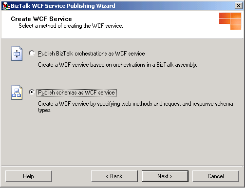
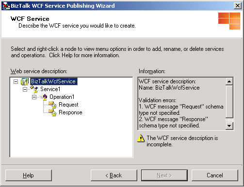
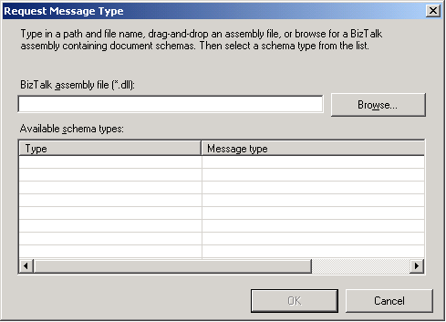

# How to Use the BizTalk WCF Service Publishing Wizard to Publish Schemas as WCF Services
You use the BizTalk WCF Service Publishing Wizard to publish schemas as WCF services.  
  
> [!NOTE]
>  You must build your BizTalk projects before running the BizTalk WCF Service Publishing Wizard. The BizTalk projects must include schemas to publish as WCF services.  
  
### To publish schemas as WCF servicees  
  
1. Click **Start**, point to **All Programs**, point to [!INCLUDE[btsBizTalkServerStartMenuItemui](../includes/btsbiztalkserverstartmenuitemui-md.md)], and then click **BizTalk WCF Service Publishing Wizard**.  
  
   > [!NOTE]
   >  To create and publish BizTalk orchestrations and schemas as WCF services with the WCF adapters, you use the BizTalk WCF Service Publishing Wizard. To publish orchestrations and schemas as Web services with the SOAP adapter, you use the BizTalk Web Services Publishing Wizard.  
  
2. On the **Welcome to the BizTalk WCF Service Publishing Wizard** page, click **Next**.  
  
3. On the **WCF Service Type** page, select the **Service endpoint** option to publish the WCF services on selected BizTalk orchestrations in a BizTalk assembly.  
  
      
  
4. On the **WCF Service Type** page, select or clear the **Enable metadata endpoint** check box to indicate whether the isolated WCF receive location hosted by Internet Information Services (IIS) will publish service metadata for retrieval using an HTTP/GET request.  
  
    When this check box is selected, the wizard generates a Web.config file  in which the **httpGetEnabled** attribute of the **\<serviceMetadata\>** element is set to **true**. You can use a metadata import tool (such as SvcUtil.exe) to generate the client code required to call this service in the development environment. The address at which the metadata is published is the endpoint address plus a **?wsdl** query string.  
  
   > [!NOTE]
   >  To prevent unintentional disclosure of potentially sensitive service metadata, we recommend that you disable this behavior in the production environment. This can be done by setting httpgetenabled to false, or deleting the MEX virtual directory.  
  
5. On the **WCF Service Type** page, in the **Adapter name (Transport type)** drop-down list, select the isolated WCF adapter with which the WCF services are published. You can select any of the following adapters:  
  
   -   **WCF-BasicHttp.** The WCF-BasicHttp adapter can communicate with WS-I Basic Profile 1.1-conformant Web services like ASMX-based services.  
  
   -   **WCF-WSHttp.** The WCF-WSHttp adapter can communicate with a service through the WS-* standards over HTTP and HTTPS.  
  
   -   **WCF-CustomIsolated.** The WCF-CustomIsolated adapter enables the use of Windows Communication Foundation (WCF) extensibility features over the HTTP transport.  
  
6. On the **WCF Service Type** page, select the **Create BizTalk receive locations in the following application** check box to create the receive ports and locations corresponding to each generated .svc file for the WCF adapter that you selected in the **Adapter name** drop-down list. If a receive location already exists, it is not replaced. After selecting this option, choose the application where the receive ports and locations will be generated in the **BizTalk application name** drop-down list, and then click **Next**.  
  
7. On the **Create WCF Service** page, select **Publish schemas as WCF service**, and then click **Next**.  
  
      
  
8. On the **WCF Service** page, define the WCF service(s) to publish. Use the tree in the **Web service description** dialog box to add, remove, rename, and edit the Web service description nodes for the WCF services to publish. The **Information** dialog box provides information about the selected node and displays any errors in the current node or subnodes:  
  
   -   The root node to the tree (Web service description) describes the WCF services to publish. The virtual directory name uses the root node as the default name. You can modify the Web service description name for the WCF services to publish by selecting **Rename web service description**.  
  
          
  
   -   The Web method node, **Operation1**, of the default service node, **Service1**, shown by default in the **Web service description** dialog box can be used for a request-response receive location. If you plan to publish a one-way WCF receive location for this service description, right-click the default Web method node, click **Delete web method**, and then create a one-way Web method as follows: Right-click the default service node, point to **Add web method**, and then click **One-Way**.  
  
   -   To add a new WCF service, right-click the Web service description name, and then click **Add web service**. This creates a new WCF service without any WCF operations. To modify the name of the WCF service, right-click the WCF service node, click **Rename web service**, and then press ENTER to accept the new name.  
  
   -   To add a new WCF operation, right-click the WCF service node, point to **Add Web Method**, and then click **One-way** (for a request WCF operation) or **Request-response** (for a request-response WCF operation).  
  
   -   To set the request and response schema types, right-click the **Request** or **Response** node, and then click **Select schema type**. In the **Request Message Type** dialog box, type the name of the assembly containing the document schema in the **BizTalk assembly file**text box or click **Browse** to search for the assembly. The **Available schema types** list view displays each root element of the schema. Select a root node to add as the request or response schema type.  
  
       > [!NOTE]
       >  If you installed the BizTalk assembly file into the global assembly cache (GAC), make sure that the assembly in the GAC has been updated with the assembly that you will select in the **Request Message Type** dialog box. If the GAC has the same fully qualified name, the BizTalk WCF Service Publishing Wizard uses the assembly file in the GAC instead of the one you selected.  
  
          
  
   -   You can rename the **Request** and **Response** nodes without affecting the generated code. After defining your schemas, you can rename the part elements, which modifies the WCF operation parameter name. You can see the changes by viewing the service metadata for the WCF services to publish.  
  
       > [!NOTE]
       >  You cannot use spaces when renaming any of the Web service description nodes.  
  
9. Click **Next** to continue the wizard.  
  
10. On the **WCF Service Properties** page, in the **Targetnamespace of the WCF service** text box, type a target namespace for the WCF services, and then click **Next**.  
  
       
  
11. On the **WCF Service Location** page, in the **Location** text box, type the Web directory name where the WCF services are generated. You can accept the default location (http://localhost/<*Web service description name*>), type a location for the WCF services in the **Location** text box, or click **Browse** and select a Web directory. Select any of the following options:  
  
    - **Overwrite existing project.** This option is available only if the Web directory already exists. You will be able to publish to the same location only if you select this option. Otherwise, you must enter a different project location.  
  
    - **Allow anonymous access to WCF service.** This option adds anonymous access to the created virtual directory. By default, the virtual directory inherits the access privileges from its parent virtual directory or the Web site (if it is a top-level virtual directory).  
  
      When you finish this page, click **Next**.  
  
        
  
    > [!NOTE]
    >  The project location can exist on a different server. To publish the WCF services to a different server, type the project name as http://<*servername*>/<*WCF service location*>.  
  
    > [!NOTE]
    >  The project location can exist on a non-default Web site. When publishing to a non-default Web site, include the port number of the Web site in the URL. For example, http://<*servername*>:8080/<*WCF service location*>.  
  
    > [!NOTE]
    >  When using the wizard to create receive locations, the wizard creates the receive locations using the default values. The default value for the receive pipeline is the **Microsoft.BizTalk.DefaultPipelines.PassThruReceive** pipeline. If messages received through the published WCF services require any special pipeline processing (for example, validation, correlation/property promotion, or inbound/outbound maps) then you should set the receive pipeline to **Microsoft.BizTalk.DefaultPipelines.XMLReceive**, or to a custom pipeline by using the BizTalk Administration console.  
  
12. On the **WCF Service Summary** page, review your settings for the WCF services.  
  
13. Click **Create** to create the WCF services.  
  
14. Click **Finish** to complete the BizTalk WCF Service Publishing Wizard.  
  
15. After publishing WCF services with the BizTalk WCF Service Publishing Wizard, you must configure them properly. For information about how to configure the isolated WCF receive adapter, see [How to Configure WCF Services Published with the BizTalk WCF Service Publishing Wizard](../core/configure-wcf-services-published-with-the-biztalk-wcf-service-publishing-wizard.md).  
  
## See Also  
 [How to Configure WCF Services Published with the BizTalk WCF Service Publishing Wizard](../core/configure-wcf-services-published-with-the-biztalk-wcf-service-publishing-wizard.md)   
 [Walkthrough: Publishing WCF Services with the WCF-BasicHttp Adapter](../core/walkthrough-publishing-wcf-services-with-the-wcf-basichttp-adapter.md)   
 [How to Use the BizTalk WCF Service Publishing Wizard to Publish Orchestrations as WCF Services](../core/publish-orchestrations-as-wcf-services--biztalk-wcf-service-publishing-wizard.md)