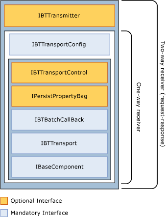

# Receiver Interfaces
In addition to the standard adapter interfaces, receive adapters need to implement **IBTTransportConfig**. This is the interface on which the BizTalk Messaging Engine delivers receive location configuration to the adapter.  
  
## Request-Response Adapters  
 Receive adapters may also need to handle send messages in some cases. Adapters that do this are usually referred to as two-way, or Request-Response adapters. To be able to send messages, a receive adapter needs to implement **IBTTransmitter**.  
  
 The following figure shows the interfaces implemented by receive adapters.  
  
> [!NOTE]
>  The **IBTBatchTransmitter** interface is not supported for Request-Response adapters.  
  
 