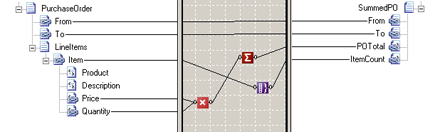

# Record Count Functoid
The **Record Count** functoid counts records in the input instance message.  
  
 The **Record Count** functoid has one input and one output. The input is a link from a looping record in the source schema. The output of the **Record Count** functoid is the count of the looping record in an actual input instance message.  
  
 Looping records correspond to elements that repeat an unpredictable number of times in an input instance message. For example, in a purchase order, the **Item** element might occur many times. And, the **Item** element might include products, descriptions, prices, and quantities. The following code is a simplified example of such a purchase order.  
  
```  
<ns0:PurchaseOrder xmlns:ns0="http://RecordFunctoid.PurchaseOrder">  
    <From>Kevin F. Browne</From>  
    <To>Northwind Traders</To>  
    <LineItems>  
        <Item>  
            <Product>Laptop Computer</Product>  
            <Description>Thin profile laptop</Description>  
            <Price>1999.95</Price>  
            <Quantity>1</Quantity>  
        </Item>  
        <Item>  
            <Product>Monitor Swipes</Product>  
            <Description>Disposable monitor swipes</Description>  
            <Price>3.95</Price>  
            <Quantity>10</Quantity>  
        </Item>  
    </LineItems>  
</ns0:PurchaseOrder>  
```  
  
 The **Max Occurs** property for the **Item** record is set as unbounded. This indicates that the **Item** record loops, and BizTalk Mapper compiles this record as a loop.  
  
 Suppose you want to find the total number of **Item** elements in the purchase order input instance message and place the result in a field in the output instance message.  
  
 The following figure shows a **Record Count** functoid that counts the number of items in an incoming purchase order and puts that value in the **ItemCount** field in the **SummedPO** output instance message.  
  
   
Record Count Functoid Map  
  
 Notice that the **Max Occurs** property for the **Item** record would be **unbounded**. This indicates that the **Item** record loops, and BizTalk Mapper compiles this record as a loop.  
  
 For the preceding sample purchase order instance message, which contained two **Item** elements, the value of the **ItemCount** field will be set to 2.  
  
```  
<ns0:SummedPO xmlns:ns0="http://RecordCountFunctoid.SummedPO">  
    <From>Kevin F. Browne</From>  
    <To>Northwind Traders</To>  
    <POTotal>2039.45</POTotal>  
    <ItemCount>2</ItemCount>  
</ns0:SummedPO>  
```  
  
> [!NOTE]
>  You can also use the **Record Count** functoid to count repeating field elements. It is not restricted to records.  
  
## See Also  
 [How to Add Record Count Functoids to a Map](../core/how-to-add-record-count-functoids-to-a-map.md)   
 [Advanced Functoids](../core/advanced-functoids.md)   
 [Index Functoid](../core/index-functoid.md)   
 [Iteration Functoid](../core/iteration-functoid.md)   
 [Looping Functoid](../core/looping-functoid.md)
