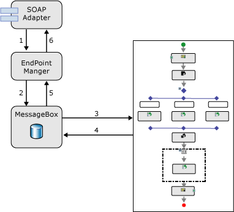

# Request-Response Messaging
In a request/response messaging pattern, one party sends a request message and the receiving party returns a response message. Two typical examples of request/response processing are the interaction that a browser has with a Web server using the HTTP adapter, and Web service processing using the Simple Object Access Protocol (SOAP) adapter. In [!INCLUDE[btsBizTalkServerNoVersion](../includes/btsbiztalkservernoversion-md.md)], both the request and the response messages are handled in a typical publish/subscribe fashion. This is an important consideration to understand when you performance-tune a BizTalk application, because a system requiring high throughput might be configured differently than one requiring low latency for individual messages.  
  
   
  
 When a message is received by a request/response style receive adapter, BizTalk Server first publishes the request message to the MessageBox database. Next this message is received by the appropriate subscriber, which is likely an orchestration bound to a receive port. This subscriber formulates a response message and publishes it to the MessageBox, along with properties that cause it to be sent back to the receive port from which the request came. Finally, the response message is picked up by the publisher of the request, the receive adapter that submitted the request, and is returned to the calling application. The diagram below provides a detailed graphical representation of these steps.  
  
   
  
 **Flow of request/response message received by SOAP adapter**  
  
1. The SOAP adapter submits messages to the Endpoint Manager.  
  
2. The Endpoint Manager publishes the message into the MessageBox.  
  
3. The orchestration, which is bound to the receive port and therefore has a subscription for the message, receives the message and processes it.  
  
4. The orchestration sends a response message that is published to the MessageBox.  
  
5. The Endpoint Manager receives the response message.  
  
6. The Endpoint Manager returns the response to the SOAP adapter  
  
   The implications of this type of behavior on performance can be overlooked if the internal implementation is not understood. BizTalk Server is initially tuned for high throughput scenarios, but it can also be configured for an environment with lower throughput and a need for lower latency, especially in request/response scenarios. You need to consider several components for tuning in this scenario. First, subscribers find out about published messages through a polling mechanism. If the polling interval is set too high, this could cause request/response style interactions to have a higher latency than you would want.  
  
   Note that in this scenario, there are two subscriptions to be filled: the subscription for the initial message, as well as the one for the response message, and this increases the impact of this polling interval. Second, receive adapters are configured to insert messages into the MessageBox in batches of varying sizes. Most adapters enable you to configure the batch size through the typical adapter configuration interface or through parameters in BizTalk Server or the registry. If the batch size is set too high, the latency for individual messages may be increased. For more information about the performance characteristics of [!INCLUDE[btsBizTalkServerNoVersion](../includes/btsbiztalkservernoversion-md.md)], see [Planning for Sustained Performance](../core/planning-for-sustained-performance.md).  
  
## See Also  
 [Runtime Architecture](../core/runtime-architecture.md)