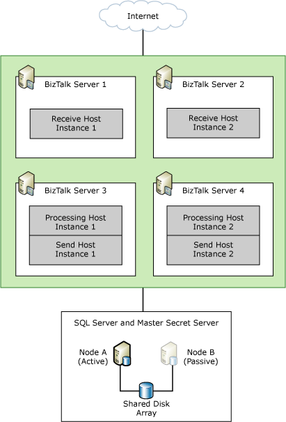
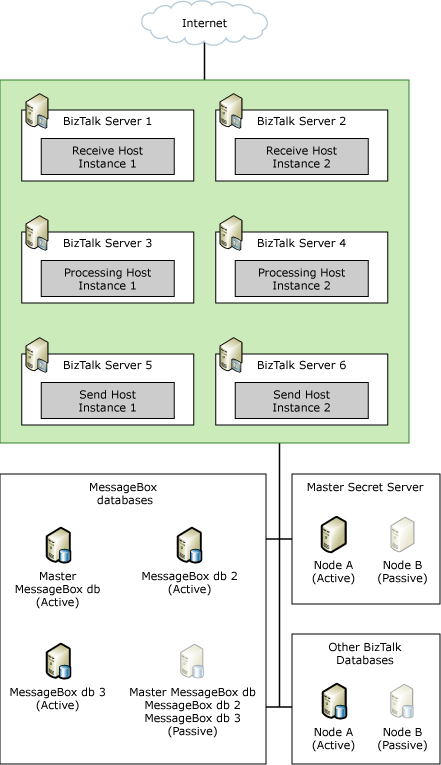

# Sample BizTalk Server High Availability Scenarios
This topic describes the scenarios in Microsoft [!INCLUDE[btsBizTalkServerNoVersion](../includes/btsbiztalkservernoversion-md.md)] that provide high availability through scaled-out tiers of hosts. By separating areas of functionality into different hosts and tiers in [!INCLUDE[btsBizTalkServerNoVersion](../includes/btsbiztalkservernoversion-md.md)], administrators can provide redundancy for each host and scale them independently of other hosts. To provide high availability for each functional area, you create separate hosts for each primary function—receiving, processing, sending, and tracking—and cluster the [!INCLUDE[btsBizTalkServerNoVersion](../includes/btsbiztalkservernoversion-md.md)] databases and the Enterprise Single Sign-On master secret server.  
  
## Small BizTalk Server Deployments  
 The smallest [!INCLUDE[btsBizTalkServerNoVersion](../includes/btsbiztalkservernoversion-md.md)] deployment that provides high availability for the both SQL Server and [!INCLUDE[btsBizTalkServerNoVersion](../includes/btsbiztalkservernoversion-md.md)] is made up of two computers that have an active/active cluster configuration for SQL Server. Both computers contain instances of all the BizTalk Hosts in the environment. If one computer fails or encounters errors, the other computer maintains service availability for both SQL Server and BizTalk Server. This configuration is not highly available because it does not accommodate clustering the master secret server, since [!INCLUDE[btsBizTalkServerNoVersion](../includes/btsbiztalkservernoversion-md.md)] host instances will not start on a [!INCLUDE[btsBizTalkServerNoVersion](../includes/btsbiztalkservernoversion-md.md)] computer where the clustered Enterprise Single Sign-On resource is passive. For more information about clustering the master secret server, see [High Availability for Enterprise Single Sign-On](../core/high-availability-for-enterprise-single-sign-on.md).  
  
 For small [!INCLUDE[btsBizTalkServerNoVersion](../includes/btsbiztalkservernoversion-md.md)] deployments that contain fewer than five computers, we recommend that the SQL Server cluster that contains the BizTalk Server databases runs on separate computers from the BizTalk Server computers. The BizTalk Server computers can run all the BizTalk Hosts (receive, process, and send). To make this deployment highly available, cluster the SQL Server and the Enterprise Single Sign-On master secret server, and have two BizTalk Servers, each running an instance of each host in your environment.  
  
 The following figure shows a small BizTalk Server deployment that is highly available.  
  
   
  
## Medium-Sized BizTalk Server Deployments  
 For medium-sized deployments that contain five to ten computers, we recommend that you cluster the SQL Server that contains the BizTalk Server databases and the Enterprise Single Sign-On master secret server. If your scenario is receive-intensive, you may want to dedicate two BizTalk Servers to run the receiving host instances to provide a highly available solution. You can then have two more computers that are running both the processing and send host instances. To make this a highly available deployment, create host instances of both the processing and send hosts on two BizTalk Servers. Similarly, if you have a processing-intensive scenario, you may want to dedicate two BizTalk Servers to run the processing host instances, and have the remaining two BizTalk Servers running instances of both the receive and send hosts.  
  
 The following figure shows a highly available medium-sized BizTalk Server deployment with two BizTalk Servers dedicated to receiving operations.  
  
   
  
 For more information about high availability for Enterprise Single Sign-On, see [High Availability for Enterprise Single Sign-On](../core/high-availability-for-enterprise-single-sign-on.md).  
  
## Large-Scale BizTalk Server Deployments  
 For large-scale deployments that contain 10 or more computers, dedicate separate BizTalk Server computers for the receiving, processing, and sending functions. Also, if you have many BizTalk Server computers in a group, you can include additional MessageBox database computers to increase performance. In this case, cluster the MessageBox databases and the master secret server to provide high availability.  
  
 Such a distributed configuration demonstrates the flexibility of [!INCLUDE[btsBizTalkServerNoVersion](../includes/btsbiztalkservernoversion-md.md)] because it lets you to evaluate and identify specific points of failure in your deployment, and then strategically allocate resources to reduce those points in the system. Today's dynamic business environment demands such flexibility because workload fluctuations and business requirements can change daily.  
  
 Instead of spending additional money to upgrade or acquire new hardware, you can use existing resources to achieve high availability by moving resources from computers that consume few resources to computers that are resource-intensive.  
  
 The following figure shows a large-scale [!INCLUDE[btsBizTalkServerNoVersion](../includes/btsbiztalkservernoversion-md.md)] deployment.  
  
   
  
 For more information about high availability for Enterprise Single Sign-On, see [High Availability for Enterprise Single Sign-On](../core/high-availability-for-enterprise-single-sign-on.md).  
  
## Providing High Availability using Hyper-V and Failover Clustering  
 The Windows® Server 2008 Hyper-V role and the Windows Server 2008 Failover Clustering feature can be used together to provide high availability for a virtualized server computing environment. The BizTalk Server computers and the SQL Server computers used in a [!INCLUDE[btsBizTalkServerNoVersion](../includes/btsbiztalkservernoversion-md.md)] deployment can be installed in a Hyper-V virtualized environment and then made highly available through failover clustering. Because there is a system resource cost associated with running a guest operating system on Hyper-V, we recommend that thorough performance testing is performed before deploying such a solution into production. For more information about using Hyper-V and Failover clustering together to provide high availability for virtual machines, see “Hyper-V Step-by-Step Guide: Hyper-V and Failover Clustering” at [http://go.microsoft.com/fwlink/?LinkID=129113](http://go.microsoft.com/fwlink/?LinkID=129113). For more information about deploying a [!INCLUDE[btsBizTalkServerNoVersion](../includes/btsbiztalkservernoversion-md.md)] into a Hyper-V virtualized environment, see the BizTalk Server Hyper-V Guide available for download at [http://go.microsoft.com/fwlink/?LinkId=189706](http://go.microsoft.com/fwlink/?LinkId=189706).  
  
## See Also  
 [Providing High Availability for BizTalk Hosts](../core/providing-high-availability-for-biztalk-hosts.md)   
 [Providing High Availability for BizTalk Server Databases](../core/providing-high-availability-for-biztalk-server-databases.md)   
 [High Availability for Enterprise Single Sign-On](../core/high-availability-for-enterprise-single-sign-on.md)