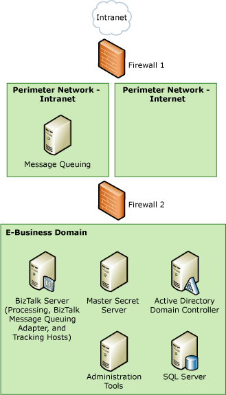
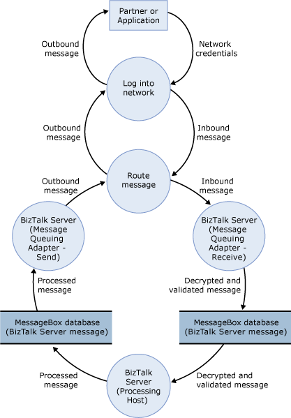

# Sample TMA: BizTalk Message Queuing Adapter
This topic presents the threat model analysis (TMA) for the BizTalk Message Queuing adapter scenario for the sample architecture.  
  
## Step 1. Collect Background Information (BizTalk Message Queuing Adapter Scenario)  
 This section provides the data flow diagram (DFD) for the BizTalk Message Queuing adapter scenario for the sample architecture. The following figure shows the sample architecture for the HTTP and SOAP adapters scenario.  
  
 **Figure 1 Sample architecture for the BizTalk Message Queuing adapter scenario**  
  
   
  
 All the other background information is the same for all our usage scenarios, and is described previously in [Background Information for Sample Scenarios](../core/background-information-for-sample-scenarios.md).  
  
### Data Flow Diagram  
 The following figure shows the DFD for the sample architecture when you use the BizTalk Message Queuing adapter.  
  
 **Figure 2 DFD for the sample architecture of the BizTalk Message Queuing adapter scenario**  
  
   
  
 The data flow is as follows:  
  
1.  A partner sends a message using Message Queuing or BizTalk Message Queuing. The message is packed in the appropriate format and sent on the network. If you use Active Directory, the message goes through a series of Message Queuing routers until it reaches the right destination (the BizTalk Server that runs a host instance of the BizTalk Message Queuing receive adapter).  
  
2.  An instance of an in-process host for the BizTalk Message Queuing receive adapter regularly receives the message from a Message Queuing router (through Firewall 2), does any initial processing, sends the correct network responses as defined by the network protocol, and puts the message in the MessageBox database.  
  
3.  An instance of the processing host that has a subscription to the message picks it up from the MessageBox database, does any additional processing, and puts the message back in the MessageBox database.  
  
4.  An instance of the in-process host that has a BizTalk Message Queuing send adapter picks up the message from the MessageBox database. The message goes through any final processing in the send pipeline, and is then sent through Firewall 2 over the network to the partner or application.  
  
## Step 2. Create and Analyze the Threat Model (BizTalk Message Queuing Adapter Scenario)  
 This section provides the results of the TMA we did for the BizTalk Message Queuing adapter scenario for the sample architecture.  
  
- **Identify Entry Points, Trust Boundaries, and Flow of Data -** See background information described earlier in step 1 and in [Background Information for Sample Scenarios](../core/background-information-for-sample-scenarios.md).  
  
- **Create a List of the Identified Threats -** We used the following categorization for all entries in the DFD to identify potential threats to the scenario: **S**poofing identify, **T**ampering with data, **R**epudiation, **I**nformation disclosure, **D**enial of service, and **E**levation of privileges. The following table lists the threats we identified when you use the BizTalk Message Queuing adapter to send and receive messages to and from BizTalk Server.  
  
  **Table 1 List of identified threats**  
  
|Threat|Description|Asset|Impact|  
|------------|-----------------|-----------|------------|  
|Send lots of messages to receive location|A malicious user can send a large number of valid or invalid messages and flood the application.|BizTalk Server environment|Denial of service|  
|Message header travels in the clear on the wire|As the message travels from the queue to the BizTalk Message Queuing receive adapter, the message header is in the clear, and a malicious user can potentially read and tamper with the header.|Message header|Tampering with data   Information disclosure|  
|An unauthorized user can make a network connection to the BizTalk Server that runs the BizTalk Message Queuing host|You cannot use a discretionary access list (DACL) to restrict access to the BizTalk Message Queuing receive location. Therefore, anyone that can make a network connection to the BizTalk Server that runs a host instance of the BizTalk Message Queuing receive adapter and to port 1801 can send messages to the BizTalk Message Queuing receive location.|BizTalk Server environment|Repudiation   Tampering with data   Information disclosure   Denial of service   Elevation of privileges|  
|A malicious user can tamper with the message before BizTalk Server receives it|A malicious user can intercept the message while it is in transit and modify it.|Message body|Tampering with data   Information disclosure|  
  
## Step 3. Review Threats (BizTalk Message Queuing Adapter Scenario)  
 This section provides the results of the risk analysis we did for threats we identified for the BizTalk Message Queuing adapter scenario for the sample architecture. After the main threat model meeting, we reviewed the threats and used the following impact categories to identify the risk for each threat: **D**amage potential, **R**eproducibility, **E**xploitability, **A**ffected users, and **D**iscoverability.  
  
 The following table lists the risk ratings for the threats we identified when you use the BizTalk Message Queuing adapter to send and receive messages to and from BizTalk Server.  
  
 **Table 2 Risk ratings for identified threats**  
  
|Threat|Impact|Damage potential|Reproducibility|Exploitability|Affected users|Discoverability|Risk exposure|  
|------------|------------|----------------------|---------------------|--------------------|--------------------|---------------------|-------------------|  
|Send lots of messages to receive location|Denial of service|8|7|7|7|5|6.8|  
|Message header travels in the clear on the wire|Tampering with data   Information disclosure|8|10|8|3|5|6.8|  
|An unauthorized user can make a network connection to the BizTalk Server that runs the BizTalk Message Queuing host|Repudiation   Tampering with data   Information disclosure   Denial of service   Elevation of privileges|8|10|9|9|9|9|  
|A malicious user can tamper with the message before BizTalk Server receives it|Tampering with data   Information disclosure|5|7|6|5|7|6|  
  
## Step 4. Identify Mitigation Techniques (BizTalk Message Queuing Adapter Scenario)  
 This section presents some mitigation techniques for the threats we identified for the BizTalk Message Queuing adapter scenario for the sample architecture.  
  
 The following table lists mitigation techniques and technologies for the threats we identified when you use the BizTalk Message Queuing adapter to send and receive messages to and from BizTalk Server.  
  
 **Table 3 Mitigation techniques and technologies**  
  
|Threat|Impact|Risk exposure|Mitigation techniques and technologies|  
|------------|------------|-------------------|--------------------------------------------|  
|Send lots of messages to receive location|Denial of service|6.8|Use the BizTalk Message Queuing adapter in authentication-required mode. Set the **Requires MSMQ authentication** flag on the receive location and **Authentication Required (Drop messages)** on the receive port.   Configure BizTalk Message Queuing to require certificate-based authentication. This behavior occurs at the adapter level, and is different from the Party Resolution component of a BizTalk pipeline. If configured, the public certificate is included with the incoming message. This is the only client authentication mode available for BizTalk Message Queuing. To use this client authentication mode, you must install BizTalk Message Queuing with Active Directory Integration Mode. When you use this feature, remember to select the **Require Authentication** check box on the property dialog box for the BizTalk Message Queuing receive location.|  
|Message header travels in the clear on the wire|Tampering with data   Information disclosure|6.8|Use Internet Protocol security (IPsec) to help protect the message body and the message header as it travels from one server to another.|  
|An unauthorized user can make a network connection to the BizTalk Server that runs the BizTalk Message Queuing host|Repudiation   Tampering with data   Information disclosure   Denial of service   Elevation of privileges|9|Create a custom pipeline with a Party Resolution pipeline component, and then configure the Party Resolution component to use the Sender ID (SID) to resolve the party. Set the **Resolve Party By Certificate** property to **False**, and the **Resolve Party By SID** property to **True**. For more information, see [Party Resolution Pipeline Component](../core/party-resolution-pipeline-component.md).   On the receive port, set the **Authentication** property to **Required (Drop Messages)**.|  
|A malicious user can tamper with the message before BizTalk Server receives it|Tampering with data   Information disclosure|6|Use protocol-level authentication to make sure the message was not tampered with while in transit. To use protocol-level authentication, you must have a Message Queuing router in the E-Business domain. Configure BizTalk Server as follows:   -   On the **BizTalk Messaging** page of the Configuration Manager, provide the name of the router. -   For the receive port, set the **Authentication** property to **Required (Drop Messages)** or **Required (Keep Messages)**. -   For the send handler, on the **General** tab, in the **MSMQ Router** name box, type the name of the Message Queuing router. -   For the send port, select **Use MSMQ Authentication**.|  
  
## See Also  
 [Threat Model Analysis](../core/threat-model-analysis.md)   
 [Sample Scenarios for Threat Model Analysis](../core/sample-scenarios-for-threat-model-analysis.md)   
 [Sample Architectures for Small & Medium-Sized Companies](../core/sample-architectures-for-small-medium-sized-companies.md)