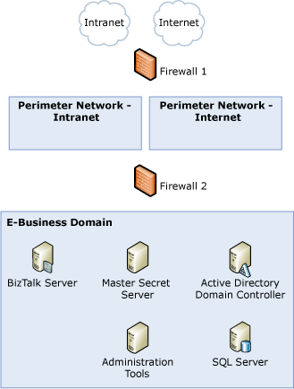
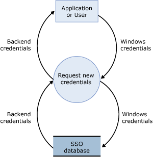

# Sample TMA: Enterprise Single Sign-On
This topic presents the threat model analysis (TMA) for the Enterprise Single Sign-On scenario for the sample architecture.  
  
 The following figure shows the base sample architecture, which includes the Enterprise Single Sign-On scenario.  
  
 **Figure 1 Base sample architecture that includes the Enterprise Single Sign-On scenario**  
  
   
  
## Step 1. Collect Background Information (Enterprise Single Sign-On Scenario)  
 This section provides the data flow diagram (DFD) for using the Enterprise Single Sign-On scenario when you map Windows credentials to the credentials you use to connect to a back-end network.  
  
 All the other background information is the same for all our usage scenarios, and is described previously in [Background Information for Sample Scenarios](../core/background-information-for-sample-scenarios.md).  
  
### Data Flow Diagram  
 The following figure shows the DFD for the Enterprise Single Sign-On scenario.  
  
 **Figure 2 DFD for the Enterprise Single Sign-On scenario**  
  
   
  
 The data flow is as follows:  
  
1.  The user or application logs on with Windows credentials.  
  
2.  Enterprise Single Sign-On uses the Windows credentials to request the credentials for the back-end network.  
  
3.  Enterprise Single Sign-On maps the Windows credentials to the back-end credentials stored in the SSO database.  
  
4.  Enterprise Single Sign-On retrieves the back-end credentials, and uses them to connect the user or application to the back-end network.  
  
## Step 2. Create and Analyze the Threat Model (Enterprise Single Sign-On Scenario)  
 This section provides the results of the TMA we did for the Enterprise Single Sign-On scenario for the sample architecture.  
  
- **Identify Entry Points, Trust Boundaries, and Flow of Data** - See background information described earlier in step 1 and in [Background Information for Sample Scenarios](../core/background-information-for-sample-scenarios.md).  
  
- **Create a List of the Identified Threats** - We used the following categorization for all entries in the DFD to identify potential threats to the scenario: **S**poofing identify, **T**ampering with data, **R**epudiation, **I**nformation disclosure, **D**enial of service, and **E**levation of privileges. The following table lists the threats we identified when you use Enterprise Single Sign-On (SSO) to send and receive messages to and from BizTalk Server.  
  
  **Table 1 List of identified threats**  
  
|Threat|Description|Asset|Impact|  
|------------|-----------------|-----------|------------|  
|Master secret server is a single point of failure|If a malicious user compromises the master secret server, the SSO computer is unable to encrypt credentials (it is able to continue decrypting credentials).|BizTalk Server and SSO environment|Denial of service|  
|A malicious user can spoof a client or server|If a client or server runs Windows without NTLM authentication, a malicious user can spoof the client or server.|BizTalk Server and SSO environment|Spoofing identity   Tampering with data   Repudiation   Information disclosure   Denial of service   Elevation of privileges|  
|A malicious user can tamper with the data as it travels from one server to another|The communication between servers is in clear text, and a malicious user can potentially read the data as it travels.|Data|Tampering with data   Information disclosure|  
  
## Step 3. Review Threats (Enterprise Single Sign-On Scenario)  
 This section provides the results of the risk analysis we did for threats we identified for the Enterprise Single Sign-On (SSO) scenario for the reference architecture. After the main threat model meeting, we reviewed the threats and used the used the following impact categories to identify the risk for each threat: **D**amage potential, **R**eproducibility, **E**xploitability, **A**ffected users, and **D**iscoverability.  
  
 The following table lists the risk ratings for the threats we identified when you use Enterprise Single Sign-On to send and receive messages to and from BizTalk Server.  
  
 **Table 2 Risk rating of identified threats**  
  
|Threat|Impact|Damage potential|Reproducibility|Exploitability|Affected users|Discoverability|Risk exposure|  
|------------|------------|----------------------|---------------------|--------------------|--------------------|---------------------|-------------------|  
|Master secret server is a single point of failure|Denial of service|2|3|2|1|2|2|  
|A malicious user can spoof a client or server|Spoofing identity   Tampering with data   Repudiation   Information disclosure   Denial of service   Elevation of privileges|3|2|2|2|1|2|  
|A malicious user can tamper with the data as it travels from one server to another|Tampering with data   Information disclosure|3|1|1|2|1|1.6|  
  
## Step 4. Identify Mitigation Techniques (Enterprise Single Sign-On Scenario)  
 This section presents some mitigation techniques for the threats we identified for the Enterprise Single Sign-On scenario for the sample architecture.  
  
 The following table lists mitigation techniques and technologies for the threats we identified when you use Enterprise Single Sign-On.  
  
 **Table 3 Mitigation techniques and technologies**  
  
|Threat|Impact|Risk exposure|Mitigation techniques and technologies|  
|------------|------------|-------------------|--------------------------------------------|  
|Master secret server is a single point of failure|Denial of service|2|Use an active-passive cluster configuration for the master secret server.   For more information about clustering the master secret server, see [High Availability for Enterprise Single Sign-On](../core/high-availability-for-enterprise-single-sign-on.md).|  
|A malicious user can spoof a client or server|Spoofing identity   Tampering with data   Repudiation   Information disclosure   Denial of service   Elevation of privileges|2|If your network supports Kerberos authentication, you should register all SSO servers. When you use Kerberos authentication between the master secret server and the SSO database, you must configure Service Principal Names (SPN) on the SQL Server where the SSO database is located.   For more information about how to configure Service Principal Names, see the Microsoft TechNet Web site at [http://go.microsoft.com/fwlink/?LinkId=61374](http://go.microsoft.com/fwlink/?LinkId=61374).|  
|A malicious user can tamper with the data as it travels from one server to another|Tampering with data   Information disclosure|1.6|Use Internet Protocol security (IPsec) or Secure Sockets Layer (SSL) between all the SSO servers and the SSO database.   For more information about SSL, see the Microsoft Help and Support Web site at [http://go.microsoft.com/fwlink/?LinkID=189708](http://go.microsoft.com/fwlink/?LinkID=189708).   For more information about how to use SSL between all the SSO servers and the SSO database, see [How to Enable SSL for SSO](../core/how-to-enable-ssl-for-sso.md).|  
  
## See Also  
 [Threat Model Analysis](../core/threat-model-analysis.md)   
 [Sample Scenarios for Threat Model Analysis](../core/sample-scenarios-for-threat-model-analysis.md)   
 [Sample Architectures for Small & Medium-Sized Companies](../core/sample-architectures-for-small-medium-sized-companies.md)