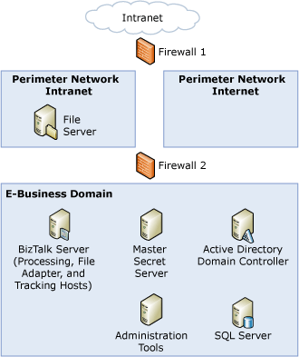
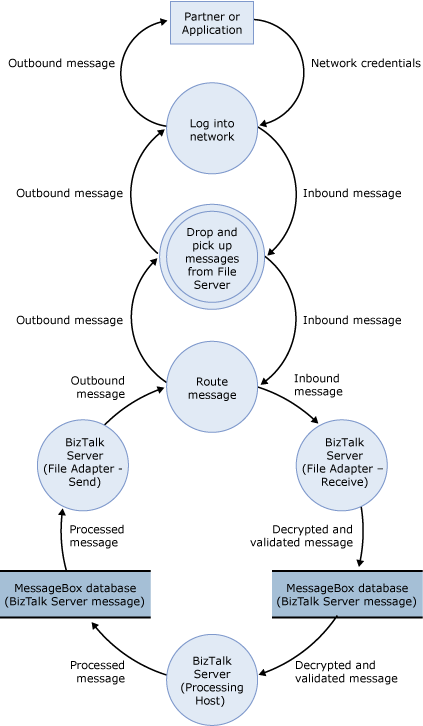

# Sample TMA: File Adapter
This topic presents the threat model analysis (TMA) for the File adapter scenario for the sample architecture. The following figure shows the sample architecture for the File adapter scenario.  
  
 **Figure 1 Sample architecture for the File adapter scenario**  
  
   
  
## Step 1. Collect Background Information (File Adapter Scenario)  
 This section provides the data flow diagram (DFD) for the File adapter scenario for the sample architecture.  
  
 All the other background information is the same for all our usage scenarios, and is described previously in [Background Information for Sample Scenarios](../core/background-information-for-sample-scenarios.md).  
  
### Data Flow Diagram  
 The following figure shows the DFD for the sample architecture when you use the File adapter.  
  
 **Figure 2 DFD for the sample architecture of the File adapter scenario**  
  
   
  
 The data flow is as follows:  
  
1.  A partner puts a message (through Firewall 1) in the File server in the intranet perimeter network.  
  
2.  An instance of an in-process host for the File receive adapter regularly polls the File server for new messages (through Firewall 2). After it finds a new message, it retrieves the message, does any initial processing, and puts the message in the MessageBox database.  
  
3.  An instance of the processing host that has a subscription to the message picks it up from the MessageBox database, does any additional processing, and puts the message back in the MessageBox database.  
  
4.  An instance of the in-process host that has a File send adapter picks up the message from the MessageBox database. The message goes through any final processing in the send pipeline, and is then sent through Firewall 2 to the File server.  
  
5.  The partner picks up the message from the File server.  
  
## Step 2. Create and Analyze the Threat Model (File Adapter Scenario)  
 This section provides the results of the TMA we did for the File adapter scenario for the sample architecture.  
  
- **Identify Entry Points, Trust Boundaries, and Flow of Data -** See background information described earlier in "Collect Background Information for File Adapter Scenario" and "Background Information for all Scenarios."  
  
- **Create a List of the Identified Threats -** We used the following categorization for all entries in the DFD to identify potential threats to the scenario: **S**poofing identify, **T**ampering with data, **R**epudiation, **I**nformation disclosure, **D**enial of service, and **E**levation of privileges. The following table lists the threats we identified when you use the File adapter to send and receive messages to and from BizTalk Server.  
  
  **Table 1 List of identifies threats**  
  
|Threat|Description|Asset|Impact|  
|------------|-----------------|-----------|------------|  
|Unauthorized user can retrieve messages from file drop folder|If you have not set strong discretionary access lists (DACLs) for the folders that the File adapter uses, an unauthorized user can drop messages in the file receive location, or pick up messages from the file send location.|Message body|Tampering with data   Information disclosure|  
|Unauthorized user can submit messages to BizTalk Server|If a user has write permissions to the file folder from which BizTalk Server picks up messages, an unauthorized user can submit messages to BizTalk Server.|Message body|Denial of service   Elevation of privileges|  
  
## Step 3. Review Threats (File Adapter Scenario)  
 This section provides the results of the risk analysis we did for threats we identified for the File adapter scenario for the sample architecture. After the main threat model meeting, we reviewed the threats and used the following impact categories to identify the risk for each threat: **D**amage potential, **R**eproducibility, **E**xploitability, **A**ffected users, and **D**iscoverability.  
  
 The following table lists the risk ratings for the threats we identified when you use the File adapter to send and receive messages to and from BizTalk Server.  
  
 **Table 2 Risk ratings for identified threats**  
  
|Threat|Impact|Damage potential|Reproducibility|Exploitability|Affected users|Discoverability|Risk exposure|  
|------------|------------|----------------------|---------------------|--------------------|--------------------|---------------------|-------------------|  
|Unauthorized user can retrieve messages from file drop folder|Tampering with data   Information disclosure|4|7|5|4|6|5.2|  
|Unauthorized user can submit messages to BizTalk Server|Denial of service   Elevation of privileges|4|7|5|4|5|5.2|  
  
## Step 4. Identify Mitigation Techniques (File Adapter Scenario)  
 This section presents some mitigation techniques for the threats we identified for the File adapter scenario for the sample architecture.  
  
 The following table lists mitigation techniques and technologies for the threats we identified when you use the File adapter to send and receive messages to and from BizTalk Server.  
  
 **Table 3 Mitigation techniques and technologies**  
  
|Threat|Impact|Risk exposure|Mitigation techniques and technologies|  
|------------|------------|-------------------|--------------------------------------------|  
|Unauthorized user can retrieve messages from file drop folder|Tampering with data   Information disclosure|5.2|For the folder from which BizTalk Server picks up messages, use a strong discretionary access list (DACL) as follows:   -   For the service account for the host instance for the host that runs the receive adapter, set read, write, delete files, and delete subfolders and files permissions to the directory from which the file receive location picks up messages. -   For the external user or application that drops files to this folder, set write permissions. -   For the BizTalk Administrators group, set full control.   For the folder to which BizTalk Server drops messages, use a strong DACL as follows:   -   For the service account for the host instance for the host that runs the send adapter, set write permissions. -   For the external user or application that drops files to this folder, set read permissions. -   For the BizTalk Administrators group, set full control.|  
|Unauthorized user can submit messages to BizTalk Server|Denial of service   Elevation of privileges|5.2|Set strong DACLs in the receive location drop directories as indicated earlier.|  
  
## See Also  
 [Threat Model Analysis](../core/threat-model-analysis.md)   
 [Sample Scenarios for Threat Model Analysis](../core/sample-scenarios-for-threat-model-analysis.md)   
 [Sample Architectures for Small & Medium-Sized Companies](../core/sample-architectures-for-small-medium-sized-companies.md)