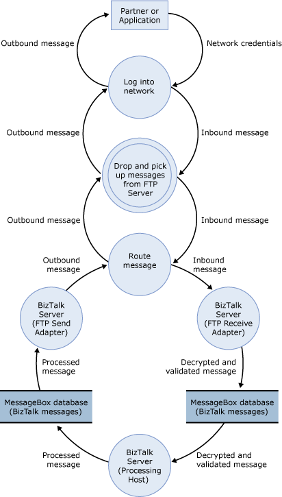

# Sample TMA: FTP Adapter
This topic presents the threat model analysis (TMA) for the FTP adapter scenario for the sample architecture.  
  
 The following figure shows the sample architecture for the FTP adapter scenario.  
  
 **Figure 1 Sample architecture for the FTP adapter scenario**  
  
   
  
## Step 1. Collect Background Information (FTP Adapter Scenario)  
 This section provides the data flow diagram (DFD) for the FTP adapter scenario for the sample architecture.  
  
 All the other background information is the same for all our usage scenarios, and is described previously in [Background Information for Sample Scenarios](../core/background-information-for-sample-scenarios.md).  
  
### Data Flow Diagram  
 The following figure shows the DFD for the sample architecture when you use the FTP adapter.  
  
 **Figure 2 DFD for the sample architecture of the FTP adapter scenario**  
  
   
  
 The data flow is as follows:  
  
1.  A partner or customer sends a message to the FTP server. The message is routed to the IP address of Firewall 1.  
  
2.  Firewall 1 receives the message, and routes it to the FTP server located in the Internet perimeter network.  
  
3.  An instance of an in-process host for the FTP receive adapter regularly polls the FTP server for new messages (through Firewall 2). After it finds a new message, it retrieves the message, does any initial processing, and puts the message in the MessageBox database.  
  
4.  An instance of the processing host that has a subscription to the message picks it up from the MessageBox database, does any additional processing, and puts the message back in the MessageBox database.  
  
5.  An instance of the in-process host that has an FTP send adapter picks up the message from the MessageBox database. The message goes through any final processing in the send pipeline, and is then sent through Firewall 2 to the FTP server.  
  
6.  The FTP server then routes the message through Firewall 1 back to the partner or customer.  
  
## Step 2. Create and Analyze the Threat Model (FTP Adapter Scenario)  
 This section provides the results of the TMA we did for the FTP adapter scenario for the sample architecture.  
  
- **Identify Entry Points, Trust Boundaries, and Flow of Data -** See background information described earlier in step 1 and in [Background Information for Sample Scenarios](../core/background-information-for-sample-scenarios.md).  
  
- **Create a List of the Identified Threats -** We used the following categorization for all entries in the DFD to identify potential threats to the scenario: **S**poofing identify, **T**ampering with data, **R**epudiation, **I**nformation disclosure, **D**enial of service, and **E**levation of privileges. The following table lists the threats we identified when you use the FTP adapter to send and receive messages to and from BizTalk Server.  
  
  **Table 1 List of identified threats**  
  
|Threat|Description|Asset|Impact|  
|------------|-----------------|-----------|------------|  
|FTP protocol is not secure|FTP protocol user ID and password are sent as clear text. A malicious user can monitor the network to access credentials. Data is exposed.|User credentials|Spoofing identity   Tampering with data   Information disclosure|  
|FTP server is vulnerable to unauthorized DHCP server attacks|If the URI does not contain the password of the user but it is specified on the handler, at run time the password from the handler is currently sent to the FTP server. If there is a rogue FTP server listening for authentication calls, it might steal passwords in this way. One solution is to enable/disable using the password at the handler level.|FTP server|Spoofing identity   Tampering with data   Information disclosure|  
  
## Step 3. Review Threats (FTP Adapter Scenario)  
 This section provides the results of the risk analysis we did for threats we identified for the FTP adapter scenario for the sample architecture. After the main threat model meeting, we reviewed the threats and used the used the following impact categories to identify the risk for each threat: **D**amage potential, **R**eproducibility, **E**xploitability, **A**ffected users, and **D**iscoverability.  
  
 The following table lists the risk ratings for the threats we identified when you use the FTP adapter to send and receive messages to and from BizTalk Server.  
  
 **Table 2 Risk ratings for identified threats**  
  
|Threat|Impact|Damage potential|Reproducibility|Exploitability|Affected users|Discoverability|Risk exposure|  
|------------|------------|----------------------|---------------------|--------------------|--------------------|---------------------|-------------------|  
|FTP protocol is not secure|Spoofing identity   Tampering with data   Information disclosure|9|9|2|10|5|7|  
|FTP server is vulnerable to unauthorized DHCP server attacks|Spoofing identity   Tampering with data   Information disclosure|5|5|2|10|5|5.4|  
  
## Step 4. Identify Mitigation Techniques (FTP Adapter Scenario)  
 This section presents some mitigation techniques for the threats we identified for the FTP adapter scenario for the sample architecture.  
  
 The following table lists mitigation techniques and technologies for the threats we identified when you use the FTP adapter to send and receive messages to and from BizTalk Server.  
  
 **Table 3 Mitigation techniques and technologies**  
  
|Threat|Impact|Risk exposure|Mitigation techniques and technologies|  
|------------|------------|-------------------|--------------------------------------------|  
|FTP protocol is not secure|Spoofing identity   Tampering with data   Information disclosure|7|The FTP adapter must be used within a secure environment and over a secure line.|  
|FTP server is vulnerable to unauthorized DHCP server attacks|Spoofing identity   Tampering with data   Information disclosure|5.4|We recommend that you put the remote FTP server in a secure location. You must ensure the physical and network security of this server to minimize unauthorized DHCP server attacks.|  
  
## See Also  
 [Threat Model Analysis](../core/threat-model-analysis.md)   
 [Sample Scenarios for Threat Model Analysis](../core/sample-scenarios-for-threat-model-analysis.md)   
 [Sample Architectures for Small & Medium-Sized Companies](../core/sample-architectures-for-small-medium-sized-companies.md)