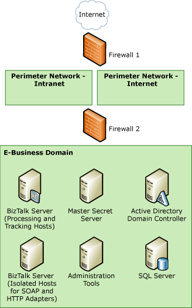
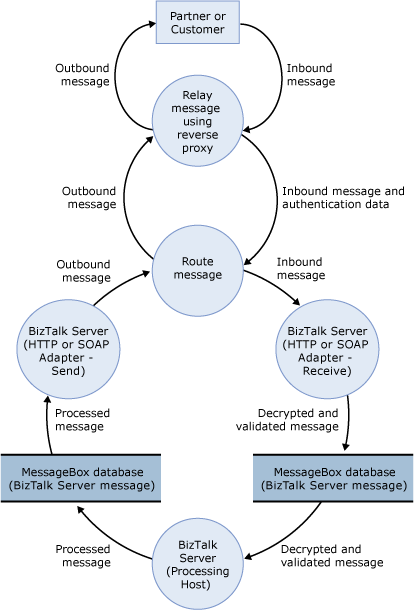

# Sample TMA: HTTP and SOAP Adapters
This topic presents the threat model analysis (TMA) for the HTTP and SOAP (Web services) adapter scenario for the sample architecture. The following figure shows the sample architecture for the HTTP and SOAP adapters scenario.  
  
 **Figure 1 Sample architecture for the HTTP/SOAP adapters scenario**  
  
   
  
## Step 1. Collect Background Information (HTTP and SOAP adapters scenario)  
 This section provides the data flow diagram (DFD) for the HTTP and SOAP (Web services) adapters scenario for the sample architecture.  
  
 All the other background information is the same for all our usage scenarios, and is described previously in [Background Information for Sample Scenarios](../core/background-information-for-sample-scenarios.md).  
  
### Data Flow Diagram  
 The following figure shows the DFD for the sample architecture when you use the HTTP and SOAP (Web services) adapters.  
  
 **Figure 2 DFD for the sample architecture of the HTTP/SOAP adapter scenario**  
  
   
  
 The data flow is as follows:  
  
1.  A partner or customer sends a message through HTTP, HTTPS, or a Web service. The message is routed to the IP address of Firewall 1.  
  
2.  Firewall 1 relays the message through Firewall 2 using reverse proxy.  
  
3.  Firewall 2 routes the message to the BizTalk Server that runs an instance of an isolated host for the HTTP or SOAP receive adapter. The isolated host processes the message and puts it in the MessageBox database.  
  
4.  An instance of the processing host that has a subscription to the message picks it up from the MessageBox database, does any additional processing, and puts the message back in the MessageBox database.  
  
5.  An instance of the isolated host that has an HTTP or SOAP send adapter picks up the message from the MessageBox database. The message goes through any final processing in the send pipeline, and is sent back out to the partner or customer.  
  
6.  As the message is sent to the partner or customer, it is routed through Firewall 2 and through Firewall 1 using reverse proxy.  
  
## Step 2. Create and Analyze the Threat Model (HTTP and SOAP Adapters Scenario)  
 This section provides the results of the TMA we did for the HTTP and SOAP (Web services) adapters scenario for the sample architecture.  
  
- **Identify Entry Points, Trust Boundaries, and Flow of Data -** See background information described earlier in step 1 and [Background Information for Sample Scenarios](../core/background-information-for-sample-scenarios.md).  
  
- **Create a List of the Identified Threats -** We used the following categorization for all entries in the DFD to identify potential threats to the scenario: **S**poofing identify, **T**ampering with data, **R**epudiation, **I**nformation disclosure, **D**enial of service, and **E**levation of privileges. The following table lists the threats we identified when you use the HTTP and SOAP adapters to send and receive messages to and from BizTalk Server.  
  
  **Table 1 List of threats**  
  
|Threat|Description|Asset|Impact|  
|------------|-----------------|-----------|------------|  
|Send infinite-size message|A malicious user can send a message of infinite size.|BizTalk Server environment|Denial of service|  
|Send lots of messages to receive location|A malicious user can send a large number of valid or invalid messages and flood the application.|BizTalk Server environment|Denial of service|  
|Read message bodies over HTTP|A malicious user can intercept the message as it travels from the sender to Firewall 1, and can read the message.|Message payload|Information disclosure|  
|Read user credentials from message|If you use basic authentication, and the message contains user credentials, a malicious user can gain access to the credentials and use them to access the application.|User credentials|Information disclosure   Elevation of privilege|  
  
## Step 3. Review Threats (HTTP and SOAP Adapters Scenario)  
 This section provides the results of the risk analysis we did for threats we identified for the HTTP and SOAP (Web services) adapters scenario for the sample architecture. After the main threat model meeting, we reviewed the threats and used the following impact categories to identify the risk for each threat: **D**amage potential, **R**eproducibility, **E**xploitability, **A**ffected users, and **D**iscoverability.  
  
 The following table lists the risk ratings for the threats we identified when you use the HTTP and SOAP adapters to send and receive messages to and from BizTalk Server.  
  
 **Table 2 Risk ratings of threats**  
  
|Threat|Impact|Damage potential|Reproducibility|Exploitability|Affected users|Discoverability|Risk exposure|  
|------------|------------|----------------------|---------------------|--------------------|--------------------|---------------------|-------------------|  
|Send infinite-size message|Denial of service|2|3|2|3|2|2.4|  
|Send lots of messages to receive location|Denial of service|3|3|1|3|3|2.6|  
|Read message bodies over HTTP|Information disclosure|3|3|2|3|3|2.8|  
|Read user credentials from message|Information disclosure   Elevation of privilege|3|3|2|3|2|2.6|  
  
## Step 4. Identify Mitigation Techniques (HTTP and SOAP Adapters Scenario)  
 This section presents some mitigation techniques for the threats we identified for the HTTP and SOAP (Web services) adapters scenario for the sample architecture.  
  
 The following table lists mitigation techniques and technologies for the threats we identified when you use the HTTP and SOAP adapters to send and receive messages to and from BizTalk Server.  
  
 **Table 3 Mitigation techniques and technologies**  
  
|Threat|Impact|Risk exposure|Mitigation techniques and technologies|  
|------------|------------|-------------------|--------------------------------------------|  
|Send infinite-size message|Denial of service|2.4|Limit the maximum size of an incoming message per URL and reject messages that exceed that maximum.   For more information, see [Mitigating Denial of Service Attacks](../core/mitigating-denial-of-service-attacks.md).|  
|Send lots of messages to receive location|Denial of service|2.6|The SOAP adapter takes advantage of HTTP to send and receive messages to and from BizTalk Server. Therefore, you must follow the security recommendations to help secure Internet Information Services (IIS). If you use IIS, make sure that you follow the IIS recommendations on how to configure application isolation.   For more information, see the Microsoft TechNet Web site at [http://go.microsoft.com/fwlink/?LinkId=60951](http://go.microsoft.com/fwlink/?LinkId=60951).   Use client authentication and party resolution to limit the number of messages being processed to only those that are valid and authorized.|  
|Read message bodies over HTTP|Information disclosure|2.8|We recommend that you use S/MIME to help secure the content of messages sent to and from BizTalk Server.   We recommend that you use Secure Sockets Layer (SSL) to help secure the transmission of data to and from BizTalk Server and between BizTalk Server components distributed across your environment.|  
|Read user credentials from message|Information disclosure   Elevation of privilege|2.6|When you use basic authentication, or when you do not use encryption at the message level, we recommend that you use SSL both to receive and send messages to make sure that an unauthorized person cannot read the user credentials.|  
  
## See Also  
 [Threat Model Analysis](../core/threat-model-analysis.md)   
 [Sample Scenarios for Threat Model Analysis](../core/sample-scenarios-for-threat-model-analysis.md)   
 [Sample Architectures for Small & Medium-Sized Companies](../core/sample-architectures-for-small-medium-sized-companies.md)