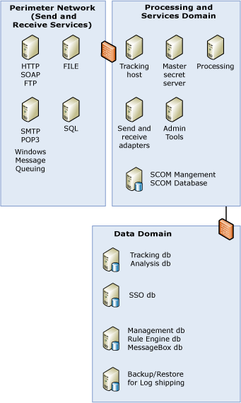

# Scaled Down Architecture
For complete information about the system architecture for[!INCLUDE[btsBizTalkServerNoVersion](../includes/btsbiztalkservernoversion-md.md)] deployment, see [Sample BizTalk Server Architectures](../core/sample-biztalk-server-architectures.md).  
  
 The following figure provides a sample [!INCLUDE[btsBizTalkServerNoVersion](../includes/btsbiztalkservernoversion-md.md)] architecture that combines some of the domains and BizTalk Servers to reduce the number of servers and firewalls you need. While this architecture is not the most distributed, it still separates the BizTalk Servers based on their function.  
  
   
  
        Scaled Down Architecture  
  
 In the previous figure, the servers in the service interfaces and services domain correspond to BizTalk Hosts, and not physical servers. While it is recommended to keep the master secret server and the administrative tools in stand-alone computers, you can have host instances for the tracking, processing, send, and receive hosts running on multiple computers. Similarly, the servers in the perimeter network correspond to logical locations.  
  
 The servers in the perimeter network for SMTP, Message Queuing, File, and SQL correspond to the mail servers, queue, directory, or SQL Server respectively from which the BizTalk receive and send hosts in the processing and services domain receive and send messages.  
  
## See Also  
 [Scaled Down Architecture with Information Worker Services](../core/scaled-down-architecture-with-information-worker-services.md)   
 [Large Distributed Architecture](../core/large-distributed-architecture.md)   
 [Designing a Secure Architecture](../core/designing-a-secure-architecture.md)   
 [Sample BizTalk Server Architectures](../core/sample-biztalk-server-architectures.md)