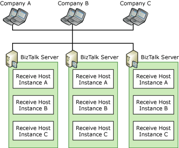

# Scaled-Out Receiving Hosts
When a host contains a receiving item, such as a receive location or pipeline, it acts as a security boundary, and the message decoding and decrypting occurs in a pipeline within the host. To make the receiving hosts highly available, you must have two or more [!INCLUDE[btsBizTalkServerNoVersion](../includes/btsbiztalkservernoversion-md.md)] computers that are running instances of each receiving host. By scaling out the receiving hosts you can guarantee availability for [!INCLUDE[btsBizTalkServerNoVersion](../includes/btsbiztalkservernoversion-md.md)] deployments that are messaging intensive. While these deployments might perform minimal processing for orchestrations, they can route many messages of varying types with great speed and reliability.  
  
 You can enhance security and scalability in your environment by separating the receiving host from the hosts that process orchestrations and send messages because you can secure and scale each host independently of other hosts. For example, you can add two computers (host instances) to the receiving host without adding any computers to the processing or sending hosts.  
  
## Multiple Hosts for Receiving Messages  
 The following figure shows a [!INCLUDE[btsBizTalkServerNoVersion](../includes/btsbiztalkservernoversion-md.md)] deployment that provides high availability for the receiving host by having two computers that are running instances of the receiving host. Note that in this figure the processing and sending hosts are not highly available.  
  
   
  
 For large deployments, for scenarios dealing with multiple trading partners, and for scenarios when you use different protocols, you can spread out the receiving functionality across multiple receiving hosts. For example, you can create a host for receiving messages for each adapter, or different hosts for receiving messages from different partners. When you create multiple receiving hosts you can create security boundaries and ease the manageability and scalability of your environment; however, it does not make your environment highly available.  
  
 To make your environment highly available, you must create two or more host instances for each receiving host that you create. For example, you can create three different receive hosts (A, B, and C) to receive messages from three different companies. To make each of these hosts highly available you then create host instances of each of these hosts in two or more computers. Note that you can have instances of each host on one computer without losing the security boundary, manageability, or scalability.  
  
 The following figure shows a highly available three-computer BizTalk Server environment with hosts dedicated to receiving messages from different companies.  
  
   
  
 To provide high availability in this configuration, each computer runs three host instances: one instance for each of the three companies. The host instances for each company contain the receive locations and pipelines to communicate with that company. During typical operations, as long as you have done the necessary work for scale out in front of the receive adapters (for example, if you configure network load balancing for HTTP), the messaging load is distributed among the three host instances for each host. If a host instance on one computer fails, the host instances running on the other two computers provide redundancy and maintain service availability.  
  
## Scaling the BizTalk Server Receive Adapters  
 Besides host instances, the process of scaling and providing high availability for the receive hosts also depends on the specific adapters that you implement in your deployment. Each adapter has protocol-specific characteristics that make planning and deployment different in each case. However, [!INCLUDE[btsBizTalkServerNoVersion](../includes/btsbiztalkservernoversion-md.md)] lets you apply the same high-availability solution for all adapters, primarily through additional computers and host instances.  
  
 Depending on the specific protocol being used, some receive adapters require an additional mechanism for distributing incoming messages among multiple host computers to provide high availability. For example, [!INCLUDE[btsBizTalkServerNoVersion](../includes/btsbiztalkservernoversion-md.md)] solutions that use the HTTP or SOAP adapter (otherwise known as the Web services adapter) require a load balancer such as Network Load Balancing (NLB) to distribute the receiving workload. The following table summarizes the high-availability guidelines for the most common adapters in [!INCLUDE[btsBizTalkServerNoVersion](../includes/btsbiztalkservernoversion-md.md)].  
  
|**Adapter**|**High-availability guidelines**|  
|-----------------|---------------------------------------|  
|HTTP|Add multiple computers to the receive host and configure NLB to distribute incoming messages across the multiple host computers.|  
|SOAP|Add multiple computers to the receive host and configure NLB to distribute incoming messages across the multiple host computers.|  
|File|Add multiple computers to the receive host with the receive location on each host computer referencing the same file folder or Universal Naming Convention (UNC) path. For a complete highly available solution, you must make sure that the file location to which the UNC path points is highly available (or at least reliable).|  
|FTP|Configure the FTP receive adapter to run in a clustered BizTalk host. For more information, see [Considerations for Running Adapter Handlers within a Clustered Host](../core/considerations-for-running-adapter-handlers-within-a-clustered-host1.md).|  
|POP3|Configure the POP3 receive adapter to run in a clustered BizTalk host. For more information, see [Considerations for Running Adapter Handlers within a Clustered Host](../core/considerations-for-running-adapter-handlers-within-a-clustered-host1.md).|  
|MSMQ|Configure the MSMQ receive adapter to run in a Windows-clustered BizTalk host. For more information, see [Considerations for Running Adapter Handlers within a Clustered Host](../core/considerations-for-running-adapter-handlers-within-a-clustered-host1.md). If the MSMQ receive locations are using queues on a remote MSMQ server, you do not need to cluster the BizTalk host.  In this scenario, run the MSMQ receive host on multiple BizTalk computers in the group.|  
|MQSeries|Add multiple computers to the receive host for this adapter, use clustered queue managers in MQSeries for Windows, and cluster the MQSeries Server for Windows.|  
|Windows Sharepoint Services|Add multiple computers to the receive host and configure NLB to distribute incoming messages across the multiple host computers.|  
|-   WCF-NetTcp -   WCF-Custom|Add multiple computers to the receive host and configure NLB to distribute incoming messages across these host computers.   -or -   Cluster the host used by the adapter receive handler.|  
|-   WCF-NetNamedPipe -   WCF-BasicHttp -   WCF-WSHttp -   WCF-CustomIsolated|Add multiple computers to the receive host and configure NLB to distribute incoming messages across these host computers.|  
|WCF-NetMsmq|Cluster the host used by the adapter receive handler.|  
  
### HTTP Adapter  
 The HTTP receive adapter in [!INCLUDE[btsBizTalkServerNoVersion](../includes/btsbiztalkservernoversion-md.md)] is an Internet Server API (ISAPI) extension (BTSHTTPReceive.dll) that runs as a host instance on each receive host computer. When a partner sends a message to BizTalk Server through the HTTP protocol, the message typically arrives at a specific URL on a BizTalk Server computer with Internet Information Services (IIS) installed. You create a host instance in BizTalk Server with a receive location that subscribes to this URL. When messages arrive at the URL, BizTalk Server retrieves them and persists them in the MessageBox database.  
  
 [!INCLUDE[btsBizTalkServerNoVersion](../includes/btsbiztalkservernoversion-md.md)] provides high availability for the HTTP receive adapter by letting you create multiple host instances of the same receive host. These host instances subscribe to a specific URL that can be a shared, cluster IP address if you are using NLB to distribute incoming messages across multiple receive hosts. These hosts all function to serve the virtual IP address of the cluster, so that if one cluster member fails, others can still serve this IP address.  
  
### SOAP Adapter (Web Services Adapter)  
 Unlike the HTTP receive adapter, the receive adapter for Web services does not involve an ISAPI extension. It receives incoming messages through a URL that you specify by using the BizTalk Web Services Publishing Wizard. This wizard exports a Web service and creates a virtual directory that functions as the receive location.  
  
 To provide high availability for the Web services adapter, add multiple computers to the receive host and use NLB to distribute incoming messages. When a client sends a message to BizTalk Server through the Web services adapter, NLB load balances the message to one of the receiving hosts, and the appropriate host instance running on the host persists the message to the MessageBox database.  
  
### File Adapter  
 The File receive adapter retrieves messages from a file folder or UNC path. This adapter is frequently used within companies instead of in business-to-business scenarios because both parties require permissions to the path, and companies do not typically share file systems. You configure the File receive handler to subscribe to the path so that BizTalk Server retrieves the message when it arrives at the receive location.  
  
 [!INCLUDE[btsBizTalkServerNoVersion](../includes/btsbiztalkservernoversion-md.md)] provides high availability for the file receive adapter by letting you create host instances on multiple host computers that subscribe to the same UNC path. If a host instance running on one host computer encounters errors or fails, the same host instance running on another host computer can retrieve the message and persist it to the MessageBox database.  
  
### FTP Adapter  
 The FTP receive adapter should not be configured to run in multiple hosts because the FTP receive adapter uses the FTP protocol to retrieve files from the target system and the FTP protocol does not have any notion of file locking to ensure that multiple copies of the same file are not retrieved simultaneously when running multiple instances of the FTP receive adapter. The FTP receive adapter should be configured to run in a clustered BizTalk host. For more information, see [Considerations for Running Adapter Handlers within a Clustered Host](../core/considerations-for-running-adapter-handlers-within-a-clustered-host1.md).  
  
### POP3 Adapter  
 The POP3 receive adapter can be configured to run in multiple hosts unless the POP3 server that the adapter is reading from allows multiple concurrent connections to be made to the same mailbox. If the POP3 server that the POP3 adapter is connected to permits multiple concurrent connections to its mailboxes then high availability for the POP3 adapter must be achieved by configuring POP3 adapter receive handlers to run in a BizTalk host instance that has been clustered. For more information, see [Considerations for Running Adapter Handlers within a Clustered Host](../core/considerations-for-running-adapter-handlers-within-a-clustered-host1.md).  
  
### MSMQ Adapter  
 To achieve high availability, run the MSMQ receive adapter in a Windows-clustered BizTalk host that is in the same cluster group as the clustered MSMQ resource. For more information, see [Considerations for Running Adapter Handlers within a Clustered Host](../core/considerations-for-running-adapter-handlers-within-a-clustered-host1.md).  
  
 If the MSMQ receive location is **only** receiving from MSMQ queues on a remote MSMQ server, then high availability can be achieved by running the MSMQ receive host on multiple BizTalk computers in the BizTalk group.  To provide high availability for MSMQ, you must ensure the remote MSMQ server is using failover clustering in Windows.  If using transactional queues, the remote MSMQ server must be running MSMQ 4.0 (Windows Server 2008) or above.  
  
### MQSeries Adapter  
 The Microsoft BizTalk Adapter for MQSeries serves as a bridge between [!INCLUDE[btsBizTalkServerNoVersion](../includes/btsbiztalkservernoversion-md.md)] and IBM MQSeries servers. To provide a highly available solution when you use this adapter, you must have multiple instances of the host running the MQSeries adapter, use clustered queue managers in MQSeries for Windows, and cluster the MQSeries Server for Windows. For more information about clustering the queue manager and clustering the MQSeries Server, see the IBM WebSphere MQ documentation. For more information about making the MQSeries adapter highly available, see "High Availability" in Microsoft BizTalk Adapter for MQSeries Help.  
  
### Windows SharePoint Services Adapter  
 The Windows SharePoint Services adapter retrieves messages from SharePoint by calling into the Windows SharePoint Services web service installed by BizTalk on the SharePoint machine. The adapter uses a checkout mechanism in order to ensure that different host instances will not process the same message. This allows the receive adapter to scale out by adding more host instances. [!INCLUDE[btsBizTalkServerNoVersion](../includes/btsbiztalkservernoversion-md.md)] provides high availability for the SharePoint receive adapter by letting you run the same receive locations on multiple host instances that subscribe to the same HTTP URL pointing to a SharePoint NLB installation.  
  
### WCF-NetTcp Adapter  
 The NetTcpBinding can be load balanced using IP-layer load balancing techniques. However, the NetTcpBinding pools TCP connections by default to reduce connection latency. This is an optimization that interferes with the basic mechanism of load balancing. The primary configuration value for optimizing the NetTcpBinding is the lease timeout, which is part of the Connection Pool Settings. Connection pooling causes client connections to become associated to specific servers within the farm. As the lifetime of those connections increase (a factor controlled by the lease timeout setting), the load distribution across various servers in the farm becomes unbalanced. As a result the average call time increases. So when using the NetTcpBinding in load-balanced scenarios, consider reducing the default lease timeout used by the binding. A 30-second lease timeout is a reasonable starting point for load-balanced scenarios, although the optimal value is application-dependent. For more information about the channel lease timeout and other transport quotas, see Transport Quotas.  
  
## See Also  
 [Providing High Availability for BizTalk Hosts](../core/providing-high-availability-for-biztalk-hosts.md)