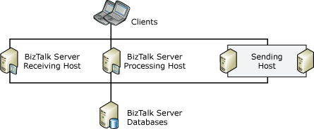

# Scaled-Out Sending Hosts
A scaled-out sending host makes sure that the sending functionality in [!INCLUDE[btsBizTalkServerNoVersion](../includes/btsbiztalkservernoversion-md.md)] is highly available. If you add multiple computers to a host for sending messages, you can run multiple sending host instances for redundancy and high availability.  
  
 The following figure shows a [!INCLUDE[btsBizTalkServerNoVersion](../includes/btsbiztalkservernoversion-md.md)] deployment that provides high availability for the sending host by having two computers that are running instances of the sending host. Note that in this figure the receiving and processing hosts are not highly available.  
  
   
  
## High Availability for Sending Hosts  
 Sending functionality in [!INCLUDE[btsBizTalkServerNoVersion](../includes/btsbiztalkservernoversion-md.md)] is similar to processing functionality in the sense that neither of these activities requires any association between host and data. Just as any processing host instance can retrieve messages from the MessageBox database and process them, any sending host instance can retrieve messages from the MessageBox database and send them. Therefore, providing high availability for the sending hosts means that you use the same techniques as for providing high availability for the processing hosts.  
  
## Scaling the BizTalk Server Send Adapters  
  
### High Availability for the MSMQ Send Adapter  
 To provide high availability for the MSMQ send adapter you should cluster the MSMQ service, cluster a BizTalk host in the same group as the clustered MSMQ service, and configure the MSMQ send handler to run in this clustered BizTalk host. This should be done to ensure the consistency of transactional sends initiated by the MSMQ adapter. For more information see [Considerations for Running Adapter Handlers within a Clustered Host](../core/considerations-for-running-adapter-handlers-within-a-clustered-host1.md).  
  
### High Availability for the Windows SharePoint Services Send Adapter  
 To provide high availability for the Windows SharePoint Services send adapter, add multiple computers to the send host with the send port on each host computer referencing the same document library. The Windows SharePoint Services adapter sends messages to SharePoint by calling into the Windows SharePoint Services web service installed by BizTalk on the SharePoint machine. [!INCLUDE[btsBizTalkServer2006r3](../includes/btsbiztalkserver2006r3-md.md)] provides high availability for the SharePoint send adapter by letting you run the same send ports on multiple host instances that push messages to the same HTTP URL pointing to a SharePoint NLB installation.  
  
## See Also  
 [Providing High Availability for BizTalk Hosts](../core/providing-high-availability-for-biztalk-hosts.md)   
 [Considerations for Running Adapter Handlers within a Clustered Host](../core/considerations-for-running-adapter-handlers-within-a-clustered-host1.md)