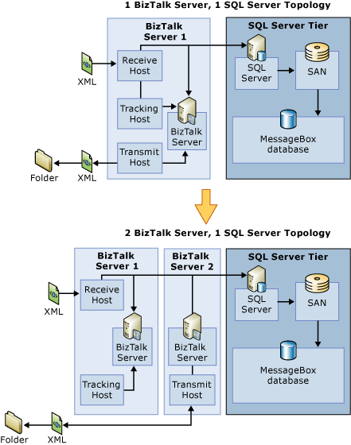
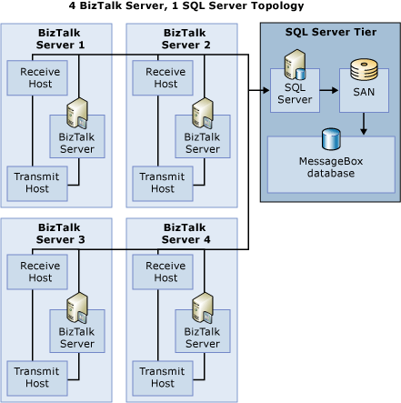

# Scaling Out the BizTalk Server Tier
To scale out the BizTalk tier, add more hardware to the existing topology. It is recommended that you add hardware in the following scenarios:  
  
- BizTalk Server becomes a bottleneck. The bottleneck itself may be caused by one of the following problems:  
  
- CPU: If the scenario uses CPU intensive pipelines, maps, or orchestrations, the BizTalk servers will not have any extra CPU headroom.  
  
- Memory and I/O: If the existing computers have reached their maximum limit on memory and IO, the only way to add resources is to add another physical computer.  
  
- Scaling up is too expensive. For example, consider the 1 BizTalk Server topology where the BizTalk CPU is at maximum capacity. If it is cheaper to add extra dual processor machines instead of upgrading the dual processor to a quad processor, you should instead scale-outyour system.  
  
- Scaling-up does not fix the bottleneck. Scaling up may not work in the following scenarios:  
  
  -   IO is at the maximum level for the BizTalk computer so you need another computer to scale the IO.  
  
  -   Memory is at the maximum level for your operating system. In this scenario, the only way to scale your system is to add an extra BizTalk computermachine to the topology.  
  
  In some scenarios, you may want dedicated servers for receiving messages, sending messages, and processing them. When you have dedicated servers, it is easier to isolate problems and do maintenance on one computer without impacting the others. You can add these computers by scaling our the BizTalk tier.  
  
## When You Can’t Scale Out the BizTalk Tier  
  
- The MessageBox database is the bottleneck.  
  
- An adapter becomes the bottleneck. For example, if you are using the SQL adapter, after you increase the number of BizTalk receivers, lock contention increases on the SQL database where the BizTalk SQL adapter is pulling data from. This limits your ability to scale out the SQL adapter.  
  
  The following figure shows an example of how you might scale out the BizTalk tier.  
  
    
  
  This figure shows a scaled-out BizTalk topology, scaling from one BizTalk server to 2 BizTalk servers. In the one BizTalk server topology, three host instances are sharing the BizTalk computer resources. In the two BizTalk server topology, the transmit host is separated onto a different server, which achieves more throughput.  
  
## Considerations When Scaling Out the BizTalk Tier  
 You must consider the following questions before you add another BizTalk Server computer:  
  
#### How do I configure the system for load balancing and fault tolerance when I scale out the BizTalk tier?  
 The selection of load balancing and fault tolerance technology depends on the adapter that is being used in the scenario. For SOAP and HTTP adapters, the recommended way is to use NLB. Refer to NLB documentation for more details.  
  
#### How do I refactor the host instances?  
 There is no one rule to determine how you should refactor the host instances when you scale out the BizTalk tier. When you factor the host instances depends on the complexity of scenario. Following are some examples how to factor the host instances.  
  
##### Scenario 1  
 One BizTalk server configuration, and receive and transmit host instances are on the same computer.  
  
 Assume there is a CPU bottleneck. You add another identical BizTalk computer to the group to scale-out, giving you two ways to factor the host instances.  
  
 Here are two solutions to this problem:  
  
- **Solution 1**: The easiest way of factoring in this scenario is to clone the host instance factoring from first computer to second computer. So, the second computer is an exact copy of the first in term of functionality; it can also have both receive and send hosts. Assuming there is no other bottleneck, you may get a scaling factor of 2 as the CPU resources are doubled.  
  
- **Solution 2**: Another way to factor the host instances is to isolate the receive and send functions onto different computers. So, one of the BizTalk servers is dedicated for receiving and other for sending.  
  
  **Comparing Solution 1 and Solution 2**  
  
  In solution 1, the number of host instances is doubled from 1 BTS configuration. This means that lock contention on the SQL server will increase. How much it increases in lock contention will determine the scaling factor. If the lock contention is well within limits of becoming a bottleneck, you can see a scaling factor of 2.  
  
  The advantage of solution 2 is that you have only two host instances, so the lock contention on the SQL server should be less compared to solution 1. But, the scaling factor depends completely on the complexity of the receive and send host instances. Consider the following cases in solution 2:  
  
  Assume that both the receive and transmit host instances are equally intensive and they each use 50% of the CPU in the one BizTalk server topology. In the two BizTalk server topology, you move the transmit host instance to different computer, and now both receive and transmit get double the resources. This should provide a scaling factor of 2, assuming that there is no other bottleneck. This case is better than Solution 1 because there are only two host instances and hence les lock contention.  
  
  Assume that transmit is way more intensive than receive, and uses 80% CPU resources in the one BizTalk server topology. By moving the transmit host instance to another machine, you gain only 20% more CPU resources so the maximum scaling factor will be 1.2. Moreover, the computer with the receive host instance will use only 20-30% CPU resources so the advantage of scaling-out is much less.  
  
  Consider the following figure that has four BizTalk servers. Each computer is both receiver and sender, giving you a  total of four host instances of each type (receive and transmit).  
  
    
  
  This topology might not be the best possible one possible. You should also test other factoring permutations, depending on the complexity of scenario. For example:  
  
- Dedicate two computers for receiving and  two for transmitting. This will give you the best possible scaling when both receive and send are equally intensive.  
  
- Dedicate three computersfor receiving and one for transmitting, if receiving is more intensive than transmit.  
  
- Dedicate one computer for receive and three for transmitting if transmitting is more intensive than receive.  
  
  In all scenarios, it is recommended that you minimize the number of host instances of each host so that contention on the MessageBox database is reduced and at the same time use the computer resources are use to the fullest. The best factoring permutation depends on the complexity of scenario and type of bottleneck. Always test your factoring before you finalize a permutation.  
  
## See Also  
 [Scaling Up the BizTalk Server Tier](../core/scaling-up-the-biztalk-server-tier.md)   
 [Scaling Up the SQL Server Tier](../core/scaling-up-the-sql-server-tier.md)   
 [Scaling Out the SQL Server Tier](../core/scaling-out-the-sql-server-tier.md)   
 [Scaled-Out Receiving Hosts](../core/scaled-out-receiving-hosts.md)   
 [Scaled-Out Processing Hosts](../core/scaled-out-processing-hosts.md)   
 [Scaled-Out Sending Hosts](../core/scaled-out-sending-hosts.md)   
 [Using Windows Server Cluster to Provide High Availability for BizTalk Server Hosts2](../core/use-windows-cluster-to-provide-high-availability-for-biztalk-hosts.md)   
 [Scaled-Out Databases](../core/scaled-out-databases.md)   
 [Clustering the BizTalk Server Databases](../core/clustering-the-biztalk-server-databases1.md)