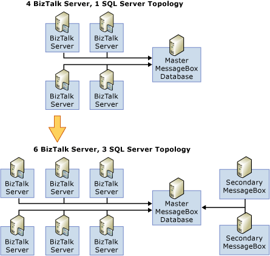

# Scaling Out the SQL Server Tier
For each BizTalk group, you add one Master MessageBox database. All the subsequent MessageBox databases that you add are called secondary MessageBoxes. The Master MessageBox handles all subscriptions and message routing. It can also publish messages. Secondary MessageBox databases will only publish messages when specifically configured to do so.  
  
## How to Add a Secondary MessageBox Database  
 There are two ways to add secondary MessageBox databases:  
  
- Add the secondary MessageBox database on the same physical server.  
  
   Do this if the existing MessageBox physical server has enough CPU and I/O resources and is only bottlenecked by lock contention. Create the secondary MessageBox database on separate IO drives.  
  
   Advantages:  
  
  -   The extra CPU headroom can be utilized by another message-box  
  
  -   Fewer SQL server licenses are required  
  
  -   Network hop is eliminated  
  
- Add the secondary MessageBox database on a different physical server  
  
   In this case, use a dedicated physical server with its own IO as the extra MessageBox database.  
  
  The following figure shows a scenario where SQL tier is scaled-out from one MessageBox database to three MessageBoxes databases.  
  
    
  
## When to Scale-out the MessageBox database  
  
-   The MessageBox database becomes the bottleneck. Those bottlenecks can be:  
  
    -   **CPU** In case of very expensive and complex orchestration scenarios, the MessageBox database consumes heavy CPU resources. Adding another publishing the MessageBox database should help increase the throughput.  
  
    -   **Lock Contention** Complex scenarios with multiple host instances or orchestrations tend to create lock contention on the MessageBox database. Again, adding another publishing MessageBox database should help increase the throughput.  
  
-   Scaling up doesn’t address the bottleneck. For example, if the Master MessageBox database is lock contention bound, scaling-out is the only option.  
  
-   Scaling-up is too expensive. For example, if upgrading the existing quad proc server to 8 way server is more expensive than adding another quad proc, scale-out is better option.  
  
## When You Can’t Scale-out the SQL Tier  
 In theory, the SQL tier should scale indefinitely as long as the Master MessageBox database is not the bottleneck. To achieve this, consider making the Master MessageBox database a non-publishing database so it only does routing. But, once the Master is bottlenecked by lock contention, you cannot scale out the SQL tier any more.  
  
## Scale-out Strategies and Considerations  
  
-   First scale-up the Master MessageBox database and then scale out.  
  
-   Scaling-out from 1 to 3 SQL MessageBox databases instead of 1 to 2. Consider the 1 SQL server topology illustrated in the figure above titled "4 BizTalk Server, 1 SQL Server Topology," and assume that the SQL server is CPU bound, in other words, the CPU processing is a bottleneck. If you add only one MessageBox database to this topology, the Master Messagebox will still be CPU bound and the secondary MessageBox database will be under-utilized. So, the scaling factor is almost 1. If you disable publishing on the Master MessageBox database and dedicate the Master MessageBox database only to do routing, the secondary MessageBox database will do the publishing. This will not help increase overall throughput though since the secondary MessageBox database is the only publisher and still becomes the bottleneck. So, adding 2 secondary MessageBox databases and disabling the publishing on the Master MessageBox database would be the recommended way to scale-out in this scenario.  
  
-   The Master MessageBox database will eventually be the bottleneck. So, the physical computer hosting the Master MessageBox database should be faster and bigger.  
  
-   To minimize sending data over the network (and the associated DTC overhead), consider placing multiple MessageBox databases on the same physical computer with dedicated drives. At the same time, make sure that the computer holding these multiple databases is not bottlenecked as the resources are being shared by multiple MessageBox databases.  
  
-   All secondary MessageBox databases should use comparable hardware because work is evenly distributed among the publishing MessageBox databases.  
  
-   Since you can scale out secondary MessageBox databases as long as the master MessageBox database is not bottlenecked, secondary MessageBox databases can run on computers with less CPU resources than is required by the master MessageBox database server.  
  
## See Also  
 [Scaling Out the BizTalk Server Tier](../core/scaling-out-the-biztalk-server-tier.md)   
 [Scaling Up the BizTalk Server Tier](../core/scaling-up-the-biztalk-server-tier.md)   
 [Scaling Up the SQL Server Tier](../core/scaling-up-the-sql-server-tier.md)   
 [Scaled-Out Receiving Hosts](../core/scaled-out-receiving-hosts.md)   
 [Scaled-Out Processing Hosts](../core/scaled-out-processing-hosts.md)   
 [Scaled-Out Sending Hosts](../core/scaled-out-sending-hosts.md)   
 [Using Windows Server Cluster to Provide High Availability for BizTalk Server Hosts2](../core/use-windows-cluster-to-provide-high-availability-for-biztalk-hosts.md)   
 [Scaled-Out Databases](../core/scaled-out-databases.md)   
 [Clustering the BizTalk Server Databases](../core/clustering-the-biztalk-server-databases1.md)